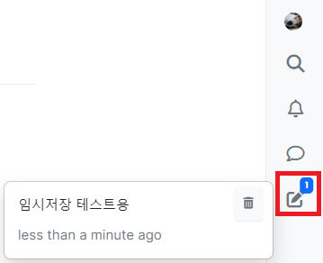

## 1. 메인화면

**1.1. 로그인하지 않은 경우**

  

**1.2. 로그인한 경우**

  

## 2. 로그인 및 회원가입

  

- 우측 메뉴바의 로그인 버튼을 클릭하여 로그인 화면으로 이동할 수 있습니다.
- 오아시스 아이디(학번)와 비밀번호를 이용하여 로그인할 수 있으며, 별도의 회원가입 기능은 제공하지 않습니다.

## 3. 게시판 이용

### 3.1. 게시판 목록

  

- 메인 화면에서 게시판 이름을 클릭하면 해당 게시판의 게시판 화면으로 이동합니다.

### 3.2. 게시판 화면

  

- 우측 상단의 `New Topic` 버튼을 클릭하여 게시글을 작성 가능합니다. 게시글은 로그인 후에만 작성 가능합니다.
- 화면 중앙에서 게시글 목록을 확인할 수 있고, 게시글 제목 클릭 시 게시글 상세 화면으로 이동합니다.

### 3.3. 게시글 작성

- 3.2.의 게시판 화면에서 `New Topic` 버튼 클릭 시 하단에 게시글 작성란이 표시됩니다.

**3.3.1. 게시판 선택 및 제목 작성**

  

- 질문을 작성할 게시판을 선택하고, 제목을 작성합니다.

 

**3.3.2. 본문 작성**

  

- 질문 내용을 자유롭게 작성할 수 있는 입력란입니다.
- **질문 작성시에는 코드, 결과물, 작성 의도 등을 명확히 알려주세요.**
- 마크다운 문법을 지원하며, 자세한 문법은 [링크](https://gist.github.com/ihoneymon/652be052a0727ad59601)를 참고해주세요

 

**3.3.3. 작성 결과 미리보기**

  
  

- `Show Preview` 버튼을 클릭하여 미리보기 화면을 열 수 있습니다.
- 본문 작성란 우측에 미리보기 화면이 생성됩니다.

 

**3.3.4. 게시글 꾸미기**

  

- 위 버튼을 이용하여 게시글을 꾸밀 수 있습니다.
- 순서대로 두껍게, 기울이기, 목록 생성, 취소선, 코드블럭, 하이퍼링크, 이미지 링크, 전체화면으로 보기, 썸네일 추가, 이모지 추가, 이미지 파일 업로드 버튼입니다.

 

**3.3.5. 코드블럭 삽입**

  

- `code` 버튼을 클릭하여 코드 블럭을 삽입할 수 있습니다.

  

- `code` 버튼 클릭 시 3개의 백틱(`)이 두 줄에 걸쳐 삽입됩니다.
- 질문에 필요한 코드를 두줄의 백틱 사이에 삽입합니다.

 

**3.3.6. 이미지 업로드**

_1. 이미지 업로드 버튼 사용하기_

  

- `Upload image` 버튼을 클릭하여 이미지 파일을 선택해 업로드할 수 있습니다.
- 파일을 선택하면 이미지를 삽입합니다.

_2. 드래그 & 드랍으로 이미지 업로드하기_

- 본문 작성란에 이미지 파일을 드래그 & 드랍하여 이미지 파일을 업로드할 수 있습니다.

 

**3.3.7. 태그 작성**

  

- 태그 입력란을 이용해 게시글에 태그를 달 수 있습니다.
- 태그명을 입력한 후 엔터 또는 쉼표를 입력하여 태그를 추가할 수 있습니다.
- 태그는 게시글 분류 및 검색에 사용되므로, 작성시 더 빠른 답변을 받을 수 있습니다.

_태그 입력 예시_

  

 

**3.3.8. 게시글 작성 중단 및 임시 저장**

  

- `Hide` 버튼을 클릭하면 게시글 작성을 중단 및 임시 저장할 수 있습니다.

  

- 화면 우측 메뉴바의 draft 버튼을 클릭하여 임시 저장된 게시글 목록을 확인할 수 있습니다.
- 계속 작성하고 싶은 게시글을 선택하여 이어서 작성할 수 있습니다.

 

**3.3.9. 게시글 작성 완료/취소**

  

- `Submit` 버튼 클릭 시 작성한 게시글이 등록됩니다.
- `Discard` 버튼 클릭 시 게시글 작성을 취소합니다.

## 3.4. 게시글 상세 화면

  

- 3.2.의 게시판 화면에서 게시글 제목 클릭 시 해당 게시글의 상세 화면으로 이동합니다.
- 게시글 또는 댓글에 마우스를 가져다대면 부가 기능을 사용할 수 있습니다.
  - `작성자 언급`, `인용`, `추천/비추천`, `글 수정/삭제`, `신고`

 

**3.4.1. 댓글 작성**

**_1. 일반 댓글 작성하기_**

  

- `Reply` 버튼 클릭 시 댓글 작성이 가능합니다. 작성 요령은 게시글 작성 요령과 같습니다.

 

**_2. 작성자 언급하며 댓글 작성하기_**

  

- 특정 게시물/댓글에 마우스를 가져다대면 `Reply`, `Quote`, `추천/비추천`, `추가 메뉴` 버튼이 나타납니다.
- `Reply` 버튼 클릭 시 게시물/댓글의 작성자를 언급하며 댓글을 작성할 수 있습니다.
- 언급된 사용자에게 알림이 전송됩니다.

_언급 예시_

  

 

**_3. 작성자의 글을 인용하며 댓글 작성하기_**

  

- 특정 게시물/댓글에 마우스를 가져다대면 `Reply`, `Quote`, `추천/비추천`, `추가 메뉴` 버튼이 나타납니다.
- `Quote` 버튼 클릭 시 특정 사용자의 글을 인용하며 댓글을 작성할 수 있습니다.

_인용 예시_

  

 

**3.4.2. 게시글 및 댓글 추천/비추천**

  

- 특정 게시물/댓글에 마우스를 가져다대면 `Reply`, `Quote`, `추천/비추천`, `추가 메뉴` 버튼이 나타납니다.
- `추천(위 화살표)`, `비추천(아래 화살표)`를 클릭하여 게시글/댓글을 추천 및 비추천할 수 있습니다.
- 추천 및 비추천의 합계가 가운데 숫자로 표시됩니다.

 

**3.4.3. 게시글 수정/삭제**

  

- 점 세개 버튼을 클릭하면 추가 메뉴를 열 수 있습니다.
- `Edit` 버튼을 클릭하여 자신이 작성한 게시글/댓글을 수정할 수 있습니다.
- `Delete` 버튼을 클릭하여 자신이 작성한 게시글/댓글을 삭제할 수 있습니다.

 

**3.4.4. 게시글 및 작성자 신고**

  

- 점 세개 버튼을 클릭하면 추가 메뉴를 열 수 있습니다.
- `Flag this post` 버튼을 클릭하여 게시물을 신고할 수 있습니다.
- `Flag this user` 버튼을 클릭하여 작성자를 신고할 수 있습니다.

## 4. 마이페이지

  

- 마이페이지로 이동합니다.

### 4.1. 작성한 게시글 목록

  

- 작성한 게시글 목록을 확인할 수 있습니다.

## 5. 검색

  

- 상세하게 검색하기 위해서 검색창으로 이동합니다

### 5.1. 상세히 검색

  

- `1번 박스`: 검색어를 지정할 수 있습니다
- `2번 박스`: 검색할 대상(Tag, Post, Category...)을 선택가능합니다
- `3번 박스`: `Match any words`를 선택하면 띄어쓰기 단위로 단어를 검색할 때 나열된 단어중 하나라도 게시글이 포함하고 있다면 그 게시글을 보여줍니다
  - `Math all words`는 띄어쓰기로 구분된 모든 단어가 포함되어있어야 게시글을 보여줍니다
- `4번 박스`: 글+제목을 보여줄지 제목만 보여줄지를 선택합니다
