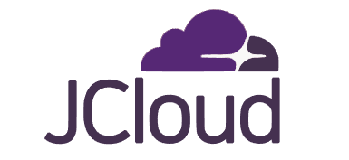

## 다양한 SW교육을 위한 클라우드 서비스
### 1.나만의 가상머신
- 학교에서 관리하고, 어디에서나 접속 가능한 나만의 가상머신 제공  
(내 컴퓨터/내 노트북이 아닌, 학교에서 제공하는 자원)
### 2. 동일한 환경
- 실습실 어느 자리에서든 동일한 환경과 동일한 파일 사용 가능  
*(단, 과제 수행 결과 등 중요한 파일은 따로 백업할 것)*
### 3. 다양한 실습
- 서버가 필요한 모든 실습을 진행해볼 수 있으며, 관심이 있는 경우 OpenStack 구축 및 운영에도 참여 가능

## 소개
### 1. 교육 활용
- 2017년부터 컴퓨터공학부에서 구축·운영 중  
- 매 학기 100개 이상의 가상머신을 학생 개별 제공 (2024년 1학기: 400대+)

### 2. 연구 활용
- GPU를 활용한 인공지능 연구, 전북대병원 블록체인 관련 연구, 약학대학 빅데이터 분석 등 다양한 프로젝트 지원

### 3. 시스템 구성
- 인프라: 9대 서버, 250+ CPU, 3 TB+ 메모리, 30 TB+ SSD, 고성능 GPU
- OpenStack Antelope 기반 (2023.11월 구축)

### 4. Infra 제공: 가상머신(인스턴스), 네트워크, 스토리지 서비스
- **가상머신 (인스턴스):**  
    - 원하는 사양의 VM 생성 가능 (예: 2 vCPUs, 2GB Memory, 20GB SSD)  
    - OS: Ubuntu 24.04 등, SSH, VNC, XRDP 등으로 CLI/GUI 접속
- **네트워크:**  
    - 외부 접속 지원, 공인 IP 및 도메인 할당, VM 간 가상 네트워크 구성, 각 네트워크 및 VM별 보안 설정 가능
- **스토리지:**  
    - 기본 탑재 스토리지 제공 및 추가 볼륨 지원, 필요 시 초고속 NVMe SSD 사용 가능