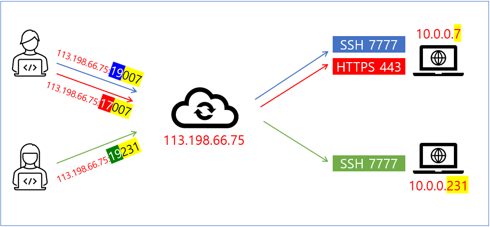
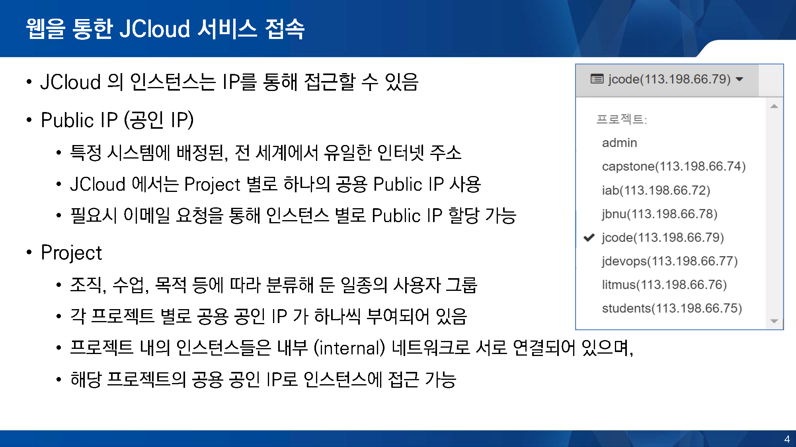
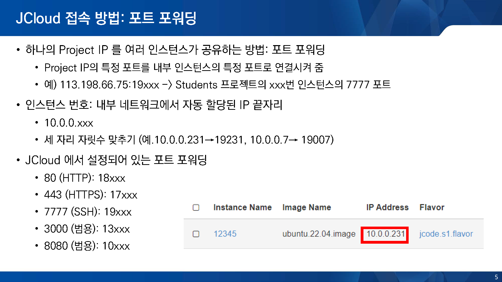

### 동영상: ["JEduTools 소개 및 사용법: JCloud(2)"@Youtube](https://youtu.be/xrCtn9E26Xw?si=0OTbKQZs5aO42pRF)
### 슬라이드: [GitHub -> Download raw file](https://github.com/JBNU-JEduTools/JEduTools/blob/main/slides/JEduTools3.pptx)

### 1. IP 확인
- 공인IP: 160.160.66.xxx
- JCloud의 왼쪽 상단 프로젝트 메뉴에서, 각 프로젝트 별로 확인 가능
  - (예제) capstone 프로젝트의 경우, 113.198.66.74 사용 (아래 그림 참조)

### 2. 포트포워딩
- 포트 포워딩 개념: 공용 IP의 특정 포트를 내부 인스턴스의 지정 포트로 연결하여 접근.
  - (예제) 113.198.66.74:19xxx -> capstone 프로젝트의 xxx번 인스턴스의 7777 포트
- 접속하려는 인스턴스의 내부 네트워크 번호 확인
  - 내부 IP의 마지막 숫자(10.0.0.xxx)를 세 자리로 맞춰 사용
  - (예제) 내 인스턴스의 내부 IP가 10.0.0.231 인 경우, 231 이 번호
- 아래 포트포워딩 참고하여, 포트 번호 완성
  - (예제) 231 인스턴스의 8080 포트로 접근하려면, 10231
        - 80 (HTTP): 18xxx
        - 443 (HTTPS): 17xxx
        - 7777 (SSH): 19xxx
        - 3000 (범용): 13xxx
        - 8080 (범용): 10xxx

### 3. 주소 완성
- IP:PORT 형식 주소로 접근
- (예제) capstone 프로젝트의 10.0.0.231 인스턴스의 8080 포트를 접근할 경우,
  - **최종 주소: 113.198.66.74:10231**
  
---

## 참고 자료
  

  
