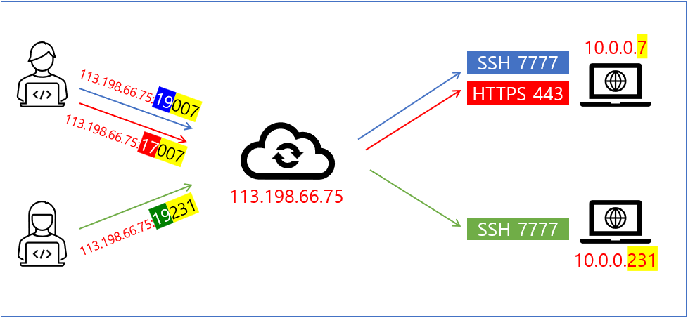
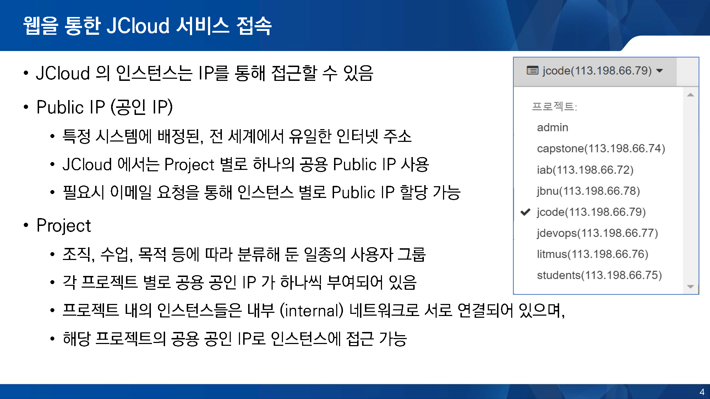
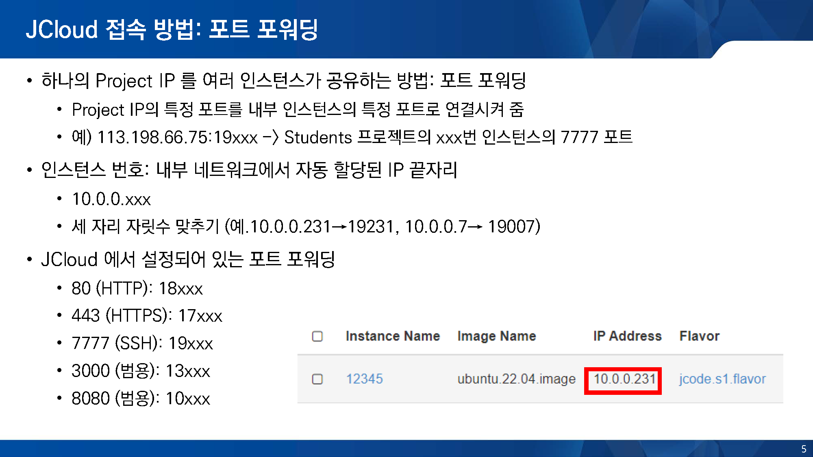

### 동영상: ["JEduTools 소개 및 사용법: JCloud(2)"@Youtube](https://youtu.be/xrCtn9E26Xw?si=0OTbKQZs5aO42pRF)
### 슬라이드: [GitHub -> Download raw file](https://github.com/JBNU-JEduTools/JEduTools/blob/main/slides/JEduTools3.pptx)
*(동영상·슬라이드는 구 클러스터 기준 자료 — 현재 화면·절차와 다를 수 있음)*

### 1. 접속 명령 복사 (가장 쉬운 방법 — students 프로젝트)
- students 프로젝트에서는 인스턴스 목록에 **"접속 주소"** 열과 **"SSH 접속 명령 복사"** 버튼이 제공됨
  - 복사되는 명령: `ssh -i <키페어 파일 경로> ubuntu@113.198.66.75 -p 12135` (키페어 경로만 본인 것으로 바꿔 사용)
- 인스턴스 상세 페이지에서 서비스별(SSH·HTTP·HTTPS·3000·8080) 접속 포트 표 확인 가능
- 그 외 프로젝트는 아래 규칙으로 포트를 직접 계산 — 2~4번 참고

### 2. IP 확인
- 공인IP: 113.198.66.xxx
- JCloud의 왼쪽 상단 프로젝트 메뉴에서, 각 프로젝트 별로 확인 가능
  - (예제) students 프로젝트의 경우, 113.198.66.75 사용

### 3. 포트 규칙 — students 프로젝트
- 내부 IP가 10.0.a.bcd 일 때, 공인 포트 = **서비스 번호(1자리) + a(1자리) + bcd(3자리)**
        - 7777 (SSH): 1
        - 80 (HTTP): 2
        - 443 (HTTPS): 3
        - 3000 (범용): 4
        - 8080 (범용): 5
- (예제) 내 인스턴스의 내부 IP가 10.0.2.135 인 경우
  - SSH(7777) 접속: 1 + 2 + 135 → **12135**
  - 8080 접속: 5 + 2 + 135 → **52135**
- 끝 숫자가 세 자리보다 짧으면 앞을 0으로 채움 (10.0.0.7 의 SSH → 10007)

### 4. 포트 규칙 — 그 외 프로젝트 (기존 방식)
- 내부 IP(10.0.0.xxx)의 마지막 숫자를 세 자리로 맞춰, 서비스별 접두사 뒤에 붙임
        - 80 (HTTP): 18xxx
        - 443 (HTTPS): 17xxx
        - 7777 (SSH): 19xxx
        - 3000 (범용): 13xxx
        - 8080 (범용): 10xxx
- (예제) 내 인스턴스의 내부 IP가 10.0.0.231 인 경우, SSH(7777) 접속은 19231, 8080 접속은 10231
  

### 5. 주소 완성
- IP:PORT 형식 주소로 접근
- (예제) students 프로젝트의 10.0.2.135 인스턴스의 8080 포트를 접근할 경우,
  - **최종 주소: 113.198.66.75:52135**
---

## 참고 자료
  

  
