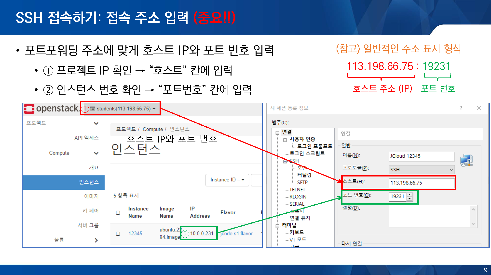
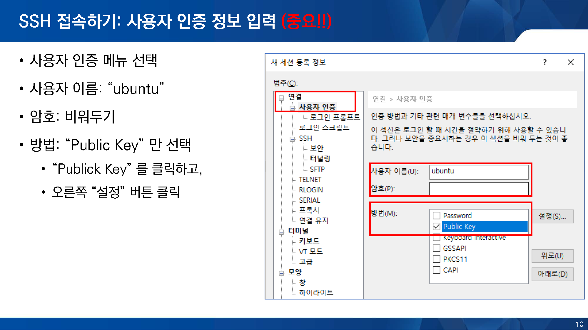
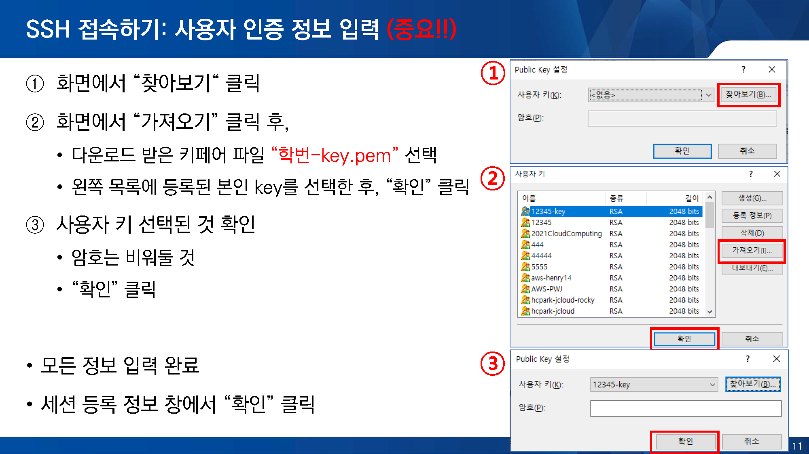

### 동영상: ["JEduTools 소개 및 사용법: JCloud(2)"@Youtube](https://youtu.be/xrCtn9E26Xw?si=UtWR2xStO1k3Dj8R&t=672)
### 슬라이드: [GitHub -> Download raw file](https://github.com/JBNU-JEduTools/JEduTools/blob/main/slides/JEduTools3.pptx)
- 7 페이지부터 SSH 접속 부분 확인

### 핵심 요약
- 접속 주소를 확인하고, SSH Client 를 이용해서 접근
  - [접속 주소 확인](/JCloud/2PortGuide)
- 메뉴얼은 XShell 기반으로 작성됨: https://www.netsarang.com/ko/xshell-download/
  - 학교 사용자용 무료 라이선스 활용. 이메일을 통한 인증 필요
- 접속 시, 각 이미지 별로 기본 id를 확인하고, 암호는 키페어 파일을 사용하여 인증함
  - Ubuntu 이미지의 경우, 기본 id는 ubuntu
  - 키페어는 초기 생성한 pem 파일 사용. 분실 시, 재발급 불가하므로 새로 생성해서 사용할 것
  

  
    
  

