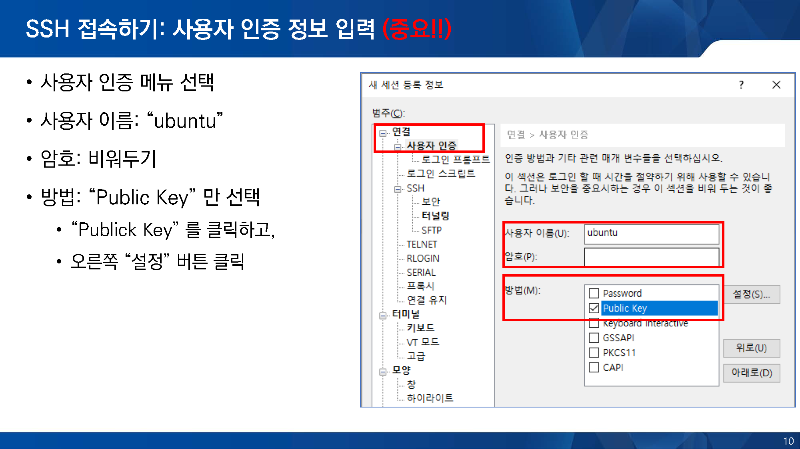
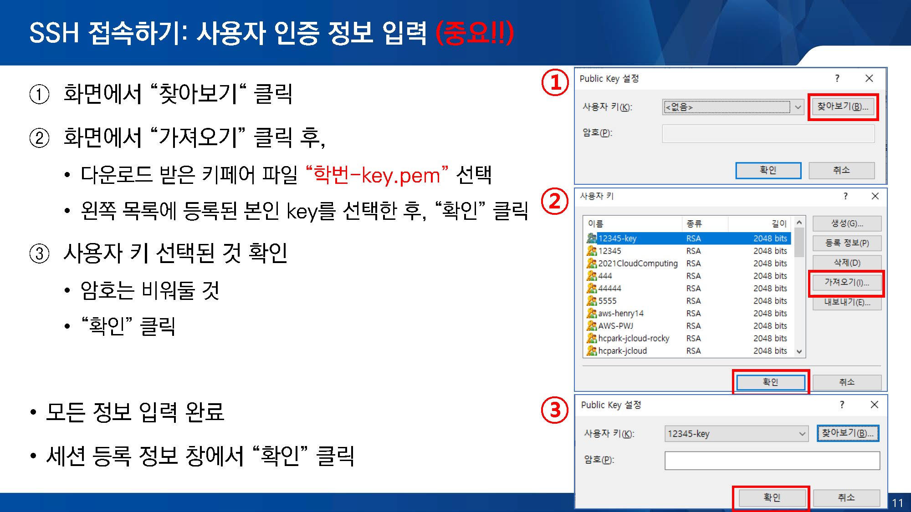

### 동영상: ["JEduTools 소개 및 사용법: JCloud(2)"@Youtube](https://youtu.be/xrCtn9E26Xw?si=UtWR2xStO1k3Dj8R&t=672)
### 슬라이드: [GitHub -> Download raw file](https://github.com/JBNU-JEduTools/JEduTools/blob/main/slides/JEduTools3.pptx)
- 7 페이지부터 SSH 접속 부분 확인

*(동영상·슬라이드는 구 클러스터 기준 자료 — 현재 화면·절차와 다를 수 있음)*

### 핵심 요약
- 터미널에서 바로 접속: `ssh -i <키 페어 파일 경로> ubuntu@<프로젝트 공인 IP> -p <포트>`
  - (예제) `ssh -i mykey.pem ubuntu@113.198.66.75 -p 12135`
  - students 프로젝트는 인스턴스 목록의 "SSH 접속 명령 복사" 버튼으로 같은 명령을 얻을 수 있음
- JCloud 기본 이미지는 SSH가 22번이 아니라 **7777 포트**를 사용 — 접속 포트는 포트 규칙의 SSH 항목으로 확인
  - [접속 주소 확인](/JCloud/2PortGuide)
- SSH Client(XShell 등)를 쓰는 경우에도 같은 주소·포트를 입력
- 메뉴얼은 XShell 기반으로 작성됨: https://www.netsarang.com/ko/xshell-download/
  - 학교 사용자용 무료 라이선스 활용. 이메일을 통한 인증 필요
- 접속 시, 각 이미지 별로 기본 id를 확인하고, 암호는 키 페어 파일을 사용하여 인증함
  - Ubuntu 이미지의 경우, 기본 id는 ubuntu
  - 키 페어는 초기 생성한 pem 파일 사용. 분실 시, 재발급 불가하므로 새로 생성해서 사용할 것
  

    
  

