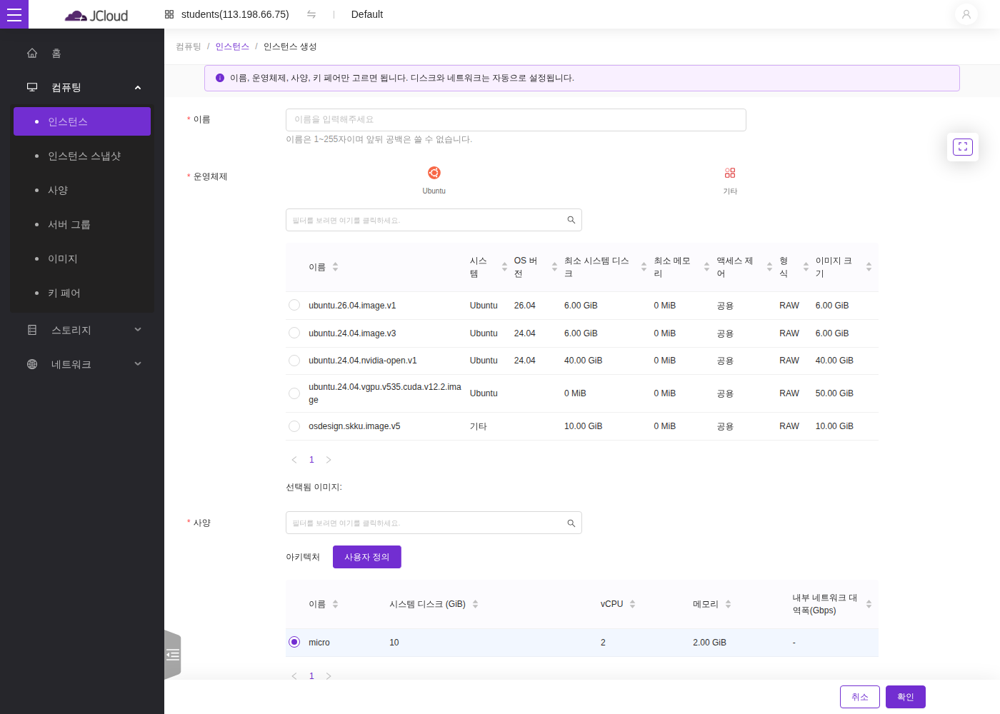

### 동영상: ["JEduTools 소개 및 사용법: JCloud(1)"@Youtube](https://youtu.be/5YYMlnuHTKc?si=rljtPM3UdLAxPrOV&t=824)
### 슬라이드: [GitHub -> Download raw file](https://github.com/JBNU-JEduTools/JEduTools/blob/main/slides/JEduTools2.pptx)
*(동영상·슬라이드는 구 클러스터 기준 자료 — 현재 화면·절차와 다를 수 있음)*

### 0. **사용 등록**
  - 수업 활용: 교수님 신청으로 일괄 등록. (1차: 개강 시, 2차: 수강정정 종료 후, 3차: 수강확정 후 (1/4선))
  - 개인 활용: 별도 신청 (추후 링크 제공)

### 1. **[jcloud.jedutools.io](https://jcloud.jedutools.io) 접속 후, 로그인**
- 전북대 구성원: JEduTools 통합 로그인 사용: [참고](/JIGSSO/JIGSSOUserManual)
  - 통합로그인의 경우, 암호 변경 불필요
- 외부 구성원: "keystone credentials" 를 이용해 별도 발급한 계정으로 로그인
  - 첫 로그인 후, 암호 변경 필수!
### 2. **Keypair 만들기 (처음 한 번)**
   - **키페어 이름:** “학번-key”  
   - **타입:** SSH key  
   - Create Key Pair 클릭 시 자동으로 pem 파일 다운로드됨  
     - pem 파일은 반드시 개인 메일로 전송해 안전하게 관리 (다시 찾을 수 있는 방법 없음)
   - 키페어는 **필수 항목** — 인스턴스 만들기 화면 안에서 바로 생성할 수도 있음

### 3. **인스턴스 만들기 **
- 인스턴스 메뉴에서 인스턴스 생성 버튼 클릭
- **students 프로젝트: "빠른 생성" 폼이 열림** — 아래 4가지만 고르면 나머지(디스크·네트워크·보안 설정)는 자동으로 구성됨
  - **이름:** 본인 ID (번호를 붙여도 됨)
  - **운영 체제:** 수업에서 지정한 이미지 선택
  - **Flavor:** 기본 선택(micro) 또는 수업에서 지정한 flavor
  - **키페어:** 미리 생성해둔 키페어 선택 (폼 안에서 즉석 생성도 가능)
  
- **그 외 프로젝트: 단계별 생성 폼** *(아래 설정을 참고하여 진행)*
  - **인스턴스 이름:** 본인 ID (번호를 붙여도 됨)
  - **부팅 소스:** 수업에서 지정한 이미지 선택
  - **Flavor:** 수업에서 지정한 flavor 선택 (시스템 디스크 크기는 flavor에 맞춰 자동 입력됨)
  - **Networks:** 각 프로젝트 별 생성된 internal network 사용
  - **키페어:** 미리 생성해둔 키페어 선택 (폼 안에서 즉석 생성도 가능)
  - 기타 옵션은 기본 설정 사용
- 마지막 생성 버튼을 클릭하면, 인스턴스 생성 시작.
- **인스턴스 생성 확인:**  
  - Power state가 **Running**으로 변경되면 부팅 시작  
  - Running 상태 후 1-2분 후에 SSH로 접속하여 확인
- 같은 프로젝트의 다른 사용자 인스턴스도 목록에 보일 수 있으나, 조작은 본인 인스턴스만 가능

### 5. **내가 뭘 한거지?**
- 학교 안에 내 컴퓨터가 한 대 생긴 것과 같음!  
  (선택한 flavor 사양의 가상머신에 Ubuntu 기반 이미지가 설치됨)  
- 부팅 완료까지 약 1-2분 소요  
  - 많은 인원이 함께 진행할 경우 약간 더 오래 걸릴 수 있음

### 6. **원격 접속 방법**
- [접속 주소 확인](/JCloud/2PortGuide)
- [SSH를 통한 접속](/JCloud/3SSHGuide)