# 로컬 VSCode로 JCode접속하기

## 1. VSCode SSH 확장프로그램 설치

먼저, VSCode 확장 프로그램에서 `Remote Development` 를 검색하여 설치합니다.

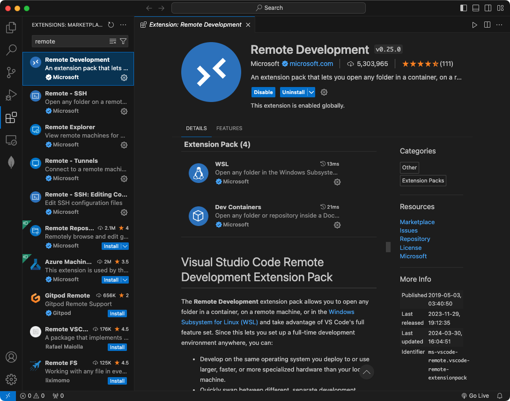

## 2. SSH 설정 구성

노란색 박스로 체크된 하단의 원격 접속 버튼 클릭합니다.

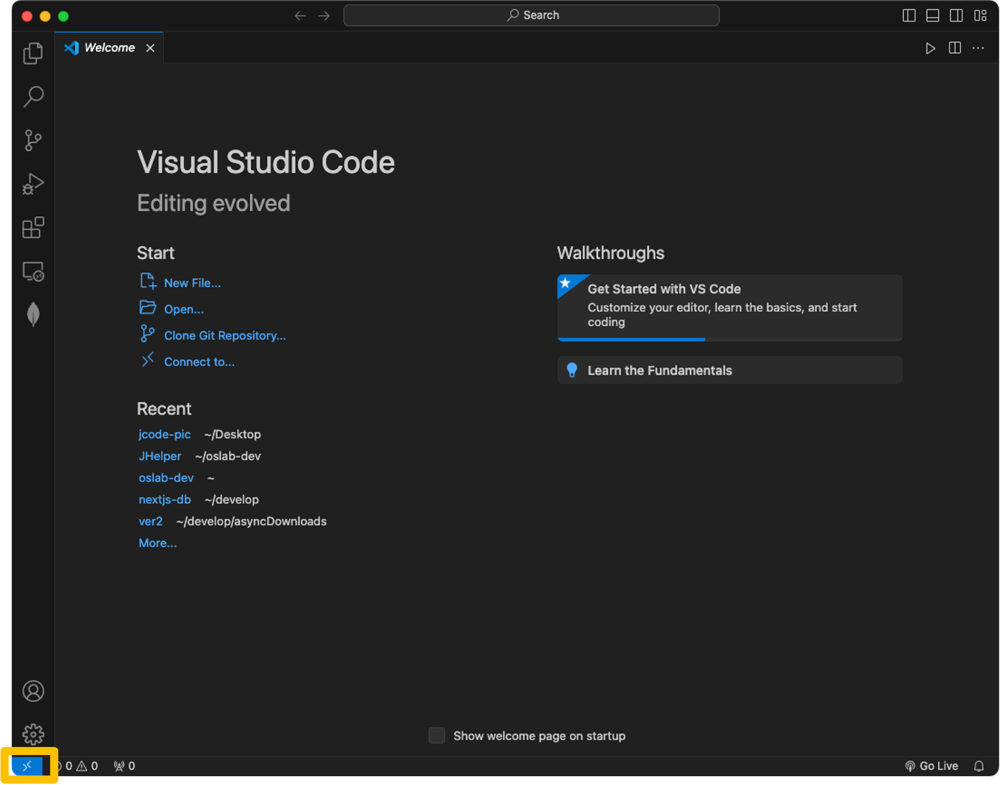

Connect to Host, Add New SSH Host를 클릭합니다.

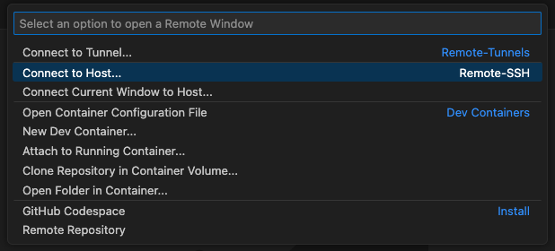
<br/>
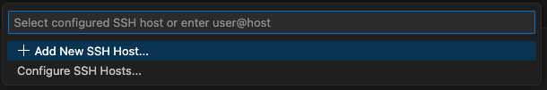


다음과 같이 ssh 명령어를 입력합니다.


```bash
ssh 계정명@jcode.jbnu.ac.kr:포트
```
❗ 이때, 포트는 웹 브라우저 용 JCode 또는 Jupyter Notebook의 포트가 아닌 ssh 포트를 입력해야 합니다.

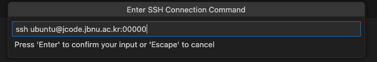

첫번째 버튼을 클릭하여 현재 사용중인 컴퓨터에 원격접속에 대한 정보를 저장합니다.

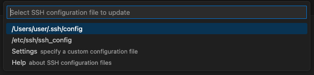


## 3. SSH로 JCode 인스턴스 접속하기

원격 접속 버튼을 클릭하고, Connect to Host를 클릭합니다.


위 과정에서 등록한 JCode 인스턴스를 클릭하여 SSH 연결을 시작합니다.

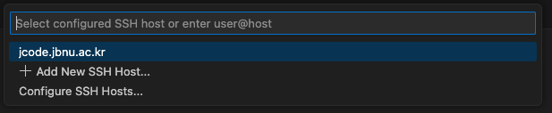

Continue를 누르고 이메일을 통해 전달받은 SSH 비밀번호를 입력하여 접속합니다.


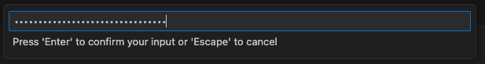


Open Folder를 누르고 OK버튼으로 현재 계정의 홈 디렉토리로 접속합니다.

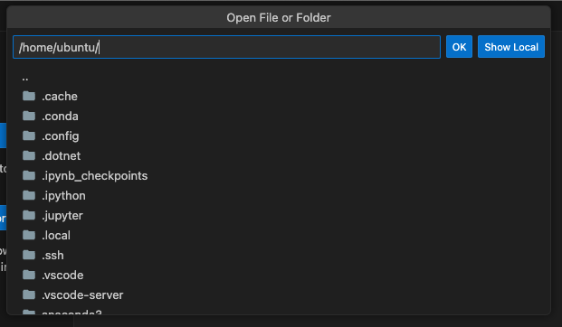

이제, 로컬에 설치된 VSCode로 JCode 인스턴스에서 작업을 수행할 수 있습니다.

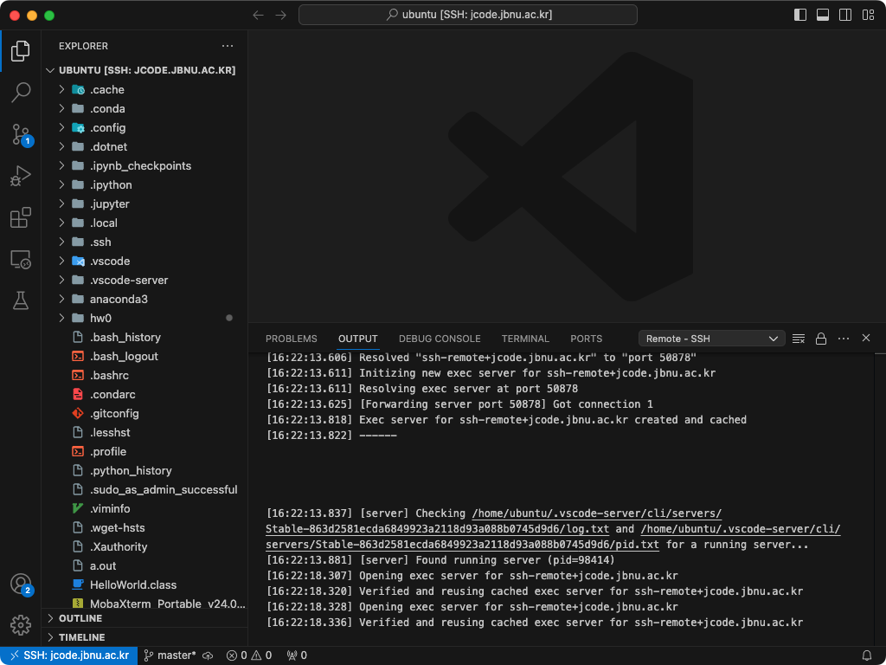


# 접속시 비밀번호 생략하기
VSCode로 SSH연결을 시도하면 비밀번호를 중복으로 입력해야 하는 경우가 잦습니다. 비밀번호를 입력하는 번거로움을 없애고자 할 때, 키 기반의 인증 방식을 사용하여 비밀번호 입력 없이 즉시 ssh 연결을 시도할 수 있습니다.

## 1. `ssh-key`를 이용해 키 쌍 생성하기

먼저, PowerShell 또는 터미널을 열고 다음의 명령어를 사용하여 SSH 키를 생성합니다. 

```powershell
ssh-keygen -t rsa -b 4096
```
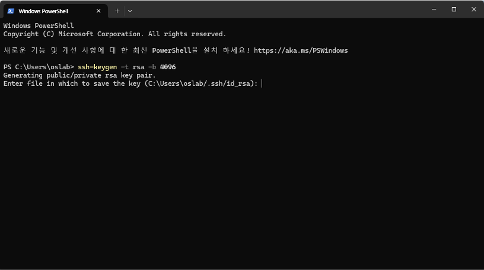


이때 나오는 요청에는 모두 엔터를 눌러 빈칸으로 입력합니다.

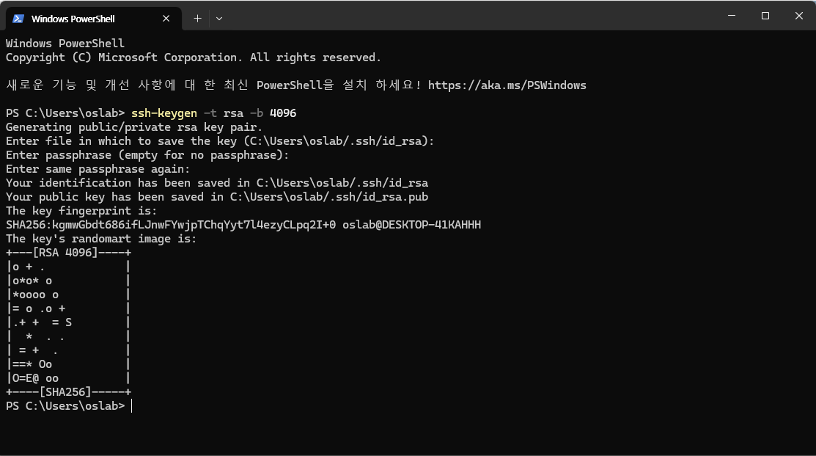


다음의 명령어를 이용하여 생성한 공개키를 확인합니다. 해당 키를 복사하고, 할당받은 JCode에 접속해야 합니다.

```powershell
Get-Content .\.ssh\id_rsa.pub
```

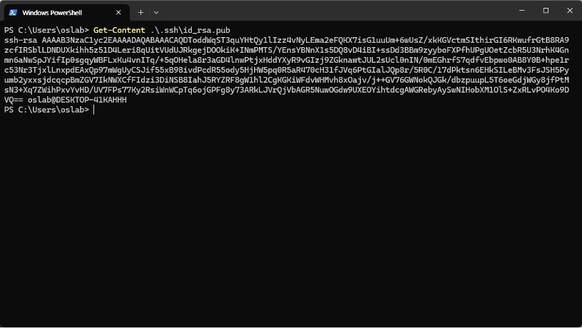


## 2. JCode 인스턴스에 공개키 등록하기

JCode 인스턴스에 접속하여 `~/.ssh/authorized_keys` 파일을 찾고 복사한 공개키를 붙여넣고 저장합니다.

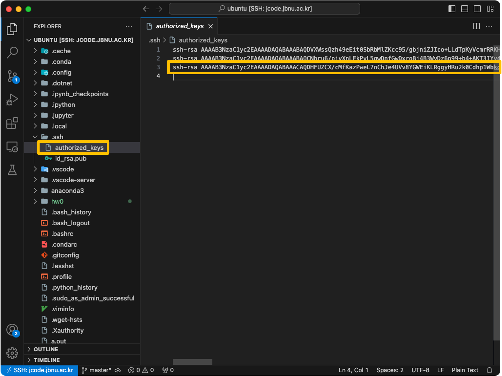

## 3. 로컬 VSCode에 비밀키 등록하기

❗이 과정은 JCode 인스턴스가 아닌 로컬 환경에서 수행해야 합니다.
 
하단의 원격 접속 버튼을 클릭하고 JCode SSH 정보를 저장한 파일(`~/.ssh/config`)을 엽니다.

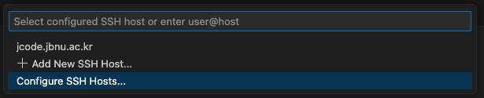
<br/>
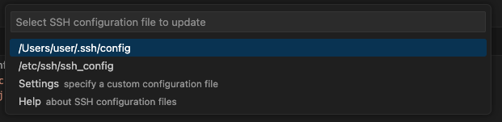

다음과 같이 `IdentityFile`을 등록후 저장합니다.

```
Host jcode.jbnu.ac.kr
    ...
    IdentityFile ~/.ssh/id_rsa
```


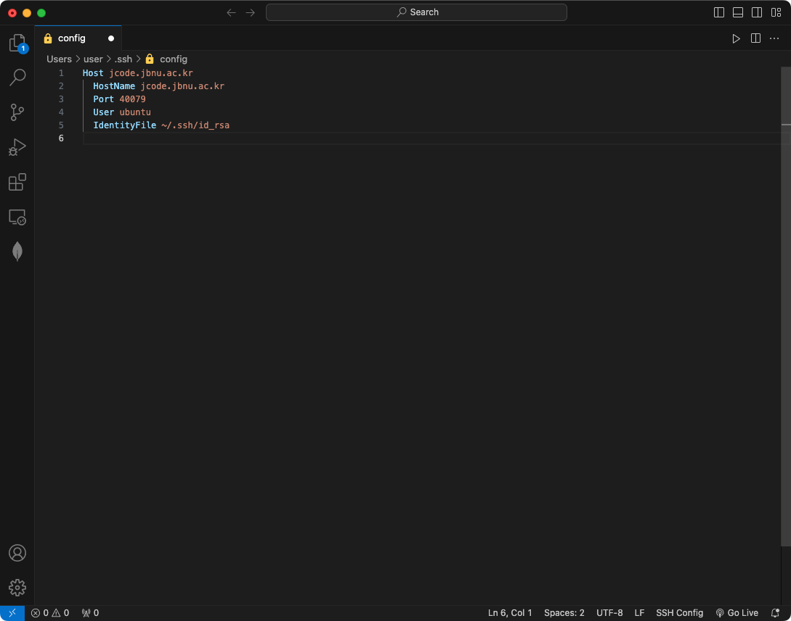


## 4. 비밀번호 없이 JCode 접속하기

이제 설정이 완료되었습니다. 원격 접속 버튼을 통해 SSH 연결을 시도하면 더 이상 비밀번호를 입력할 필요 없이 자동으로 접속됩니다.