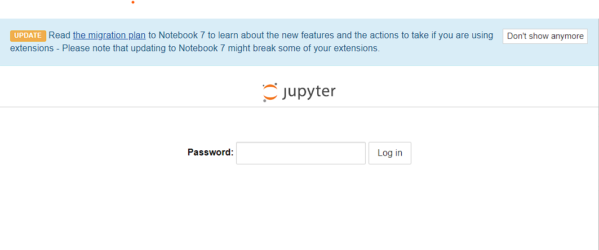
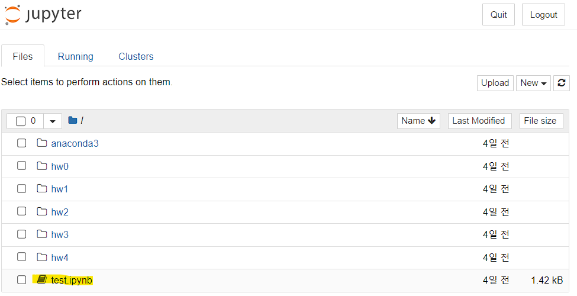
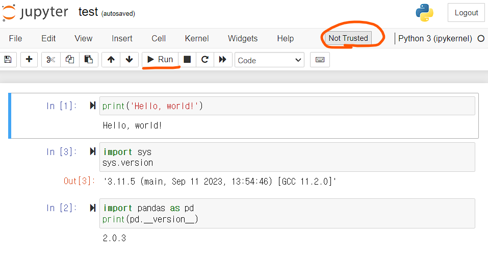

## 강의용 JCode-Jupyter Notebook 사용 방법

### 1. 사용 신청 및 접속

 * 교수님께서 제공해주신 "JCode 사용 신청" 설문 내용을 작성합니다. 
 * 이후 e-mail 로 전달된 접속 주소와 패스워드를 사용하여 나의 JCode-VScode 에 접속합니다.

 

### 2. 첫 화면 및 예제 파일 확인

 * Jupyter Notebook의 첫 화면을 확인할 수 있습니다.
 * 기본 디렉토리로 /home/ubuntu 를 사용하고 있으며, 표시되는 경로는 / 입니다.
 * 예제 파일 test.ipynb 를 선택하여 편집 화면으로 진입합니다.

### 3. 편집 화면 확인

 * 편집 화면에서 "Run"을 선택하여 각각의 블록을 실행할 수 있습니다.
 * 그래픽 표시를 위해 "Not Trusted" 버튼을 클릭하여 "Trusted"로 변경합니다.  

