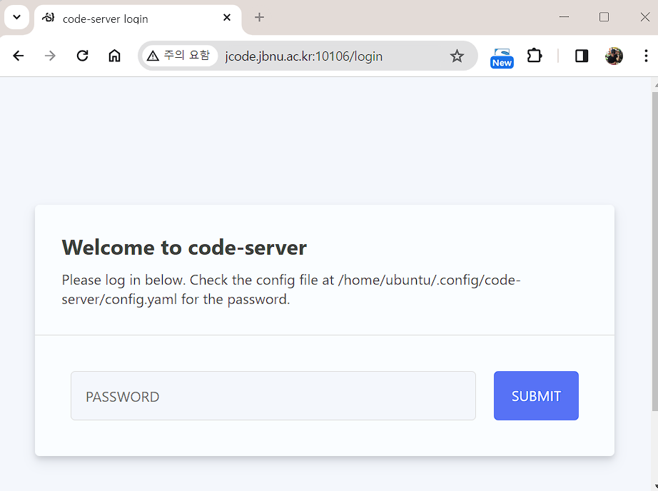
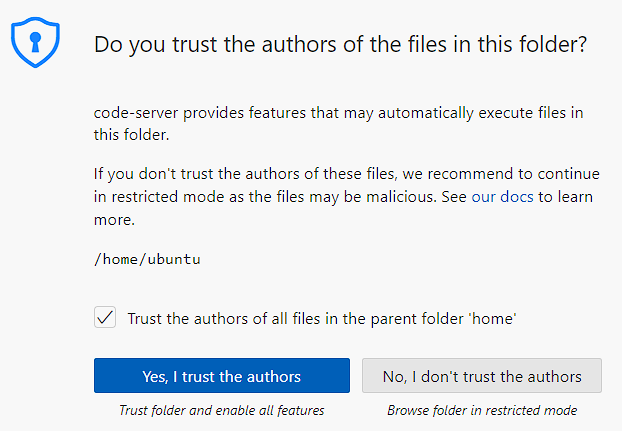
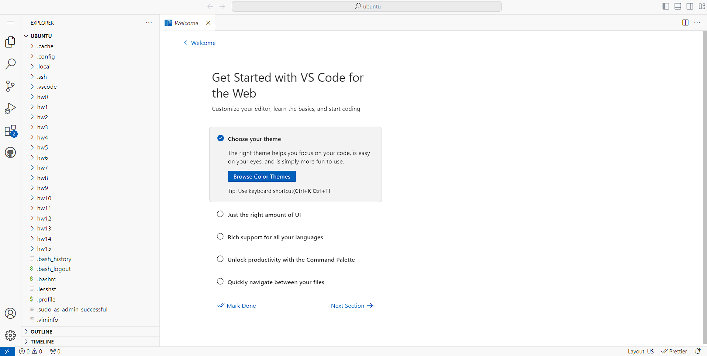
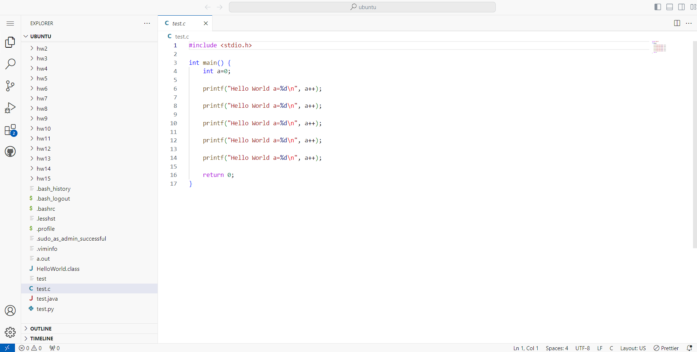
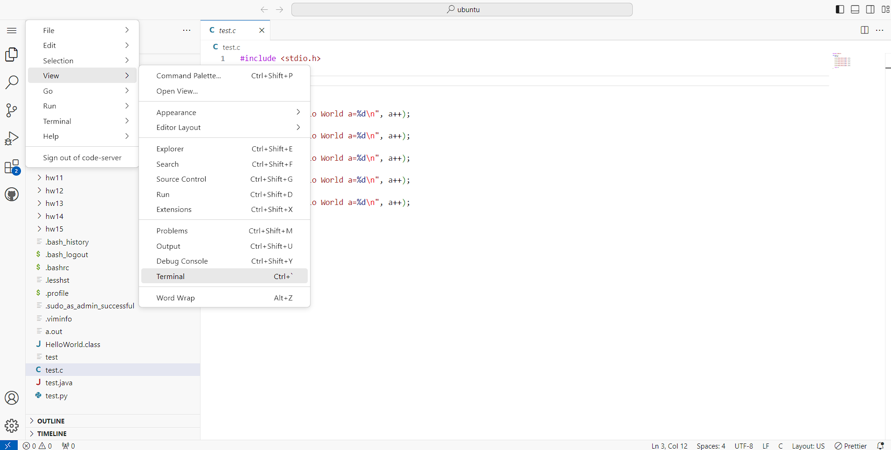
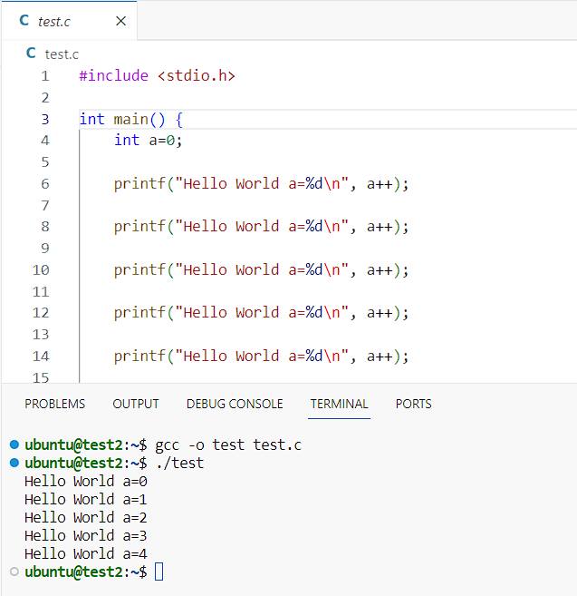
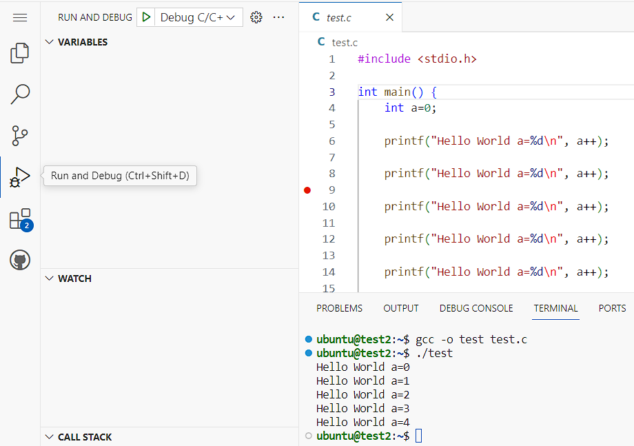
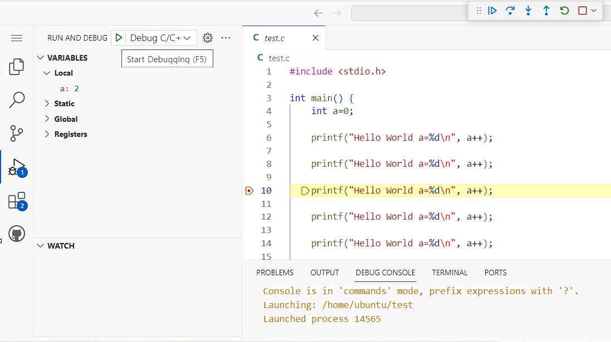

## 강의용 JCode-VSCode 사용 방법

### 1. 사용 신청 및 접속

 * 교수님께서 제공해주신 "JCode 사용 신청" 설문 내용을 작성합니다. 
 * 이후 e-mail 로 전달된 접속 주소와 패스워드를 사용하여 나의 JCode-VScode 에 접속합니다.

 * 이때, 아래와 같은 알림창이 나오면, 체크박스에 체크하고, "Trust" 를 선택합니다.

### 2. 첫 화면

 * 화면 구성을 선택할 수 있습니다. 상단 "Welcome" Tab의 X 를 눌러 스킵할 수 있습니다.
 * 오른쪽 하단에 HTTPS 관련 경고 메시지가 나오는 경우, "I understand"를 클릭하여 닫습니다. 

### 3. 예제 파일 확인

 * 왼쪽 "Explorer" 패널을 통해 파일을 관리하고, 오픈할 수 있습니다.
 * 기본 디렉토리로 /home/ubuntu 를 사용하고 있습니다.
 * test.c 파일을 클릭하여 오픈합니다.

### 4. 터미널 패널 오픈

 * 왼쪽 상단의 메뉴 버튼 (가로줄 3개)을 클릭하고, View->Terminal 을 선택하여 터미널 패널을 엽니다. 

### 5. 터미널에서 컴파일 및 실행

 * Terminal 화면에서 gcc 를 이용해 컴파일을 수행하고, 결과를 확인할 수 있습니다. 

### 6. 디버그 패널 및 중단점 (break point) 설정

 * 왼쪽 메뉴 버튼 중 "Run and Debug" 을 선택합니다.
 * 오른쪽 소스 코드에서 줄번호 영역을 클릭하여 중단점을 설정합니다. 

### 7. 디버깅 모드로 실행

 * 왼쪽 초록색 삼각형 옆의 메뉴를 "Debug C/C++"로 설정하고, 삼각형 버튼을 눌러 실행합니다.
 * 설정한 중단점에서 수행이 멈추며, 왼쪽 패널에서 현재 상태를 확인할 수 있습니다.
 * 상단 메뉴에서 

