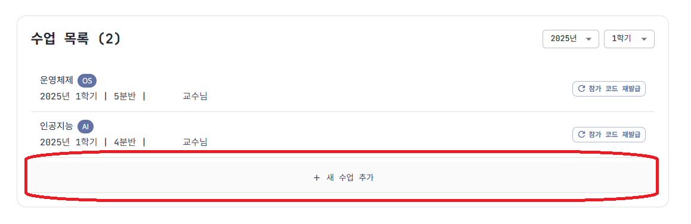
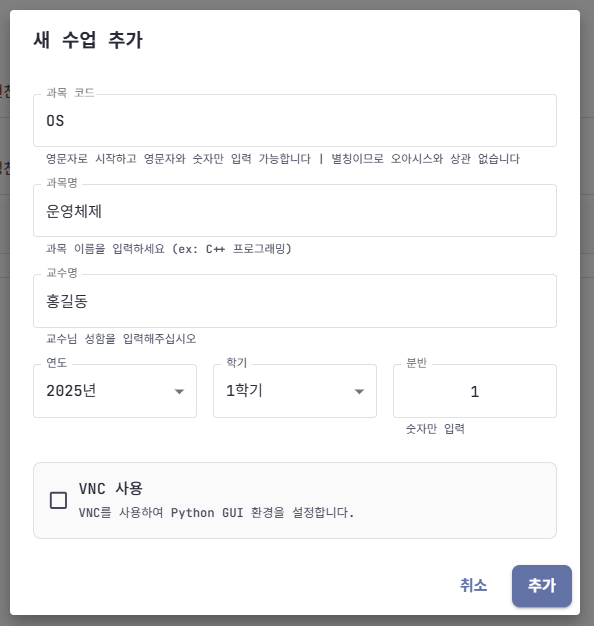

## 1. 수업 생성

### 1-1. 수업 추가 방법
- **Watcher 메뉴**에서 **새 수업 추가** 버튼을 클릭하세요.

### 1-2. 입력 항목 안내
- **과목 코드**
  - 영문자로 시작, 영문자와 숫자만 사용 가능
  - 띄어쓰기 불가
  - 중복 가능 (오아시스 과목코드와 달라도 됨)
  - **추천**: OS(운영체제), AI(인공지능) 등 직관적인 영문 약자
  
- **과목명**: 수업 전체 이름

- **교수명**: 담당 교수 이름

- **연도/학기/분반**
  - 분반은 숫자만 입력 가능

- **VNC 사용 여부**
  - VNC 필요 시 체크 (VNC 전용 이미지로 생성됨)

## 2. 수업 참가 코드

### 2-1. 참가 코드 관리
- 수업 생성 완료 시 교수님 계정의 JCode와 참가 코드가 발행됩니다.
- **참가 코드 공유**: 카카오톡, 클래스룸, LMS 등으로 학생들에게 전달
- **⚠️ 주의**: 이 화면을 닫으면 코드 재확인 불가, 필요시 신규 발급 필요

- 이전 참가 코드는 사용할 수 없습니다.

## 3. 교수/조교용 JCode 종류

1. **코드 SnapShot JCode**: 모든 학생 코드 확인 가능
2. **일반 JCode**: 학생 환경과 동일한 작업 환경

### 3-1. 코드 SnapShot JCode

- 모든 코드는 실시간 수집 (UTC 기준, 한국시간 +9시간)
- **파일명 형식**: 학번/날짜_시간.확장자
  - 예: 2020XXXXXX/20250314_022537.py
  - 의미: 2020XXXXX 학생이 2025년 3월 14일 11:25:37(KST)에 수정한 파이썬 파일

### 3-2. 일반 JCode

- 일반 JCode 사용법은 [학생용 JCode 매뉴얼](/JCode/studentManual/jcodeStudentManual)을 참고하세요.