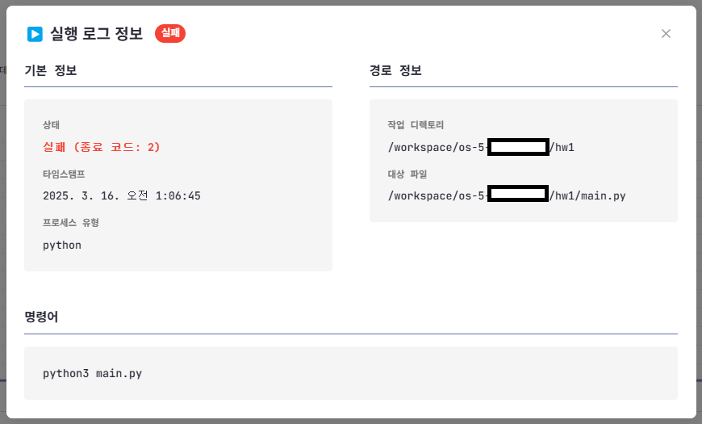

## 1. 수업 목록

- 통계를 보고자 하는 과목을 클릭합니다.

## 2. 학생 관리

### 2-1. 학생 목록 확인
- **학생 탭**을 누르면 수업에 참가한 학생 목록을 볼 수 있습니다.

### 2-2. 학생 관리 기능
- **탈퇴**
  - 해당 학생을 수업에서 탈퇴시킵니다.
  - ⚠️ 주의: 학생에게 할당된 JCode도 함께 삭제됩니다.
  
- **권한 변경**
  - 구성원을 조교 또는 학생으로 권한을 변경합니다.
  - **조교 권한**:
    - 탈퇴와 권한 변경을 제외한 모든 학생 접근 권한 부여
    - 전체 학생 JCode 접속 및 수정 가능
    - 전체 학생 통계 조회 가능

## 3. 과제 관리

### 3-1. 과제 추가 방법
- **과제 코드**
  - 현재 버전에서는 hw1~hw10까지 지원
  - JCode 이미지에 hw1부터 hw10까지의 폴더가 미리 생성되어 있음
  - 학생 코딩 데이터는 이 폴더 기준으로 수집됨
  
- **과제명**: 과제의 이름 입력

- **일정**: 시작 일시와 마감 일시 설정

## 4. 전체 통계 분석

### 4-1. 기능 개요
- **목적**: 선택한 기간 동안 전체 학생들의 코드 변화량 확인

### 4-2. 사용 방법
- **기간 설정**
  - 시작/종료 범위: 과제 시작일과 마감일 기준
  - 슬라이더 또는 날짜 직접 선택 가능
  - 설정 후 **조회** 버튼을 클릭하여 차트 갱신
  
- **검색 및 정렬**
  - 왼쪽 위 버튼: 이름, 변화량, 학번 순 정렬
  - 오른쪽 위 검색창: 이름 또는 학번으로 검색

### 4-3. 데이터 수집 방식
- 과제 단위로 수집 (예: `hw1` 과제의 전체 학생 데이터)
- `hw##` 폴더 내 `.c` 또는 `.py` 파일의 전체 변화량 합계

## 5. 과제 수행 학생 목록

### 5-1. 학생별 접근 기능
- **JCode 버튼**
  - 해당 학생의 JCode(IDE)로 직접 접속
  - 학번/이름만으로 접속하여 학생이 작업한 코드 확인 및 피드백 가능
  
- **Watcher 버튼**
  - 해당 학생의 개인 세부 통계 확인

## 6. 개인 세부 통계(Watcher)

### 6-1. 수집 정보
- `hw##` 폴더 내 `.c` 또는 `.py` 파일의 총 코드량 및 변화량
- 빌드, 실행에 대한 로그 수집

### 6-2. 빌드 및 실행 로그 확인

- 빌드/실행이 짧은 시간에 집중된 경우 겹쳐 표시될 수 있으므로 확대하여 세밀하게 확인
- 영역 클릭 시 세부 로그 확인 가능

### 6-3. 실행 로그 상세 정보

- **기본 정보**
  - 상태: 성공 또는 실패
  - 시간 정보
  - 프로세스 유형: 바이너리 실행 파일(./example) 또는 Python 실행
  
- **경로 정보**
  - 작업 디렉토리
  - 실제 실행된 파일
  
- **명령어**
  - 사용자가 실제로 입력한 명령어

### 6-4. 빌드 로그 상세 정보

- **기본 정보**
  - 상태: 성공 또는 실패
  - 시간 정보
  - 빌드한 파일의 크기
  
- **경로 정보**
  - 작업 디렉토리
  - 대상 파일: 실제 빌드한 파일
  - 바이너리 경로: gcc의 경로
  
- **명령어**
  - 사용자가 빌드에 사용한 명령어