## 1. 수업 참가 방법

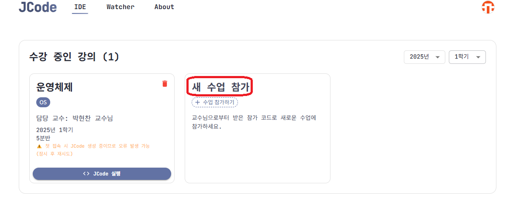

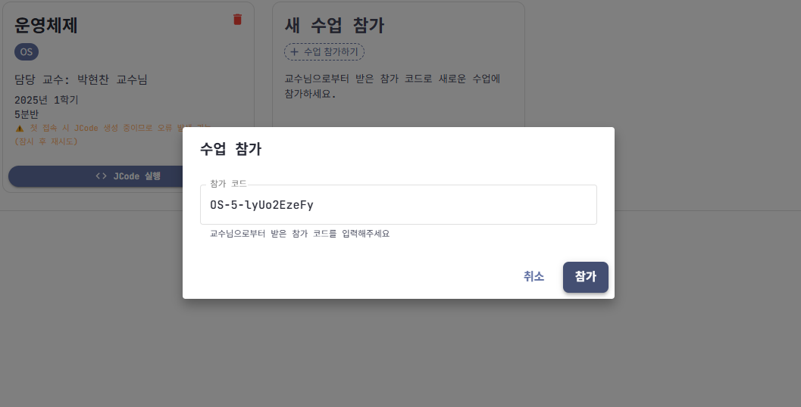

- 교수님으로부터 받은 참가 코드를 입력하여 수업에 가입합니다.

## 2. 수업 탈퇴 방법

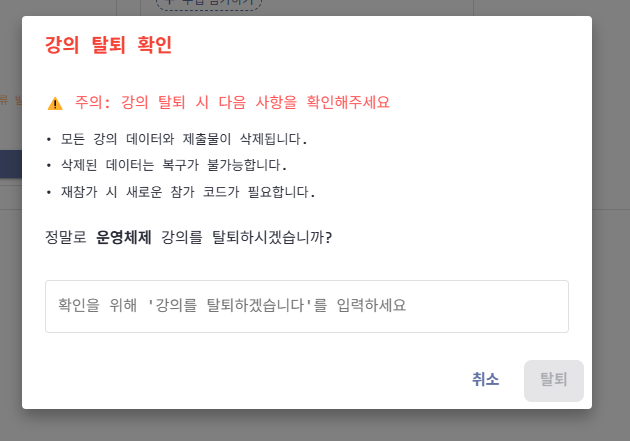

- **수업 탈퇴** 버튼을 클릭한 후 탈퇴 프로세스를 완료해야 탈퇴됩니다.
- ⚠️ **주의**: 모든 데이터는 삭제 후 복구가 불가능합니다.

## 3. JCode 실행하기

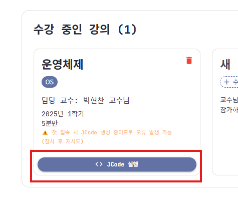

- **JCode 실행** 버튼을 클릭하면 웹 기반 IDE 서비스로 이동합니다.
- 강의 가입 후 첫 실행 시 JCode가 생성되는 시간이 필요합니다.
  - 접속 실패 메시지가 표시되면 잠시 후 다시 시도해 보세요.

## 4. 파일명 규칙 및 폴더 구조

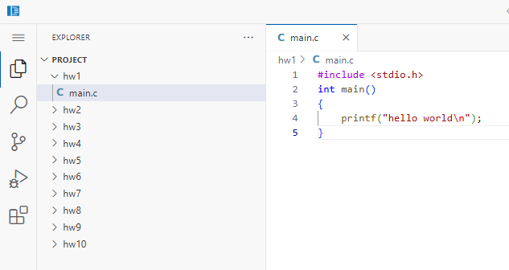

### 4-1. 과제 폴더 사용법
- 교수님이 지정한 **과제 코드**와 일치하는 폴더 내에서 과제를 수행해야 합니다.
  - 폴더는 미리 생성되어 있습니다 (과제 수에 따라 일부 폴더는 사용되지 않을 수 있음).
  - 지정된 **과제 코드(폴더명)** 외의 다른 폴더에서 작업할 경우 데이터가 올바르게 수집되지 않을 수 있습니다.
  - ⚠️ **중요**: 올바른 폴더에서 작업하지 않으면 데이터 수집 오류로 **불이익**을 받을 수 있습니다.

### 4-2. 폴더 관리
- 실수로 폴더를 삭제한 경우, 동일한 폴더명(hw1~10)으로 다시 생성하면 데이터 수집이 재개됩니다.
  - 이전 통계 데이터는 유지됩니다.
  - 단, 삭제된 파일 자체는 복구할 수 없으니 주의하세요.

### 4-3. 데이터 수집 대상
- 데이터 수집은 `.c`, `.py` 파일만 대상으로 합니다.
  - 실행 파일이나 기타 확장자(이미지, PDF 등)는 수집되지 않습니다.

## 5. 빌드 및 실행 방법

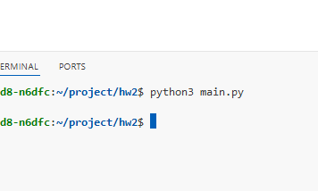
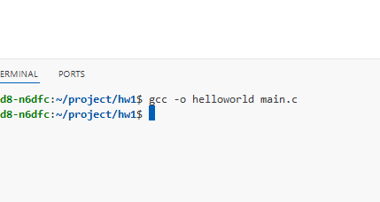

### 5-1. C 프로그램 실행
- `gcc` 명령으로 빌드 후 실행 파일은 같은 디렉토리에 생성됩니다.
- 실행은 `./실행파일명` 형식으로 진행합니다.
- `|` 파이프라인 사용도 가능합니다.

### 5-2. Python 프로그램 실행
- `python3` 명령으로 즉시 실행되며 결과가 출력됩니다.

## 6. 확장 프로그램 사용

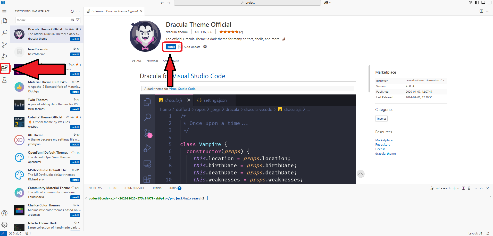

- 일반 VSCode와 같이 Extensions 설치가 자유롭게 가능합니다.
- `(sudo) apt-get` 등의 패키지 설치도 가능합니다.
  - 저장 공간이 제한적이므로 필요한 만큼만 설치하는 것을 권장합니다.

## 7. VNC 접속 방법 (선택 사항)

### 7-1. VNC 접속 단계

1. **터미널 열기**
   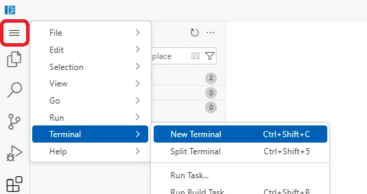

2. **포트 추가하기**
   - port 탭에서 `Add Port` 버튼 클릭
   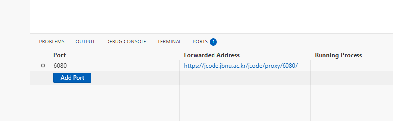
   - `6080` 포트번호 입력

3. **포워딩 주소 설정**
   - Forwarded Address에서 지구 모양 아이콘 클릭
   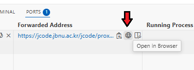

4. **VNC 페이지 접속**
   - 리다이렉트된 페이지에서 `vnc.html` 접속
   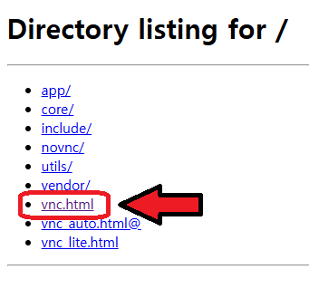

5. **연결 성공 후 사용**
   - 파이썬 GUI 실행 예시
   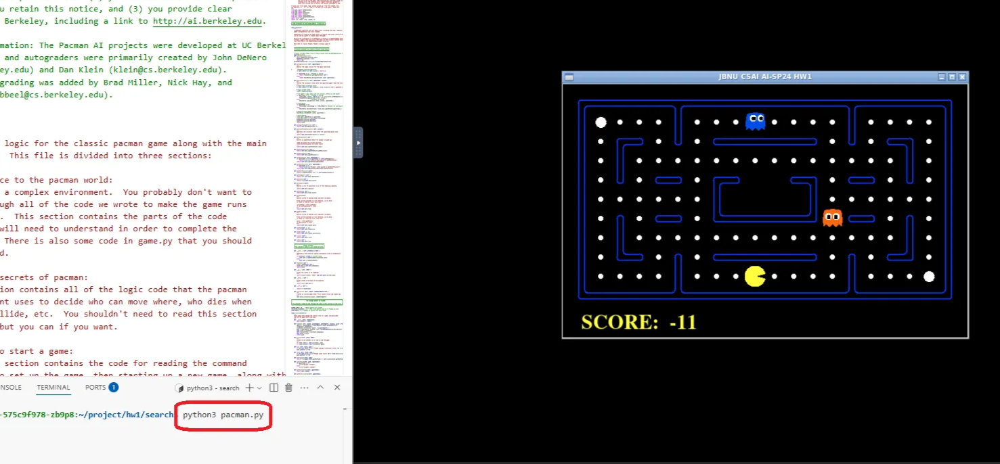
   - JCode 터미널에서 `python3` 명령 실행 시 VNC 창에서 결과 확인 가능

### 7-2. VNC 사용 가능 과목
- VNC 기능은 VNC를 사용하도록 설정된 과목에서만 사용 가능합니다.