## 1. 수업 참가 방법

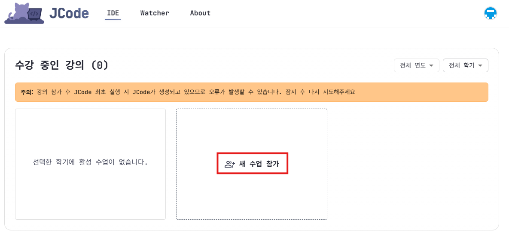

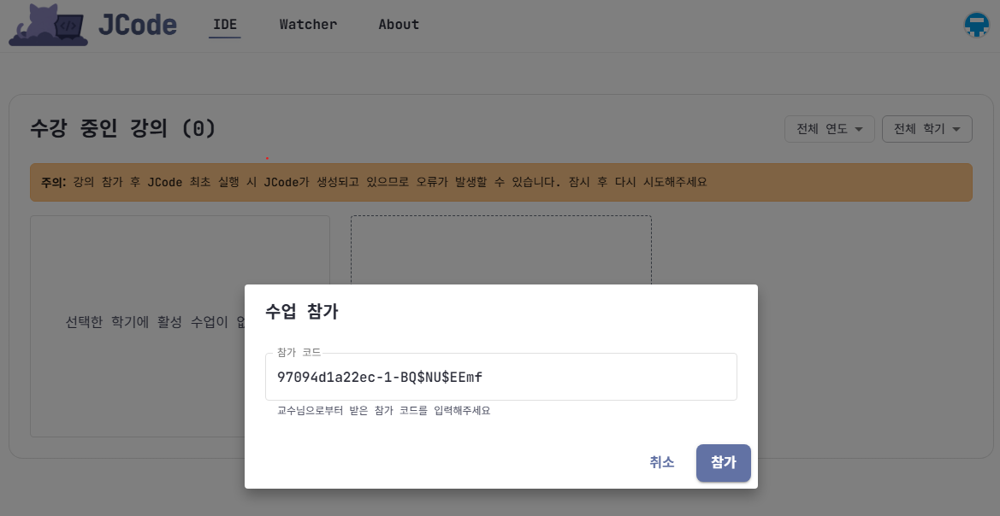

- 교수님으로부터 받은 참가 코드를 입력하여 수업에 가입합니다.

## 2. 수업 탈퇴 방법

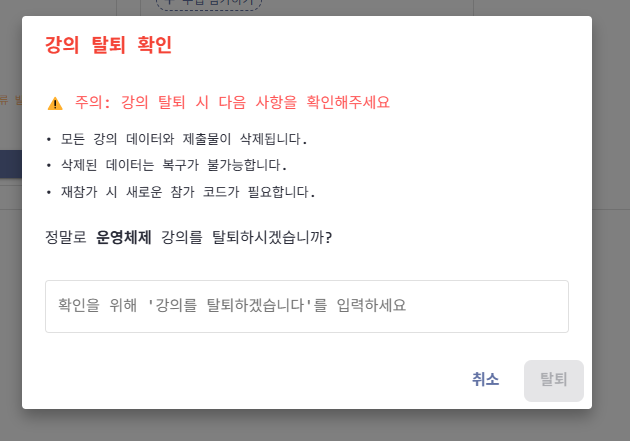

- **수업 탈퇴** 버튼을 클릭한 후 탈퇴 프로세스를 완료해야 탈퇴됩니다.
- ⚠️ **주의**: 모든 데이터는 삭제 후 복구가 불가능합니다.

## 3. JCode 실행 및 작업공간 사용 방법

- JCode는 전체 작업공간을 열거나, 과제 하나의 작업공간만 열어 사용할 수 있습니다.
- 강의 가입 후 첫 실행 시 JCode가 생성되는 시간이 필요합니다.
  - 접속 실패 메시지가 표시되면 잠시 후 다시 시도해 보세요.

### 3-1. 전체 작업공간 열기

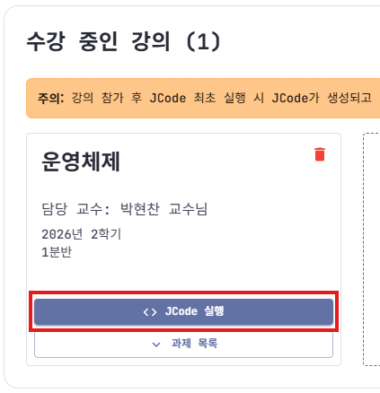

- 수업 카드의 **JCode 실행** 버튼을 클릭하면 웹 기반 IDE 서비스로 이동합니다.

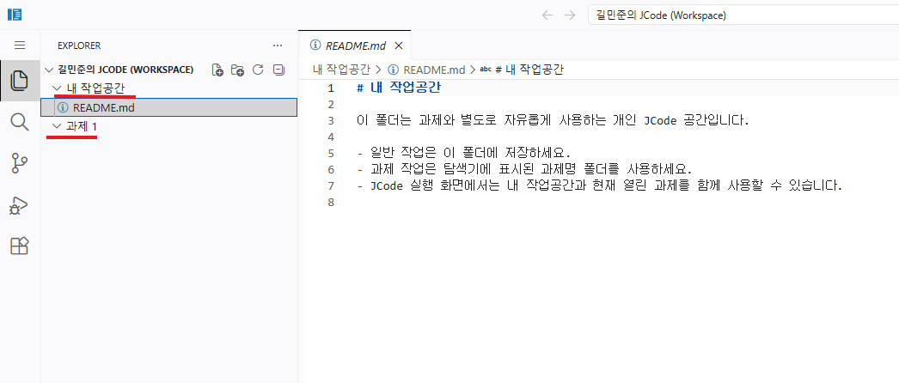

- 탐색기에서 **내 작업공간**과 모든 과제 공간을 함께 확인할 수 있습니다.
- **내 작업공간**은 과제와 별도로 자유롭게 사용하는 일반 작업공간입니다.
  - 일반 작업공간은 **Watcher 데이터 수집 대상이 아닙니다**.
- 과제를 수행할 때는 탐색기에 표시된 해당 **과제명 폴더**를 사용합니다.

### 3-2. 과제별 작업공간 열기

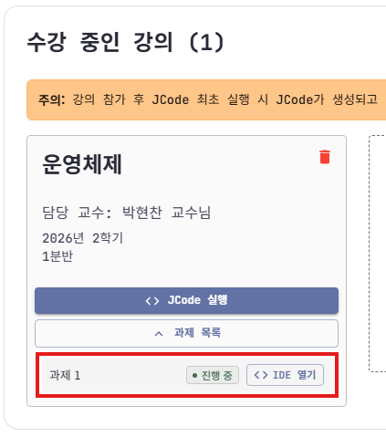

- 수업 카드의 **과제 목록**을 펼친 후, 원하는 과제의 **IDE 열기** 버튼을 클릭합니다.

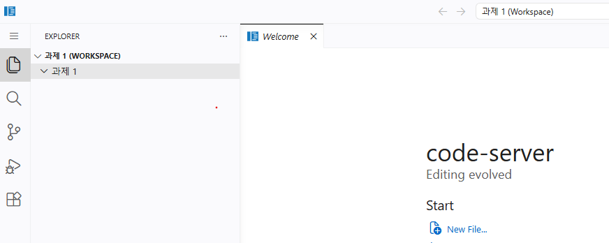

- 탐색기에는 선택한 과제의 작업공간만 표시됩니다.
- 표시된 **과제명 폴더** 내에서 과제를 수행합니다.
- 교수님이 **스타터 코드**를 제공한 경우, 과제 시작 시 과제 폴더에 기본 파일이 제공됩니다.
  - 해당 파일을 바탕으로 코드를 작성하거나 수정하여 과제를 수행합니다.
- 두 접속 방법은 탐색기에 표시되는 작업공간의 범위만 다릅니다.
  - 같은 과제 폴더에서 작업하면 어느 방법으로 접속하더라도 동일한 과제 파일을 사용합니다.

### 3-3. 데이터 수집 대상

- Watcher는 **과제 공간** 내의 `.c`, `.h`, `.cpp`, `.hpp`, `.py`, `.ipynb` 파일을 수집합니다.
  - 실행 파일이나 기타 확장자(이미지, PDF 등)의 파일은 수집되지 않습니다.
- **내 작업공간**에 저장한 파일은 위 확장자에 해당하더라도 Watcher 데이터 수집 대상이 아닙니다.
- ⚠️ **주의**: 과제 수행 기록이 수집되도록 반드시 해당 **과제명 폴더** 내에서 작업하세요.

## 4. 빌드 및 실행 방법

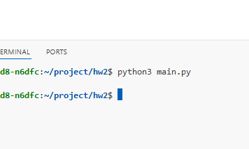
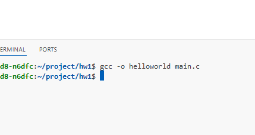

### 4-1. C 프로그램 실행
- `gcc` 명령으로 빌드 후 실행 파일은 같은 디렉토리에 생성됩니다.
- 실행은 `./실행파일명` 형식으로 진행합니다.
- `|` 파이프라인 사용도 가능합니다.

### 4-2. Python 프로그램 실행
- `python3` 명령으로 즉시 실행되며 결과가 출력됩니다.

## 5. 패키지 설치 방법

- `pip install`을 통한 설치만 가능합니다.
- 이외의 설치가 필요한 경우 관리자(<ObfuscatedEmail user="jedutools" domain="gmail.com" />)에게 문의해 주세요.

## 6. VNC 접속 방법 (선택 사항)

### 6-1. VNC 접속 단계

1. **터미널 열기**
   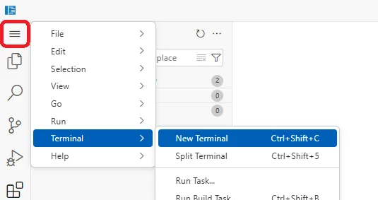

2. **포트 추가하기**
   - port 탭에서 `Add Port` 버튼 클릭
   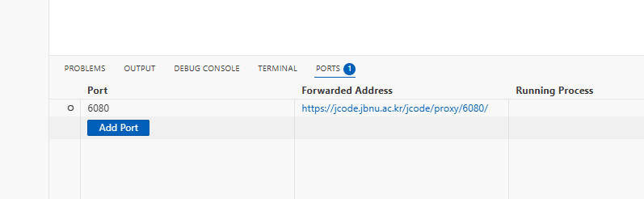
   - `6080` 포트번호 입력

3. **포워딩 주소 설정**
   - Forwarded Address에서 지구 모양 아이콘 클릭
   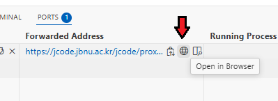

4. **VNC 페이지 접속**
   - 리다이렉트된 페이지에서 `vnc.html` 접속
   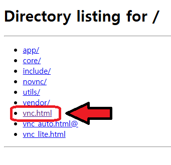

5. **연결 성공 후 사용**
   - 파이썬 GUI 실행 예시
   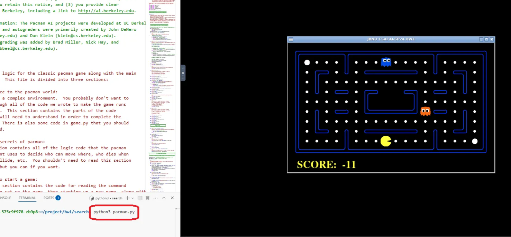
   - JCode 터미널에서 `python3` 명령 실행 시 VNC 창에서 결과 확인 가능

### 6-2. VNC 사용 가능 과목
- VNC 기능은 VNC를 사용하도록 설정된 과목에서만 사용 가능합니다.
