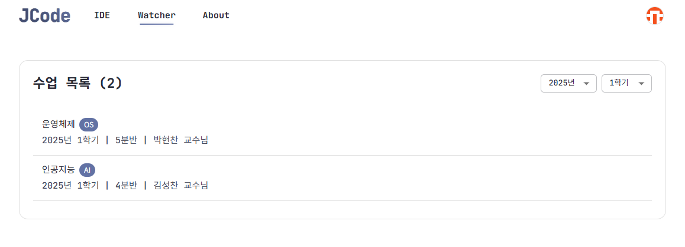
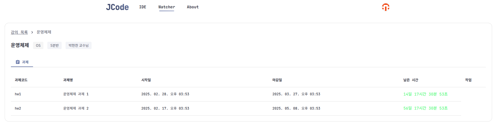
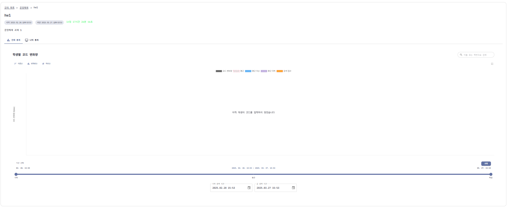
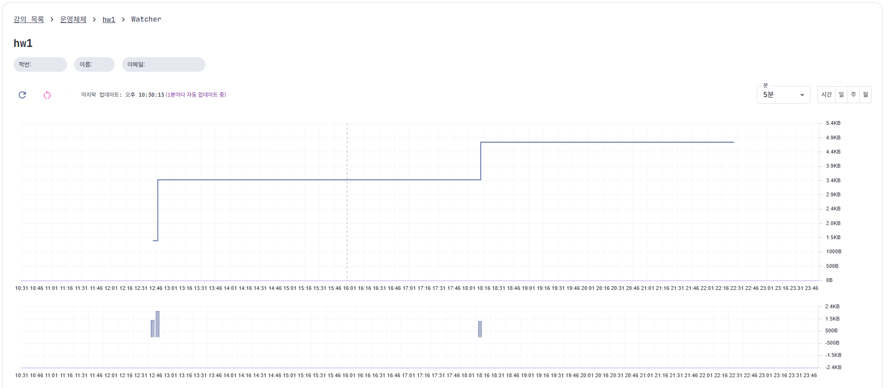

## 1. 수업 목록 확인

- 통계를 보고자 하는 과목을 클릭합니다.

## 2. 과제 목록 확인

- 과제 목록에서 원하는 과제를 클릭하여 다음 정보를 확인할 수 있습니다:
  - 전체 학생들의 통계 데이터
  - 자신의 개인 통계 데이터

## 3. 전체 통계 분석

- 기능 설명
    - 과제를 수행하고 있는 전체 학생들의 코드 변화량을 차트로 확인할 수 있습니다.

- 사용 방법
    - 기간 선택 후 **조회** 버튼을 클릭하면 해당 기간 동안의 코드 변화량이 표시됩니다.

## 4. 나의 통계 확인

### 4-1. 개인 코딩 기록
- 해당 과제에 대한 자신의 코딩 기록을 상세히 확인할 수 있습니다.
  - JCode에서 과제 수행 시 데이터가 자동으로 연동됩니다.
  - 코드의 총량과 변화량이 실시간으로 기록됩니다.

### 4-2. 데이터 수집 안내
- Watcher는 hw1~10 폴더에 대한 데이터를 수집합니다.
- **⚠️ 주의사항**:
  - 로컬 환경에서 작업 후 복사하거나, 타인의 코드, AI 도구(GPT 등)를 사용할 경우 **의심스러운 코딩 기록**이 남을 수 있습니다.
  - 다음 정보가 모두 수집됩니다:
    - 코드의 총량
    - 코드의 변화량
    - 빌드 횟수
    - 빌드의 종류
    - 코딩의 모든 기록