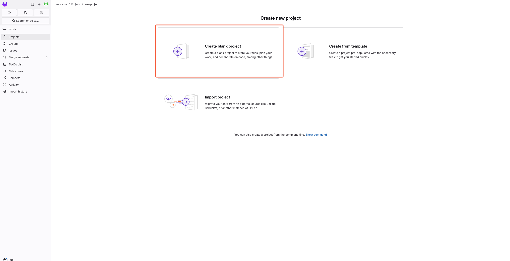

## 0. JFlow - GitLab

**`소스 코드 관리, 이슈 추적` 등 `프로젝트 라이프사이클을 관리하는 통합 개발 플랫폼`입니다.**  
**`코드 협업`과 `프로젝트 관리`를 원활하게 수행할 수 있습니다.**

 

> - JFlow에서 제공하는 GitLab는 **`교내 메일`**을 이용해 접속 가능합니다.
>
> - 각 사용자는 다른 사용자와 **`격리된 환경`**을 사용할 수 있습니다.
>
> - 가이드에서 부족한 설명은 [GitLab 공식 문서](https://docs.gitlab.com/)를 참고 바랍니다.

## 1. GitLab 접속 방법

> GitLab은 아래의 URL을 통해 접속할 수 있습니다.

> **https://gitlab.jbnu.ac.kr**

## 2. 프로젝트 관리

 

**0. 사용자별 격리 환경**

- `GitLab`은 `Private` 또는 `Public`으로 프로젝트를 생성할 수 있습니다.

 

**1. 프로젝트 생성**

> - `Create Project`를 선택합니다.

    

> - `Create blank project`를 선택합니다.   (프로젝트를 가져오려면 import를 선택합니다.)

    

> - `Private` 또는 `Public`을 선택해 생성합니다.

    

 

**❗2. Access Token 생성 ❗ **

> ** 원격에서 저장소를 연결하기 위해 Access Token이 필요합니다.**  
> (비밀번호도 사용 가능하나, 권장하지 않습니다.)

 

> - `profile` → `Edit profile` 로 접속합니다. 

    

> - `Access tokens` → `Add new token` 을 클릭합니다.

    

> - 필요한 권한을 선택 후 생성을 완료합니다. **(토큰은 잘 보관합니다.)**

    

**3. 원격 저장소 연결**

> **개인 노트북과 같은 장치에서 저장소를 연결합니다.**  
> (https 사용을 권장합니다.)

 

**🚨 토큰을 이용해 remote를 추가해야 합니다. 🚨**

    git remote add origin https://oauth2:<발급받은Access-Token>@gitlab.jbnu.ac.kr/test/test.git

    

