

## ⚠️ Grafana 사용 주의 사항 ⚠️

**Grafana는 기본적으로 제공되지 않습니다.**  
**사용 필요 시, nhj7804@jbnu.ac.kr 로 문의 바랍니다.**

## 0. JFlow - Grafana

**다양한 데이터 소스로부터 수집된 정보를 시각화하는 오픈소스 `분석 및 모니터링 플랫폼`입니다.**  
**직관적인 대시보드를 통해 `시스템 성능과 애플리케이션 상태를 실시간으로 모니터링`할 수 있습니다.**

 

> - JFlow에서 제공하는 Grafana는 **`교내 메일`**을 이용해 접속 가능합니다.
>
> - 각 사용자는 다른 사용자와 **`격리된 환경`**을 사용합니다.
>
> - 가이드에서 부족한 설명은 [Grafana 공식 문서](https://grafana.com/docs/)를 참고 바랍니다.

## 1. Grafana 접속 방법

> Grafana는 아래의 URL을 통해 접속할 수 있습니다.

> **https://grafana.jbnu.ac.kr**

## 2. 프로젝트 관리

 

**0. 사용자별 격리 환경**

- Grafana는 개인별로 조직을 할당해 격리된 환경을 제공합니다.  
**(자신의 계정과 같은 이름의 조직에 접속되었는지 확인합니다.)**

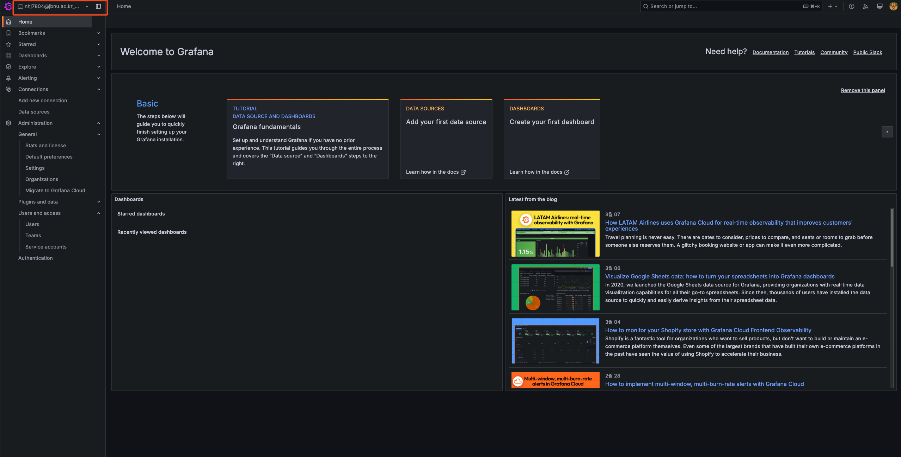    

## 3. 데이터소스 연결

**`Grafana`는 여러 데이터소스와 연결을 통해 `모니터링 환경`을 제공합니다.** 

 

**1. `Data sources` → `Add data source` 버튼을 클릭합니다.**

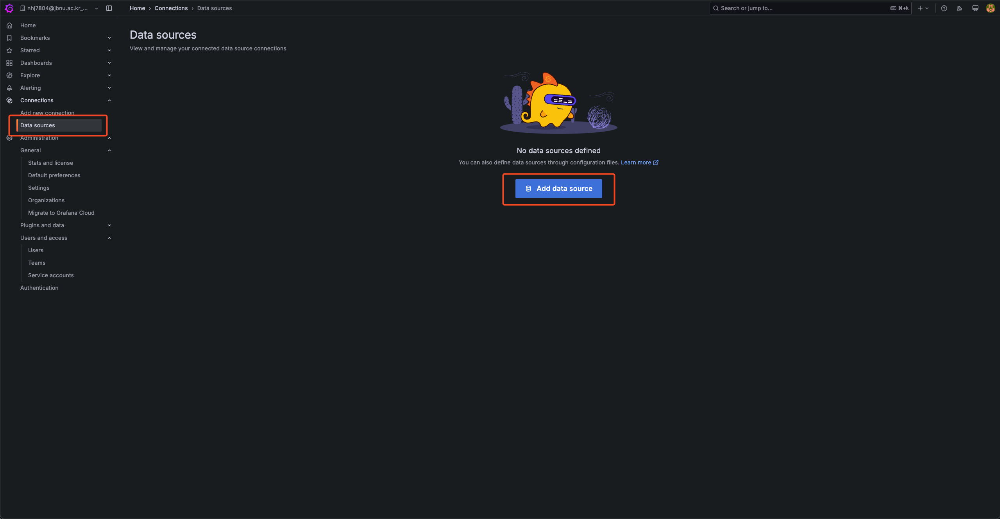    

**2. 모니터링이 필요한 데이터 소스를 선택합니다.**

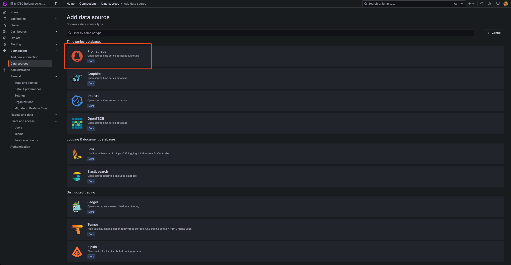    

**3. 데이터 소스 연결을 위한 URL을 입력합니다.**

- `JCloud` 인스턴스에 배포 후 모니터링을 진행 시, 아래 이미지와 같은 형식으로 입력하면 됩니다.

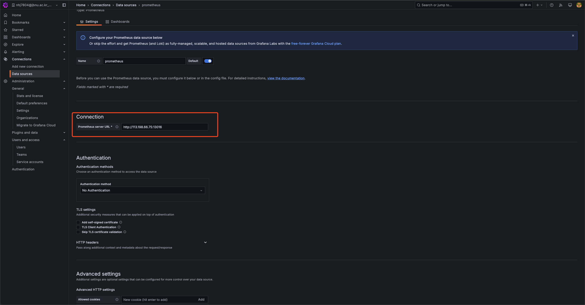    

**4. `Save & test` 버튼을 클릭해 연결을 확인합니다.**

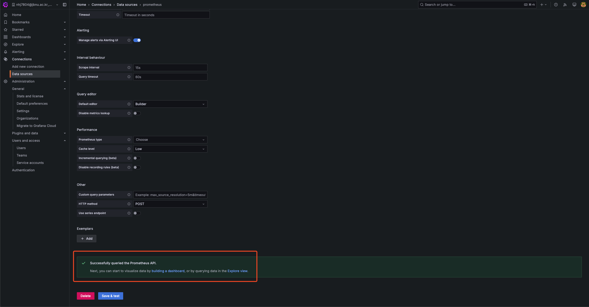    

## 4. Dashboard 생성

**데이터 소스 연결을 완료했다면, `대시보드를 생성`해 모니터링 할 수 있습니다.**

 

**1. `Dashboards` `Create dashboard` 버튼을 클릭합니다.**

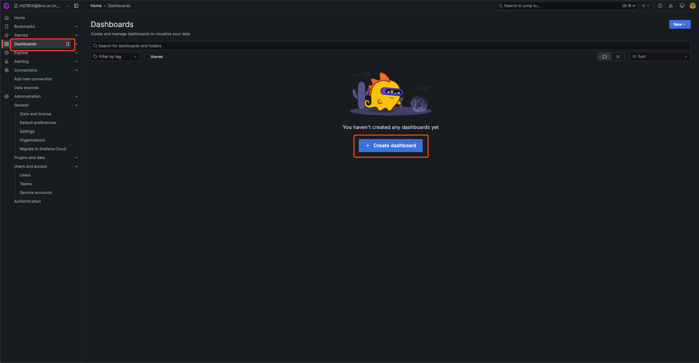    

**2. Dashboard를 생성합니다.**

- Dashboard를 직접 생성할 수 있지만, 가이드에서는 `Import`를 통해 진행합니다.  
    ([Grafana dashboads](https://grafana.com/grafana/dashboards/)에서 필요한 dashboard를 찾을 수 있습니다.)

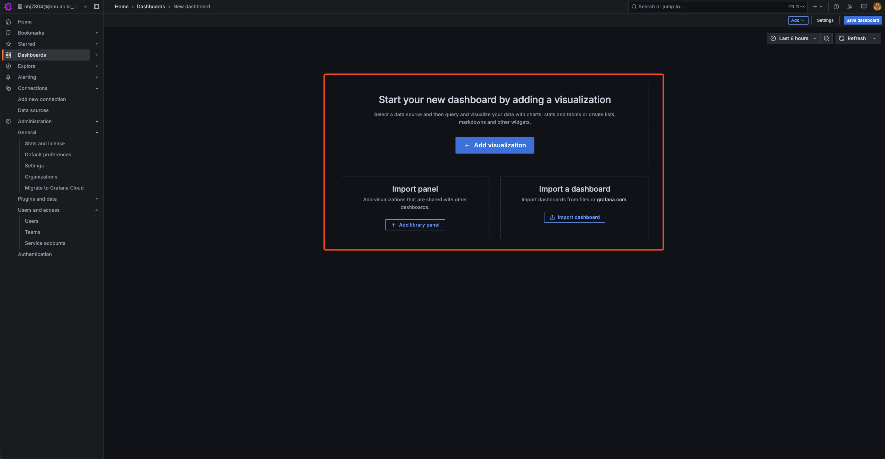    

**3. Dashboard ID를 입력합니다.**

-  Dashboard ID는 Grafana dashboards에서 확인할 수 있습니다.

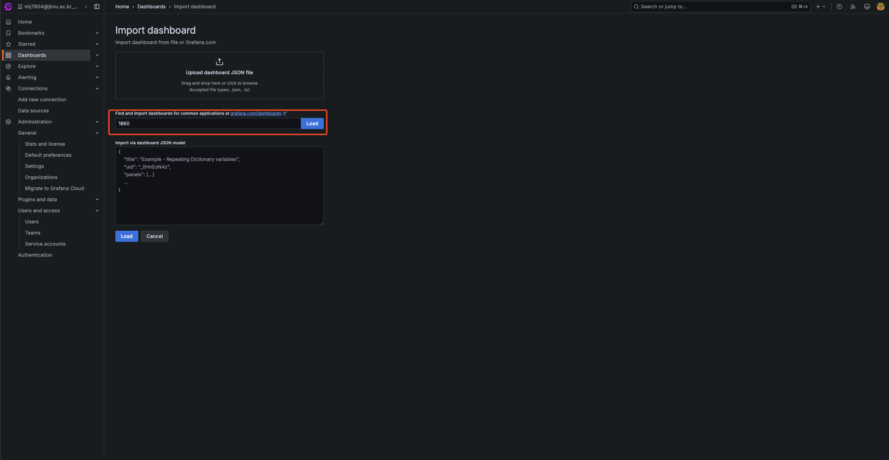  

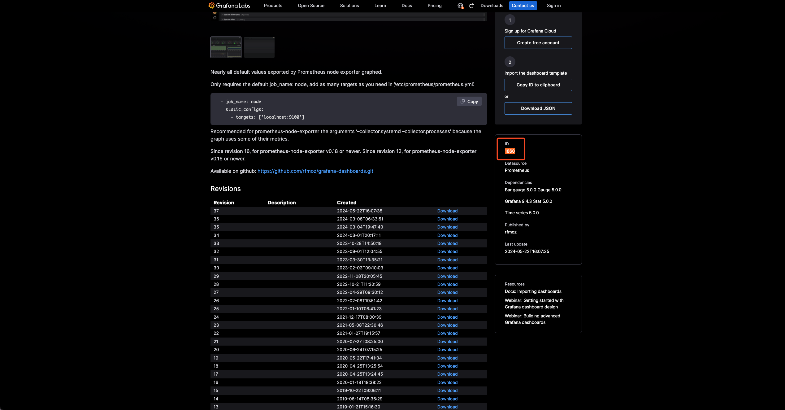    

**4. 연결할 데이터 소스를 선택합니다.**

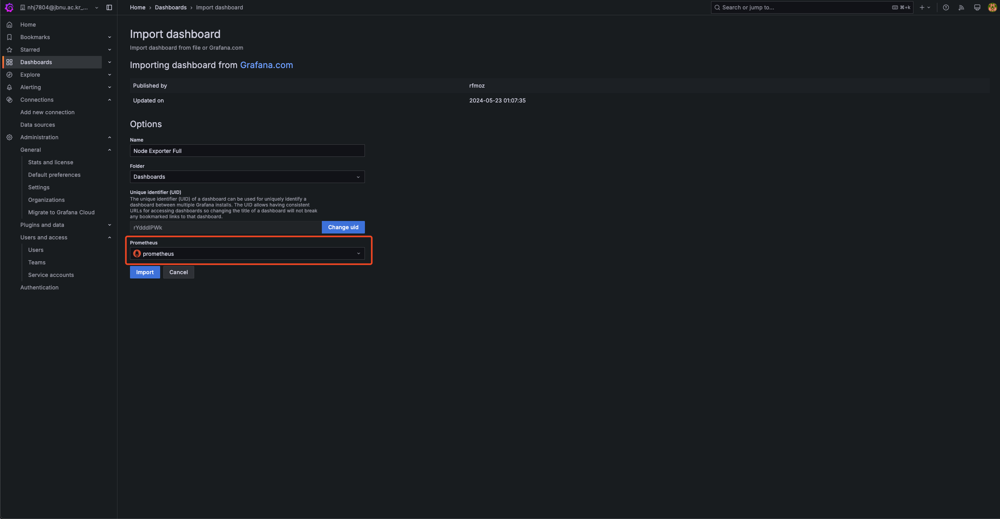    

**5. 모니터링 기간, 갱신 주기 등을 선택할 수 있습니다.**

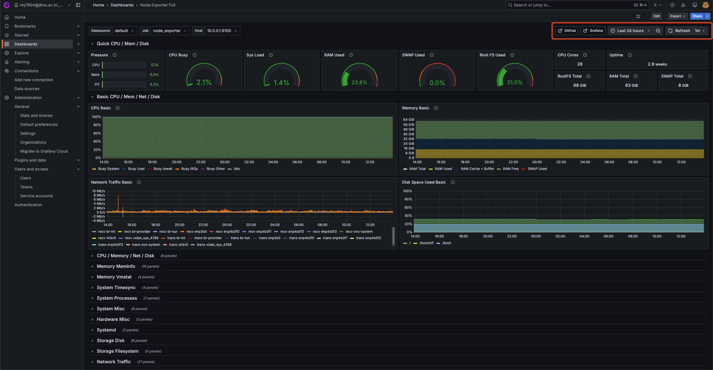    
