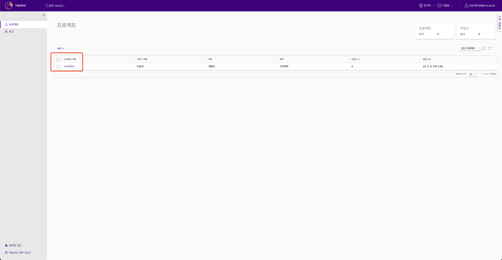
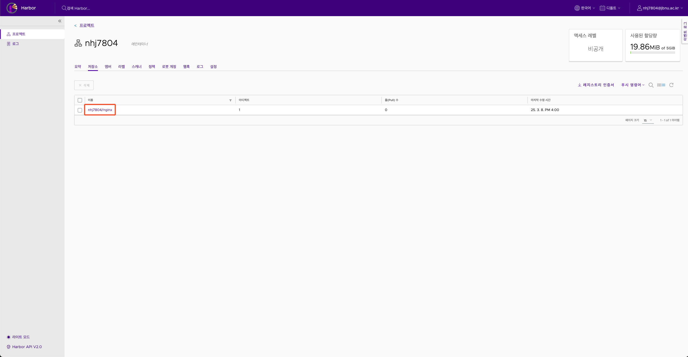
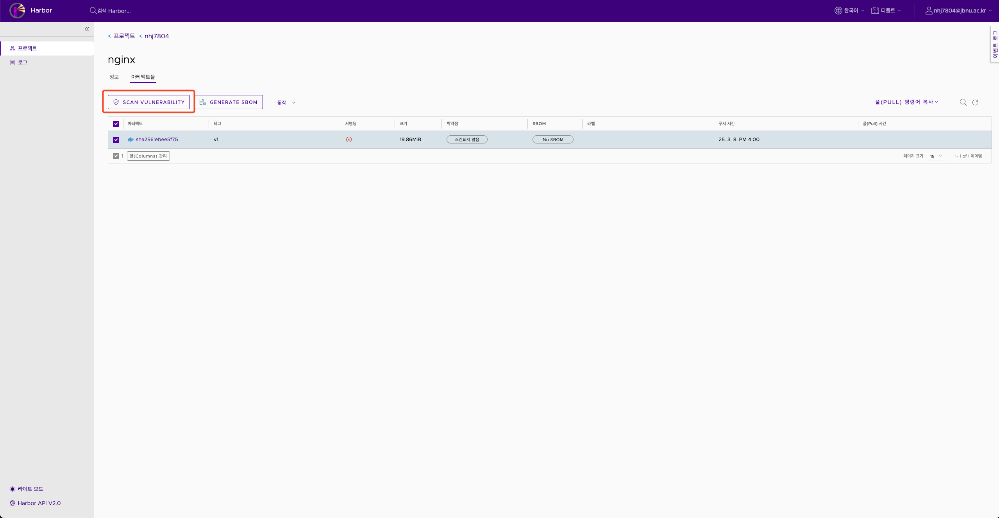
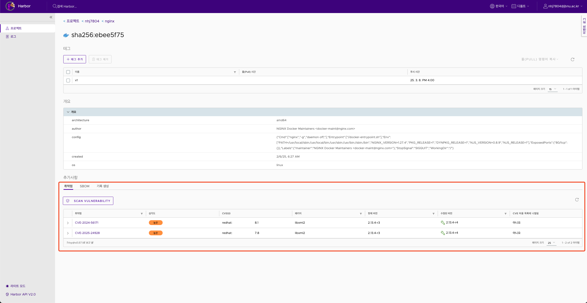
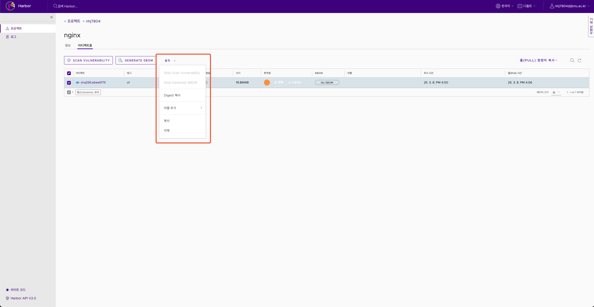
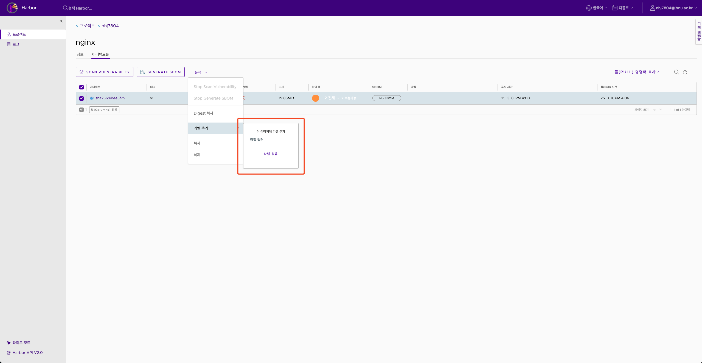
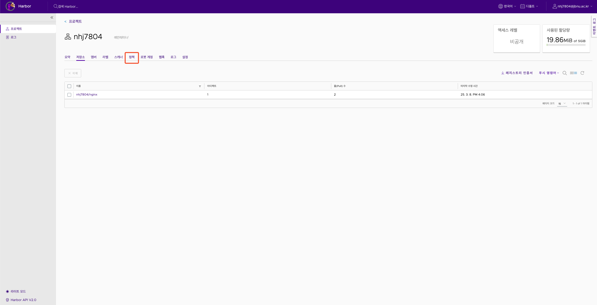
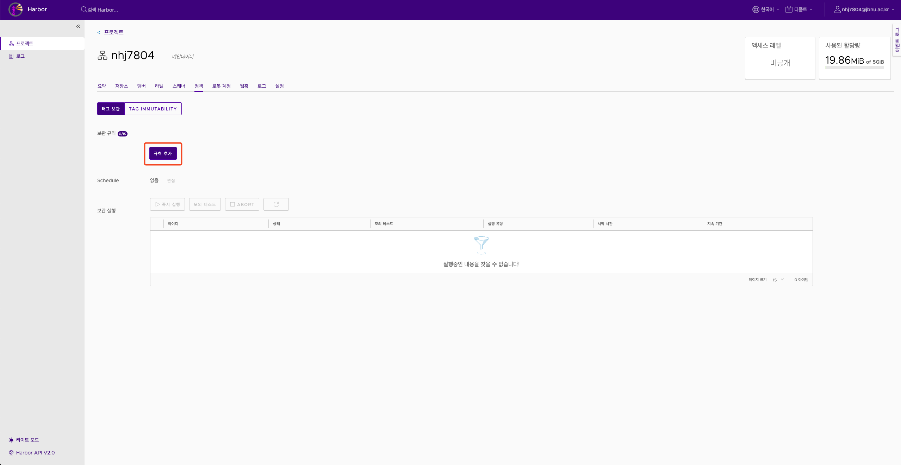
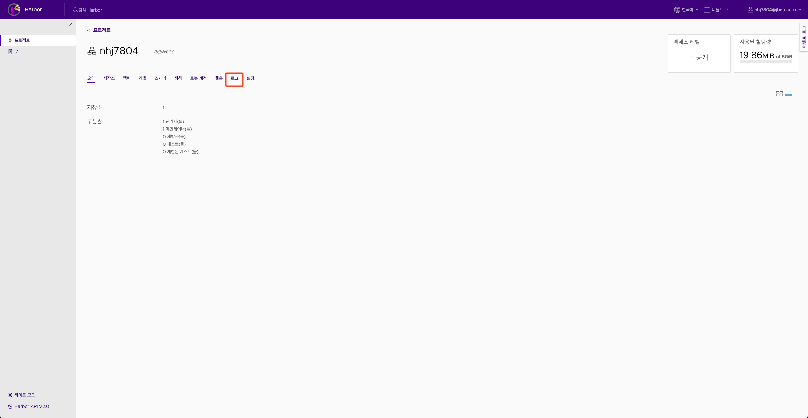

[](https://harbor.jbnu.ac.kr)

## 0. JFlow - Harbor

**`컨테이너 이미지를 안전하게 저장, 관리`할 수 있는 오픈소스 레지스트리입니다.** <br/>
**`취약점 스캐닝과 접근 제어 기능`을 통해 `컨테이너 이미지의 보안을 강화`합니다.**

<br/>

> - JFlow에서 제공하는 Harbor는 **`교내 메일`**을 이용해 접속 가능합니다.
>
> - 각 사용자는 다른 사용자와 **`완전 격리된 환경`**을 사용합니다.
>
> - 가이드에서 부족한 설명은 [Harbor 공식 문서](https://goharbor.io/docs/2.4.0/)를 참고 바랍니다.

## 1. Harbor 접속 방법

> Harbor는 아래의 URL을 통해 접속할 수 있습니다.

> **https://harbor.jbnu.ac.kr**


## 2. 프로젝트 관리

<br/>

**0. 사용자별 격리 환경**

- `Harbor`는 사용자 별 `Private` 형태로 프로젝트를 제공합니다.

<br/>

**1. 프로젝트 구조**

> - 사용자에게 **`사용자 이름과 같은 프로젝트`**가 제공됩니다.

> - 프로젝트 내에서 **`이미지 별 저장소`**를 사용할 수 있습니다.

 <br/><br/><br/>

## 3. 이미지 Push & Pull

<br/>

**1. Harbor login**
> - Harbor는 도메인을 이용해 로그인 할 수 있습니다.
    ```bash
    docker login harbor.jbnu.co.kr
    Username: [사용자 이름]
    Password: [비밀번호]
    ```

<br/><br/>

**2. Image Push**


>    1. 이미지에 태그를 지정
    ```bash
    docker tag SOURCE_IMAGE[:TAG] harbor.jbnu.co.kr/<사용자명>/<저장소명>[:TAG]
    ```

>    2. 프로젝트로 이미지 Push
    ```bash
    docker push harbor.jbnu.co.kr/<사용자명>/<저장소명>[:TAG]
    ```

<br/><br/>

**3. Image Pull**

>    1. 이미지를 Pull
    ```bash
    docker pull harbor.jbnu.co.kr/<사용자명>/<저장소명>[:TAG]
    ```

## 4. 이미지 스캔 및 보안


**JFlow의 Harobr는 `이미지 스캔 및 취약점 분석` / `SBOM` 생성이 가능합니다.**


<br/>

**1. 취약점 스캔** (**`Trivy`**를 사용합니다.)
    
1. Repositor에서 이미지를 선택합니다.

 <br/><br/><br/>

2. `SCAN VULNERABILITY` 버튼을 클릭합니다.

 <br/><br/><br/>

3. 스캔 결과를 확인합니다.

 <br/><br/><br/>


## 5. 태그 관리

**Harbor에서는 `태그 관리` 기능을 제공합니다.**

<br/>

**1. 태그 추가**

1. Repository에서 이미지를 선택합니다.

 <br/><br/><br/>

2. `동작` → `라벨 추가` 

 <br/><br/><br/>

3. 태그 추가 또는 삭제를 합니다.

 <br/><br/><br/>

**2. 태그 보관**

1. `정책` 버튼을 클릭합니다.

 <br/><br/><br/>

2. `태그 보관` 에서 `규칙 추가` 를 클릭합니다.

 <br/><br/><br/>

3. `보관 실행` 을 눌러 태그를 보관합니다.

## 6. 로그 관리 

<br/>

**1. 로그 확인**
1. `로그` 버튼을 클릭합니다.

 <br/><br/><br/>

2. 로그를 확인합니다.