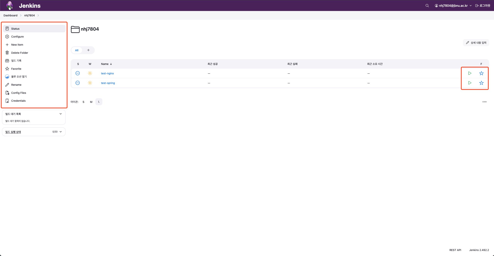

[](https://jenkins.jbnu.ac.kr)

## 0. JFlow - Jenkins

**`지속적 통합 및 배포(CI/CD)를 자동화`하는 오픈소스 도구입니다.** <br/>
**코드 변경사항을 자동으로 빌드, 테스트하고 `배포 파이프라인을 구축하여 개발 프로세스를 효율화`합니다.**

<br/>

> - JFlow에서 제공하는 Jenkins는 **`교내 메일`**을 이용해 접속 가능합니다.
>
> - 각 사용자는 다른 사용자와 **`완전 격리된 환경`**을 사용합니다.
>
> - 가이드에서 부족한 설명은 [Jenkins 공식 문서](https://www.jenkins.io/doc/)를 참고 바랍니다.

## 1. Jenkins 접속 방법

> Jenkins는 아래의 URL을 통해 접속할 수 있습니다.

> **https://jenkins.jbnu.ac.kr**


## 2. 프로젝트 및 Job 관리

<br/>

**0. 사용자 간 격리 환경**

- 사용자들은 `개별 폴더`를 통해 격리되어 있습니다.
    - `Credentials`, `Pipeline` 등을 작성해도 다른 사용자들은 볼 수 없습니다.

<br/>

**1. 새로운 Job 생성**

1. 대시보드에서 `사용자 이름의 폴더`를 클릭합니다.

   <br/><br/><br/>

2. `Create a job`을 클릭합니다.

   <br/><br/><br/>

3. Job 이름과 적절한 프로젝트 유형을 선택합니다.

>    - `Freestyle project` : 단순한 빌드 작업

>    - `Pipeline` : 복잡한 CI/CD 파이프라인 **(권장)**

>    - `Multi-configuration project` : 여러 환경에서의 빌드

   <br/><br/><br/>

4. 웹훅을 설정합니다.

>    - `Generic-Webhook-Trigger` : 웹훅에 사용할 트리거입니다. **(반드시 사용합니다.)**

>    - `Token` : 웹훅에 사용할 토큰입니다. `사용자명-서비스` 구조로 고유하도록 작성합니다.

   <br/><br/><br/>    

5. 저장소를 연결합니다.

>    - `SCM` : `GitHub`, `GitLab` 사용 시 `Git`으로 선택합니다.

>    - `Repository URL` : 연결할 저장소의 주소를 입력합니다.

>    - `Credentials` : `GitHub`, `GitLab`의 계정 토큰을 크레덴셜로 등록 후 선택합니다.

>    - `Branch Specifier` : 젠킨스가 빌드를 진행할 브랜치를 입력합니다.

>    - `Script Path` : 젠킨스파일이 위치한 경로를 입력합니다.

   <br/><br/><br/>

6. 여러 기능을 이용할 수 있습니다.

>    - `블루 오션 열기` :  파이프라인을 시각적으로 확인할 수 있습니다.

>    - `Credentials` : 다른 서비스, 서버 접속 정보 등 Credentials를 관리할 수 있습니다.

   <br/><br/><br/>    


## 3. Pipeline 작성

<br/>

**1. 기본 구조**

```groovy
pipeline {
    agent any
    
    stages {
        stage('Build') {
            steps {
                // 빌드 스크립트
            }
        }
        stage('Test') {
            steps {
                // 테스트 스크립트
            }
        }
        stage('Deploy') {
            steps {
                // 배포 스크립트
            }
        }
    }
}
```

<br/>

**2. 주요 파이프라인 문법**

> - `stage` : 파이프라인의 각 단계

> - `steps` : 각 단계에서 실행할 명령어

> - `environment` : 환경 변수 설정

> - `parameters` : 파이프라인 매개변수

> - `when` : 조건부 실행

> - `post` : 파이프라인 완료 후 작업

<br/>

**3. 예시 Jenkinsfile**

```groovy
// Jenkins 파이프라인의 시작을 선언합니다.
pipeline {
    // Kubernetes 에이전트를 설정합니다.
    agent {
        kubernetes {
            // 'docker-agent' 라벨을 가진 Pod을 생성합니다.
            label 'docker-agent'
            // 기본 컨테이너를 'docker'로 지정합니다.
            defaultContainer 'docker'
        }
    }

    // 파이프라인에서 사용할 환경 변수들을 정의합니다.
    environment {
        // Harbor 레지스트리 관련 설정입니다.
        REGISTRY = 'harbor.jbnu.ac.kr'
        HARBOR_PROJECT = 'test'
        IMAGE_NAME = 'test-nginx'
        // 도커 이미지의 전체 경로를 설정합니다.
        DOCKER_IMAGE = "${REGISTRY}/${HARBOR_PROJECT}/${IMAGE_NAME}"
        // Harbor 인증 정보의 ID를 설정합니다.
        DOCKER_CREDENTIALS_ID = 'harbor-credentials'
        // SonarQube 인증 토큰을 Jenkins 크레덴셜에서 가져옵니다.
        SONAR_TOKEN = credentials("sonarqube-credentials")
    }

    // 파이프라인의 각 단계를 정의합니다.
    stages {
        // 소스 코드를 체크아웃하는 단계입니다.
        stage('Checkout') {
            steps {
                checkout scm
            }
        }

        // SonarQube를 사용하여 코드 품질을 분석하는 단계입니다.
        stage('SonarQube Analysis') {
            steps {
                // sonar-scanner 컨테이너에서 실행합니다.
                container('sonar-scanner') {
                    // SonarQube 환경 설정을 적용합니다.
                    withSonarQubeEnv('sonarqube') {
                        // sonar-scanner 명령어를 실행하여 코드 분석을 수행합니다.
                        sh """
                         sonar-scanner \\
                         -Dsonar.projectKey=test-nginx \\
                         -Dsonar.projectName=test-nginx \\
                         -Dsonar.sources=. \\
                         -Dsonar.exclusions=**/node_modules/** \\
                         -Dsonar.login=${SONAR_TOKEN}
                        """
                    }
                }
            }
        }

        // 도커 이미지를 빌드하는 단계입니다.
        stage('Docker Build') {
            steps {
                script {
                    // 도커 데몬이 준비될 때까지 최대 2분간 대기합니다.
                    timeout(time: 2, unit: 'MINUTES') {
                        sh '''#!/bin/sh
                            until docker info >/dev/null 2>&1; do
                                echo "Waiting for docker daemon..."
                                sleep 2
                            done
                        '''
                    }

                    // 도커 이미지를 빌드합니다.
                    sh """
                        docker build -t ${DOCKER_IMAGE}:${BUILD_NUMBER} .
                    """
                }
            }
        }

        // 빌드된 도커 이미지를 Harbor 레지스트리에 푸시하는 단계입니다.
        stage('Docker Push') {
            steps {
                script {
                    // Harbor 레지스트리 인증 정보를 사용하여 이미지를 푸시합니다.
                    withDockerRegistry([credentialsId: DOCKER_CREDENTIALS_ID, url: "https://${REGISTRY}"]) {
                        sh """
                            docker push ${DOCKER_IMAGE}:${BUILD_NUMBER}
                        """
                    }
                }
            }
        }
    }

    // 파이프라인 실행 후 수행할 작업들을 정의합니다.
    post {
        // 파이프라인이 성공적으로 완료된 경우
        success {
            echo 'Successfully built and pushed the image!'
        }
        // 파이프라인이 실패한 경우
        failure {
            echo 'Failed to build or push the image'
        }
        // 성공/실패 여부와 관계없이 항상 실행
        always {
            script {
                try {
                    // 로컬에 있는 도커 이미지를 제거합니다.
                    sh """
                        docker rmi ${DOCKER_IMAGE}:${BUILD_NUMBER} || true
                    """
                } catch (Exception e) {
                    echo "Failed to remove docker image: ${e.message}"
                }
            }
        }
    }
}
```

<br/>

**4. Custom PodTemplate  사용**
> - 관리자가 설정해놓은 Pod Template이 아닌 Custom Template이 필요하다면, 아래와 같이 직접 설정할 수 있습니다. <br/>
> **(최대 사용량은`CPU 4코어 / 메모리 8GB`**이므로, 리소스 요청 시 주의 바랍니다. **(초과 시 Pod가 실행되지 않습니다.))**

```groovy
// Jenkins 파이프라인의 시작을 선언합니다.
pipeline {
    // Kubernetes 에이전트를 설정합니다.
    agent {
        kubernetes {
            // Kubernetes Pod의 구성을 YAML 형식으로 정의합니다.
            yaml """
apiVersion: v1
kind: Pod
spec:
  containers:
  # Docker in Docker(dind) 컨테이너 설정
  - name: docker
    image: docker:dind
    securityContext:
      privileged: true    // 특권 모드로 실행하여 Docker 데몬 실행 권한을 부여합니다.
    env:
    - name: DOCKER_TLS_CERTDIR
      value: ""          // TLS 인증서 디렉토리를 비활성화합니다.
    volumeMounts:
    - mountPath: /var/run
      name: docker-sock  // Docker 소켓을 마운트합니다.
    - mountPath: /var/lib/docker
      name: docker-volume // Docker 이미지와 컨테이너 데이터를 저장할 볼륨을 마운트합니다.
    tty: true
  # SonarQube 스캐너 컨테이너 설정
  - name: sonar-scanner
    image: sonarsource/sonar-scanner-cli:latest
    command:
    - cat
    tty: true
  # 볼륨 정의
  volumes:
  - name: docker-sock    // Docker 소켓을 위한 임시 볼륨
    emptyDir: {}
  - name: docker-volume  // Docker 데이터를 위한 임시 볼륨
    emptyDir: {}
"""
            // 기본 컨테이너를 'docker'로 지정합니다.
            defaultContainer 'docker'
        }
    }

    // 파이프라인에서 사용할 환경 변수들을 정의합니다.
    environment {
        // Harbor 레지스트리 관련 설정입니다.
        REGISTRY = 'harbor.jbnu.ac.kr'
        HARBOR_PROJECT = 'test'
        IMAGE_NAME = 'test-nginx'
        // 도커 이미지의 전체 경로를 설정합니다.
        DOCKER_IMAGE = "${REGISTRY}/${HARBOR_PROJECT}/${IMAGE_NAME}"
        // Harbor 인증 정보의 ID를 설정합니다.
        DOCKER_CREDENTIALS_ID = 'harbor-credentials'
        // SonarQube 인증 토큰을 Jenkins 크레덴셜에서 가져옵니다.
        SONAR_TOKEN = credentials("sonarqube-credentials")
    }

    // 파이프라인의 각 단계를 정의합니다.
    stages {
        // 소스 코드를 체크아웃하는 단계입니다.
        stage('Checkout') {
            steps {
                checkout scm
            }
        }

        // SonarQube를 사용하여 코드 품질을 분석하는 단계입니다.
        stage('SonarQube Analysis') {
            steps {
                // sonar-scanner 컨테이너에서 실행합니다.
                container('sonar-scanner') {
                    // SonarQube 환경 설정을 적용합니다.
                    withSonarQubeEnv('sonarqube') {
                        // sonar-scanner 명령어를 실행하여 코드 분석을 수행합니다.
                        sh """
                            sonar-scanner \\
                            -Dsonar.projectKey=test-nginx \\
                            -Dsonar.projectName=test-nginx \\
                            -Dsonar.sources=. \\
                            -Dsonar.exclusions=**/node_modules/** \\
                            -Dsonar.login=${SONAR_TOKEN}
                        """
                    }
                }
            }
        }

        // 도커 이미지를 빌드하는 단계입니다.
        stage('Docker Build') {
            steps {
                script {
                    // 도커 데몬이 준비될 때까지 최대 2분간 대기합니다.
                    timeout(time: 2, unit: 'MINUTES') {
                        sh '''#!/bin/sh
                            until docker info >/dev/null 2>&1; do
                                echo "Waiting for docker daemon..."
                                sleep 2
                            done
                        '''
                    }

                    // 도커 이미지를 빌드합니다.
                    sh """
                        docker build -t ${DOCKER_IMAGE}:${BUILD_NUMBER} .
                    """
                }
            }
        }

        // 빌드된 도커 이미지를 Harbor 레지스트리에 푸시하는 단계입니다.
        stage('Docker Push') {
            steps {
                script {
                    // Harbor 레지스트리 인증 정보를 사용하여 이미지를 푸시합니다.
                    withDockerRegistry([credentialsId: DOCKER_CREDENTIALS_ID, url: "https://${REGISTRY}"]) {
                        sh """
                            docker push ${DOCKER_IMAGE}:${BUILD_NUMBER}
                        """
                    }
                }
            }
        }
    }

    // 파이프라인 실행 후 수행할 작업들을 정의합니다.
    post {
        // 파이프라인이 성공적으로 완료된 경우
        success {
            echo 'Successfully built and pushed the image!'
        }
        // 파이프라인이 실패한 경우
        failure {
            echo 'Failed to build or push the image'
        }
        // 성공/실패 여부와 관계없이 항상 실행
        always {
            script {
                try {
                    // 로컬에 있는 도커 이미지를 제거합니다.
                    sh """
                        docker rmi ${DOCKER_IMAGE}:${BUILD_NUMBER} || true
                    """
                } catch (Exception e) {
                    echo "Failed to remove docker image: ${e.message}"
                }
            }
        }
    }
}

```


## 4. 빌드 결과 확인

<br/>

**1. 빌드 상태 아이콘**

> - **파란색**: 성공

> - **노란색**: 불안정 (테스트 실패)

> - **빨간색**: 실패

> - **회색:** 중단됨 또는 아직 빌드되지 않음

<br/>

**2. 빌드 로그 확인**

> - 빌드 번호를 클릭합니다.

> - `Console Output`을 선택하여 전체 로그를 확인합니다.

> - `Pipeline Steps`에서 각 단계별 실행 결과를 확인할 수 있습니다.

> - `블루 오션`에서 각 단계별 시각화를 통해 결과를 확인할 수 있습니다.


## 5. 문제 해결

<br/>

**1. 빌드 실패**

> - `Console Output` 확인

> - 소스 코드 변경사항 확인

> - 필요한 의존성 확인

> - 서비스 간의 연결 확인

<br/>

**2. 로그 분석**

> - `Console Output`에서 ERROR, WARNING 키워드 검색

> - 스택 트레이스 확인

> - 스테이지별 로그 확인


## 6. 주의 사항

**1. Webhook 설정**

> - Webhook은 반드시 `generic-webhook-trigger`를 사용해야 합니다.

> - `generic-webhook-trigger`의 `token`을 반드시 `사용자명-서비스`로 사용해야 합니다. (토큰은 고유해야 합니다.)


## 7. 기타 사항
**1. 팀 프로젝트**
- 팀 프로젝트를 위해 `팀 단위의 프로젝트` 필요 시, 관리자에게 문의 바랍니다.

<br/>

**2. Pod Template**
- `Custom PodTemplate` 작성에 어려움이 있을 시, 관리자에게 문의 바랍니다.

<br/>

**3. Plugin**
- `새로운 플러그인` 요구가 있을 시, 관리자에게 문의 바랍니다.


