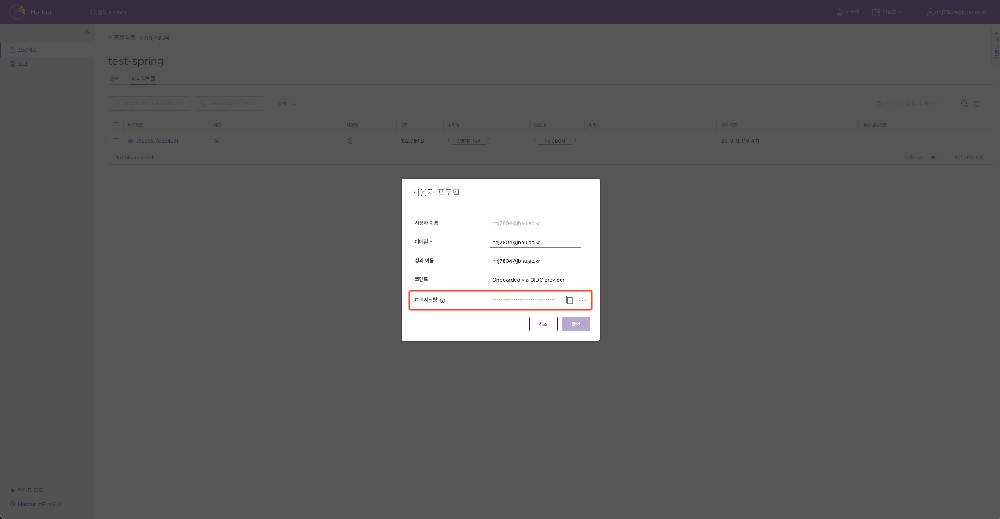

## 목차

1. 목표

2. Code 작성

3. GitLab 설정

4. Sonarqube 설정

5. Jenkins 설정

6. GitLab Webhook 생성

7. Pipeline 동작 확인

## 서비스 접속

GitLab : https://gitlab.jbnu.ac.kr

Jenkins : https://jenkins.jbnu.ac.kr

Harbor : https://harbor.jbnu.ac.kr

Sonarqube : https://sonarqube.jbnu.ac.kr

## 1. 목표

**Spring Boot 애플리케이션 Container Image를 Jenkins를 사용해 Maven 빌드 후 Harbor에 저장하는 예제입니다.**<br/>
**Sonarqube를 이용해 빌드 과정에서 코드의 취약점 분석도 진행합니다.** <br/>

**(매우 기초적인 파이프라인입니다. 학습에만 사용합니다.)**

## 2. Code 작성

**spring-boot application container image 빌드를 위해서는 아래와 같은 프로젝트가 필요합니다.**

<br/>

**예제 소스코드 다운로드**

    git clone https://github.com/NOHHYEONGJUN/JFlow-springboot.git

<br/>

**0. 예제 구조**

```bash
.
├── Dockerfile
├── Jenkinsfile
├── pom.xml
├── settings.xml
├── src
│   ├── main
│   │   ├── java
│   │   │   └── com
│   │   │       └── example
│   │   │           └── demo
│   │   │               ├── DemoApplication.java
│   │   │               ├── controller
│   │   │               │   └── UserController.java
│   │   │               ├── model
│   │   │               │   └── User.java
│   │   │               ├── repository
│   │   │               │   └── UserRepository.java
│   │   │               └── service
│   │   │                   └── UserService.java
│   │   └── resources
│   └── test
│       └── java
│           └── com
│               └── example
│                   └── demo
│                       ├── DemoApplicationsTests.java
│                       └── controller
│                           └── UserControllerTest.java
└── target
    ├── classes
    │   └── com
    │       └── example
    │           └── demo
    │               ├── DemoApplication.class
    │               ├── controller
    │               │   └── UserController.class
    │               ├── model
    │               │   └── User.class
    │               ├── repository
    │               │   └── UserRepository.class
    │               └── service
    │                   └── UserService.class
    ├── generated-sources
    │   └── annotations
    ├── generated-test-sources
    │   └── test-annotations
    └── test-classes
        └── com
            └── example
                └── demo
                    ├── DemoApplicationTests.class
                    └── controller
                        └── UserControllerTest.class

```

**1. Jenkinsfile**<br/><br/>
`관리자가 설정해둔 Pod Template`을 사용해 빌드하는 코드입니다. <br/>
**→ 13,14,52,53 번 라인 수정이 필요합니다.**

<br/>

**2. Jenkinsfile2**<br/><br/>
직접 `Custom Pod Template`을 생성해 빌드하는 코드입니다.<br/>
**→ 67,78,104,105 번 라인 수정이 필요합니다.**

<br/>

**관리자가 설정해놓은 Pod Template이 아닌 Custom Template이 필요하다면, 아래와 같이 직접 설정할 수 있습니다.**<br/>

> → **최대 사용량은 `CPU 8코어 / 메모리 16GB`** 이므로, 리소스 요청 시 주의 바랍니다. **(초과 시 Pod가 실행되지 않습니다.)**

> → **권한 상승 및 루트 파일 시스템 작성은 차단되어 있습니다. (권한 상승 요청 시, Pod가 실행되지 않습니다.)**

<br/>

**3. Quality Gate 필요 시** <br/><br/>
**Quality Gate는 프로젝트의 품질 기준을 통과해야만 다음 단계로 진행할 수 있는 체크포인트 역할을 합니다.<br/>**
→ 필요 시 아래의 Stage를 `Jenkinsfile`에 추가합니다.

```bash
       stage('Quality Gate') {
           steps {
               timeout(time: 1, unit: 'HOURS') {
                   waitForQualityGate abortPipeline: true
               }
           }
       }
```

## 3. GitLab 설정

**1. Project 생성**

- `Create blank project`를 선택합니다.

 <br/><br/><br/>

- Project name 입력 및 `Private` 선택 후 생성합니다.

 <br/><br/><br/>

- 본 가이드에서는 코드를 `원격에서 작성 후 Push`하기 때문에 아래의 내용을 따릅니다. <br/>
(https로 진행합니다.)

 <br/><br/><br/>

**2. Access Token 생성**

**Jenkins와 GitLab 연결 / 원격과 GitLab 연결 간에 Access Token이 필요합니다.**

<br/>

- `profile` → `Preferences` → `Access tokens` 로 접속합니다.

 <br/><br/><br/>

- `Add new token` 버튼을 클릭합니다.

 <br/><br/><br/>

- 필요한 권한을 선택 후 생성합니다. <br/>
(Jenkins, Local remote를 위해 `api`, `write/read_repository`를 선택합니다.)

 <br/><br/><br/>

- 토큰이 생성되었습니다. 토큰은 잘 보관해야 합니다.<br/>
**(분실 시, 재생성 필요)**

 <br/><br/><br/>

**3. Code Push**

**`GitLab을 통해 프로젝트를 관리`하므로, 원격에서 GitLab으로 Code Push가 필요합니다.**

<br/>

- GitLab과 연결 및 code push를 진행합니다.

```bash
# 새로운 Git 저장소를 초기화하고 기본 브랜치를 'main'으로 설정합니다
git init --initial-branch=main

# GitLab 원격 저장소를 추가합니다. oauth2 프로토콜로 보안을 강화합니다
git remote add origin https://oauth2:<발급받은Access-Token>@gitlab.jbnu.ac.kr/<계정 ID>/test-spring.git

# 현재 디렉토리의 모든 파일을 스테이징합니다
git add .

# 변경사항을 커밋합니다
git commit -m "Initial commit"

# 로컬 main 브랜치를 원격 저장소에 푸시하고 추적 관계를 설정합니다
git push --set-upstream origin main
```

 <br/><br/><br/>

## 4. Sonarqube 설정

**빌드 과정에서 `코드를 분석`하기 위해 `Sonarqube` 프로젝트를 생성합니다.<br/>**
(생성하지 않고 파이프라인 진행 시, 자동 생성됩니다.)

**1. Project 생성**

- `Manually`를 선택합니다.

 <br/><br/><br/>

- **🚨 반드시 자신의 ID - 사용할 서비스 로 프로젝트를 생성합니다. 🚨** <br/>
(자신의 ID로 시작하지 않을 시, Public Project가 생성됩니다.)

 <br/><br/><br/>

- `profile` → `My Account` 를 클릭합니다.

 <br/><br/><br/>

- `Security`를 클릭합니다.
- 생성할 토큰의 이름과 `Global Analysis Token` 지정 후 생성합니다. 

 <br/><br/><br/>

## 5. Jenkins 설정

**GitLab의 코드를 빌드하기 위해 Jenkins에서 `파이프라인 생성`이 필요합니다.**

<br/>

**1. Credentials 생성**

- 계정의 ID로 생성된 폴더에 접속합니다.

 <br/><br/><br/>

- 좌측의 `Credentials`를 클릭합니다.

 <br/><br/><br/>

- `이름으로 된 Store`를 클릭합니다.

 <br/><br/><br/>

- `Global credentials`를 클릭합니다.

 <br/><br/><br/>

- `Add Credentials`를 클릭합니다.

 <br/><br/><br/>

- Credentials는 3가지가 필요합니다.

    - `harbor-credentials`
    - `gitlab-credentials`
    - `sonarqube-credentials`

<br/>

- harbor-credentials

    - `Username with password` 를 선택합니다.
    - Username : harbor 접속 ID
    - Password : harbor에 접속 후 아래 이미지처럼 확인합니다.
    - ID : harbor-credentials

 <br/>
 <br/><br/><br/>

- gitlab-credentials

    - `Username with password` 를 선택합니다.
    - Username : gitlab 접속 ID
    - Password : **gitlab에서 발급받은 Access Token**
    - ID : gitlab-credentials

 <br/><br/><br/>


- sonarqube-credentials

    - `Secret text`를 선택합니다.
    - Secret : **sonarqube에서  발급받은 Token**
    - ID : sonarqube-credentials

 <br/><br/><br/>

**2. PipeLine 생성**

**Jenkins를 통해 빌드하기 위해 pipeline이 필요합니다.**

<br/>

- `Create a job`을 선택합니다.

 <br/><br/><br/>

- 적절한 이름과 `PipeLine`을 선택 후 생성합니다.

 <br/><br/><br/>

- `Generic Webhook Trigger`를 선택합니다.
- `Token` 을 `자신의 계정 ID - 서비스`  구조로 생성합니다. **(반드시 고유해야 합니다.)**

 <br/><br/><br/>

- Definiton : `Pipeline script from SCM`  을 선택합니다.
- SCM : `Git` 을 선택합니다.
- Repository URL : [`https://gitlab.jbnu.ac.kr/<GitLab-ID>/<Project>`](https://gitlab.jdevops.co.kr/<GitLab-ID>/<Project>) 을 입력합니다.
- Credentials: `gitlab-credentials` 를 선택합니다.
- Branch Specifier : `*/main` 로 수정합니다.

 <br/><br/><br/>

완료 후 저장합니다.

## 6. GitLab Webhook 생성

**원하는 Trigger로 Jenkins를 빌드하기 위해 GitLab에서 `webhook`을 생성해야 합니다.**

<br/>

- `Settings` → `Webhooks` 로 접속합니다.

 <br/><br/><br/>

- `Add new webhook` 버튼을 클릭합니다.

 <br/><br/><br/>

- URL : `https://jenkins.jbnu.ac.kr/generic-webhook-trigger/invoke?token=<파이프라인에서 지정한 토큰>`을 입력합니다.

 <br/><br/><br/>

- 빌드가 트리거되도록, 원하는 `Event`를 선택 후 생성합니다.

 <br/><br/><br/>

- Webhook이 생성되었습니다. `Test` 버튼을 통해 정상 작동을 확인할 수 있습니다.

 <br/><br/><br/>

## 7. PipeLine 동작 확인

**목표한 과정을 위한 간단한 설정은 모두 완료했습니다. 이제 정상 작동을 확인하겠습니다.**

<br/>

- `Push Events`를 웹훅의 발동 조건으로 생성했기 때문에, `Push를 진행`해 확인하겠습니다.

```bash
# 주석 등을 수정 후 푸시를 진행합니다.
git add .
git commit -m "Push Event Triger"
git push
```

 <br/><br/><br/>

- Jenkins에서 빌드가 진행되는 것을 확인합니다.

 <br/><br/><br/>

- 진행중인 빌드의 콘솔 로그를 확인할 수 있습니다.

 <br/>

 <br/><br/><br/>

- 추가적으로, 여러 기능을 사용할 수 있습니다.

 <br/><br/><br/>

- Harbor에 정상적으로 Docker Image가 저장이 되었습니다.

 <br/><br/><br/>

- Sonarqube에서 정상적으로 코드 분석이 진행되었습니다.

 <br/><br/><br/>
