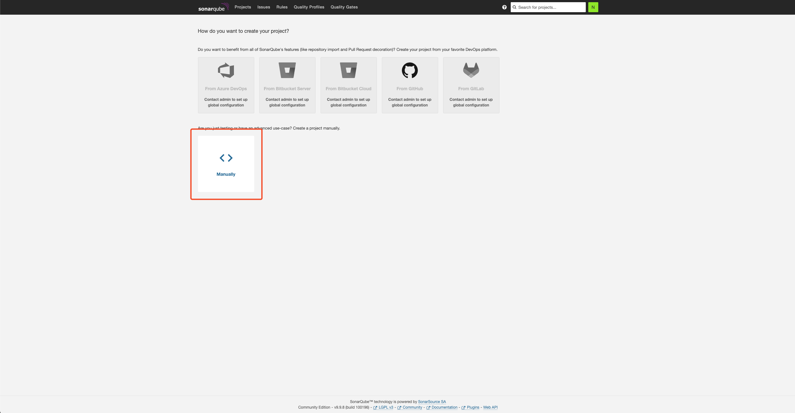
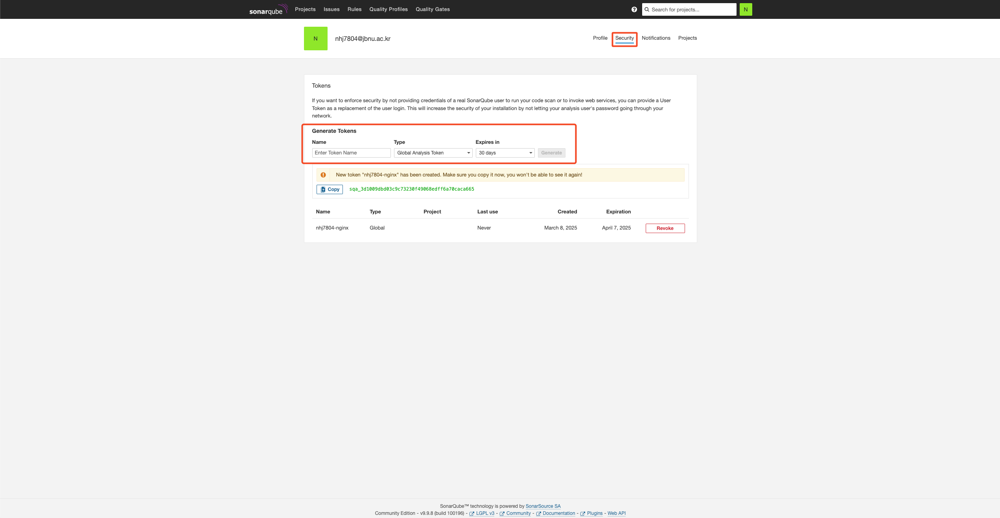

[](https://sonarqube.jbnu.ac.kr)

## 0. JFlow - SonarQube

**`코드 품질과 보안 취약점을 자동으로 검사`하는 `정적 코드 분석 도구`입니다.** <br/>
**`지속적인 코드 품질 모니터링`을 통해 더 안정적이고 유지보수가 용이한 코드를 작성할 수 있습니다.**

<br/>

> - JFlow에서 제공하는 Sonarqube는 **`교내 메일`**을 이용해 접속 가능합니다.
>
> - 각 사용자는 다른 사용자와 **`격리된 환경`**을 사용합니다.
>
> - 가이드에서 부족한 설명은 [Sonarqube 공식 문서](https://docs.sonarsource.com/sonarqube-server/10.8/analyzing-source-code/overview/)를 참고 바랍니다.

## 1. Sonarqube 접속 방법

> Sonarqube는 아래의 URL을 통해 접속할 수 있습니다.

> **https://sonarqube.jbnu.ac.kr**


## 2. 프로젝트 관리

<br/>

**0. 사용자별 격리 환경**

- `Sonarqube`는 사용자 별 `Private` 형태로 프로젝트를 생성하도록 합니다.

<br/>

**1. 프로젝트 생성**

> - `Manually` Project를 선택합니다.

 <br/><br/><br/>

**2. 프로젝트 이름 및 키 입력**

> - 자신의 **`계정 - 분석할 프로젝트`** 로 입력합니다. <br/>
> **(반드시 계정이 앞에 와야하며, 고유해야 합니다.)** <br/>
> **(패턴을 지키지 않으면 Public으로 프로젝트가 생성됩니다.)**

 <br/><br/><br/>

## 2. 토큰 생성

**토큰은 `Jenkins`와 같은 `외부 서비스`에서 소나큐브에 접근하기 위해 사용됩니다.**

<br/>

**1. `Profile` → `My Account` 로 접속합니다.**

 <br/><br/><br/>

**2. `Security` 탭에서 토큰을 생성합니다.**

> - `Global Analysis Token` 으로 선택합니다.

 <br/><br/><br/>

## 3. Quality Gates 생성

**`Quality Gate`는 `소프트웨어 코드 품질 평가 기준`으로, `빌드 또는 배포를 진행할지 결정하는 정책`입니다.**

**기본적으로 `Quality Gate`를 제공하며, 내용은 아래와 같습니다.**
```
버그(Bugs): 0개 이상이면 실패
취약점(Vulnerabilities): 0개 이상이면 실패
새로운 코드의 커버리지(Test Coverage): 80% 이상 (기본값)
새로운 코드의 유지보수성(Code Smell - Maintainability Rating): A 이상
새로운 코드의 보안(Security Hotspots): 검토 완료 상태
```

<br/>

**1. Custom Quality Gate 생성**

> - Quality Gate를 필요한 내용으로 생성 가능합니다.  <br/>
    **(생성한 Quality Gate는 다른 사용자도 사용할 수 있습니다.)**

 <br/><br/><br/>

## 4. SourceCode 정적 분석

**Sonarqube는 `외부의 다른 CI서비스`를 통해 `정적 코드를 분석`합니다.**

<br/>

**1. 분석 결과 확인**

> - 파이프라인에서 코드 분석을 완료했다면, 결과 확인 및 분석이 가능합니다.

 <br/><br/><br/>