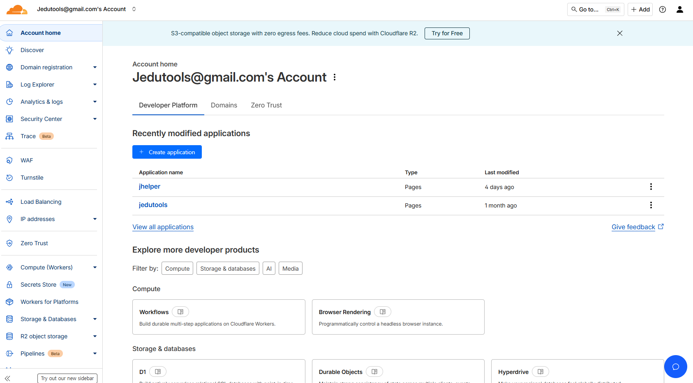
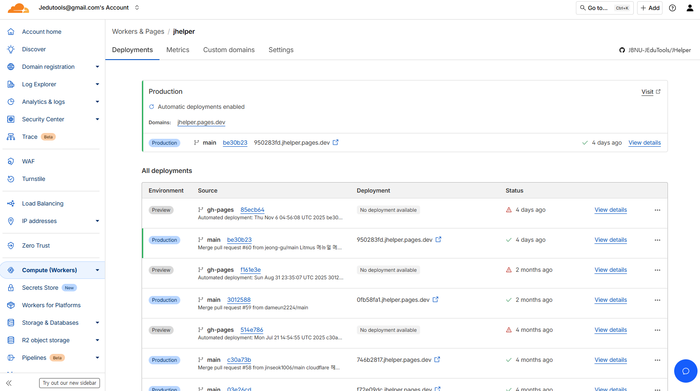
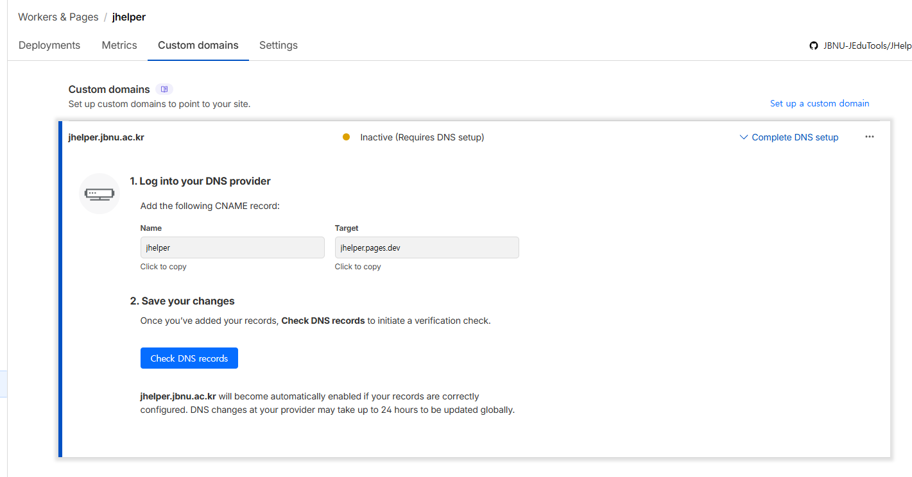
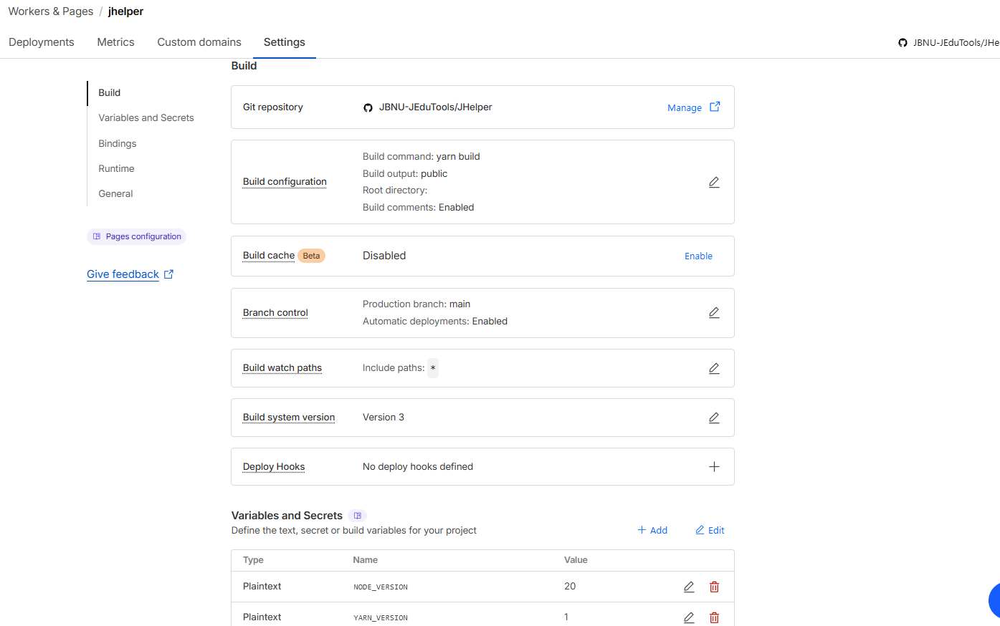

# GitHub Actions를 이용한 자동 배포 가이드

JHelper 프로젝트는 GitHub Actions를 활용하여 `main` 브랜시에 새로운 코드가 푸시(Push)될 때마다 자동으로 웹사이트를 빌드하고 배포합니다. 이 문서는 해당 자동화 워크플로우의 상세 내용과 작동 방식을 설명합니다.

---

## 1. 워크플로우 파일 위치

GitHub Actions 워크플로우는 프로젝트 루트의 `.github/workflows/deploy.yml` 파일에 정의되어 있습니다.

```yaml
name: build gatsby
on:
  push:
    branches:
      - main

jobs:
  build:
    runs-on: ubuntu-latest
    steps:
      - uses: actions/checkout@v3
      - name: Setup Node
        uses: actions/setup-node@v3
        with:
          node-version: '20.x'
      - name: Cache node_modules
        uses: actions/cache@v4
        with:
          path: node_modules
          key: ${{runner.OS}}-build-${{hashFiles('**/yarn.lock')}}
          restore-keys: |
            ${{ runner.OS }}-build-${{ runner.OS }}-
      - name: Install dependencies
        run: yarn install --prod --pure-lockfile
      - name: Build
        run: yarn build:ghpage
        env:
          NODE_ENV: production
      - name: Create CNAME
        run: echo "jhelper.jbnu.ac.kr" > ./docs/CNAME
      - uses: peaceiris/actions-gh-pages@v2
        env:
          GITHUB_TOKEN: ${{ secrets.JHELPERTOKEN }}
          PUBLISH_BRANCH: gh-pages
          PUBLISH_DIR: ./docs
```

---

## 2. 워크플로우 상세 설명

### 2.1. 트리거 (Trigger)

*   `on: push: branches: - main`: 이 워크플로우는 `main` 브랜치에 새로운 커밋이 푸시될 때마다 자동으로 실행됩니다.

### 2.2. 빌드 환경 (Build Environment)

*   `runs-on: ubuntu-latest`: 빌드 작업은 최신 버전의 Ubuntu 운영체제 환경에서 실행됩니다.

### 2.3. 빌드 단계 (Build Steps)

각 `step`은 특정 작업을 수행합니다.

1.  **`actions/checkout@v3`**:
    *   현재 GitHub 저장소의 코드를 워크플로우 실행 환경으로 가져옵니다.

2.  **`Setup Node` (`actions/setup-node@v3`)**:
    *   프로젝트 빌드에 필요한 Node.js 환경을 설정합니다. `node-version: '20.x'`를 통해 Node.js 20 버전이 사용됩니다.

3.  **`Cache node_modules` (`actions/cache@v4`)**:
    *   `node_modules` 디렉터리를 캐싱하여 빌드 속도를 최적화합니다. 이전 빌드에서 사용된 의존성 파일들을 재사용하여 설치 시간을 단축합니다.

4.  **`Install dependencies`**:
    *   `yarn install --prod --pure-lockfile` 명령어를 실행하여 프로젝트에 필요한 모든 의존성 패키지를 설치합니다.

5.  **`Build`**:
    *   `yarn build:ghpage` 명령어를 실행하여 Gatsby 프로젝트를 빌드합니다. 이 명령어는 GitHub Pages 배포에 적합한 형태로 정적 파일들을 `docs/` 디렉터리에 생성합니다. `NODE_ENV: production` 환경 변수를 설정하여 프로덕션 모드로 빌드합니다.

6.  **`Create CNAME`**:
    *   `echo "jhelper.jbnu.ac.kr" > ./docs/CNAME` 명령어를 통해 `docs/` 디렉터리 안에 `CNAME` 파일을 생성합니다. 이 파일은 GitHub Pages가 `jhelper.jbnu.ac.kr` 커스텀 도메인을 사용하도록 지시합니다.

7.  **배포 (`peaceiris/actions-gh-pages@v2`)**:
    *   `peaceiris/actions-gh-pages` 액션을 사용하여 빌드된 `docs/` 디렉터리의 내용을 `gh-pages` 브랜치로 푸시합니다.
    *   `GITHUB_TOKEN: ${{ secrets.JHELPERTOKEN }}`: GitHub 저장소에 설정된 `JHELPERTOKEN`이라는 시크릿 토큰을 사용하여 배포 권한을 인증합니다.
    *   `PUBLISH_BRANCH: gh-pages`: 배포 대상 브랜치를 `gh-pages`로 지정합니다.
    *   `PUBLISH_DIR: ./docs`: 배포할 파일들이 위치한 디렉터리를 `docs/`로 지정합니다.

---

## 3. 관리자 참고 사항

*   **시크릿 토큰 관리:** `JHELPERTOKEN`은 GitHub 저장소의 `Settings > Secrets and variables > Actions`에서 관리됩니다. 이 토큰의 유효 기간을 주기적으로 확인하고 갱신해야 합니다.
*   **배포 상태 확인:** GitHub 저장소의 `Actions` 탭에서 워크플로우의 실행 상태와 로그를 확인할 수 있습니다.
*   **자동화의 이점:** 이 자동화 덕분에 관리자는 코드 리뷰 및 `main` 브랜치 병합(Merge)에만 집중하면 되며, 배포는 신경 쓰지 않아도 됩니다.


---


# Cloudflare Pages 배포 가이드

이 문서는 GitHub Actions 대신 Cloudflare Pages를 사용하여 JHelper 프로젝트를 배포하는 방법을 안내합니다. 현재 Cloudflare pages에 jhelper.pages.dev로 접속할 수 있으나 jhelper.jbnu.ac.kr로 도메인 설정이 완료되지 않은 상태입니다.

---

## Cloudflare Pages란?

Cloudflare Pages는 개발자가 GitHub 저장소와 직접 연동하여, 코드 변경 시 자동으로 웹사이트를 빌드하고 전 세계에 배포할 수 있게 해주는 플랫폼입니다.

### 주요 장점

*   **GitHub Actions 불필요:** 코드 푸시(Push)만으로 Cloudflare가 모든 빌드 및 배포 과정을 자동으로 처리합니다.
*   **빠른 속도:** Cloudflare의 글로벌 CDN을 통해 사용자에게 매우 빠른 속도로 콘텐츠를 제공합니다.
*   **간편한 설정:** 몇 단계만으로 GitHub 저장소와 연결하여 자동 배포 파이프라인을 구축할 수 있습니다.

---

## 배포 현황 확인 및 관리

현재 JHelper 프로젝트는 이미 Cloudflare Pages에 설정되어 있습니다. 아래 절차에 따라 배포 상태를 확인하고 관리할 수 있습니다.

1.  **Cloudflare 로그인:** `jedutools@gmail.com` 계정으로 [Cloudflare 대시보드](https://dash.cloudflare.com/)에 로그인합니다.

2.  **Pages 프로젝트 접근:** 왼쪽 사이드바에서 `Workers & Pages`를 선택한 후, 프로젝트 목록에서 `jhelper` (또는 설정된 프로젝트 이름)를 클릭합니다.
    

3.  **배포 내역 확인:** 프로젝트 페이지에서 최근 배포 내역, 현재 상태, 미리보기 URL 등을 확인할 수 있습니다. `main` 브랜치에 새로운 커밋이 푸시될 때마다 새로운 배포가 자동으로 시작됩니다.
    

---

## 커스텀 도메인 설정

Cloudflare Pages는 `*.pages.dev` 형식의 기본 도메인을 제공하지만, `jhelper.jbnu.ac.kr`과 같은 커스텀 도메인을 연결할 수 있습니다.

현재 우리 프로젝트는 `jhelper.pages.dev`로 배포되고 있습니다. 커스텀 도메인을 연결하기 위해서는, **학교 도메인 관리 측에 `jhelper.jbnu.ac.kr` 주소에 대한 `CNAME` 레코드를 `jhelper.pages.dev`로 지정해달라고 요청**하기만 하면 됩니다.

- **레코드 타입:** `CNAME`
- **이름 (Name):** `jhelper` (또는 `jhelper.jbnu.ac.kr`)
- **대상 (Target/Content):** `jhelper.pages.dev`



---

## (참고) 신규 프로젝트 설정 방법

만약 처음부터 프로젝트를 다시 연결해야 할 경우, 아래의 절차를 따릅니다.

1.  **프로젝트 생성:** Pages 대시보드에서 'Create a project' 버튼을 클릭하고 'Connect to Git'을 선택합니다.

2.  **GitHub 계정 연결:** Cloudflare와 GitHub 계정을 연동하고, 배포할 JHelper 저장소를 선택합니다.

3.  **빌드 및 배포 설정:**
    - **Production branch:** `main`으로 설정합니다.
    - **Framework preset:** `Gatsby`를 선택합니다. Cloudflare가 자동으로 빌드 설정을 채워줍니다.
    - **Build command:** `yarn build`
    - **Build output directory:** `docs/`
    - **Environment variables (환경 변수):**
        - `NODE_VERSION`: `20` (Plain text)
        - `YARN_VERSION`: `1` (Plain text)
    

4.  **저장 및 배포:** 'Save and Deploy' 버튼을 클릭하면 첫 배포가 시작됩니다.

이후의 모든 과정은 `main` 브랜치에 코드를 푸시할 때마다 자동으로 진행됩니다.