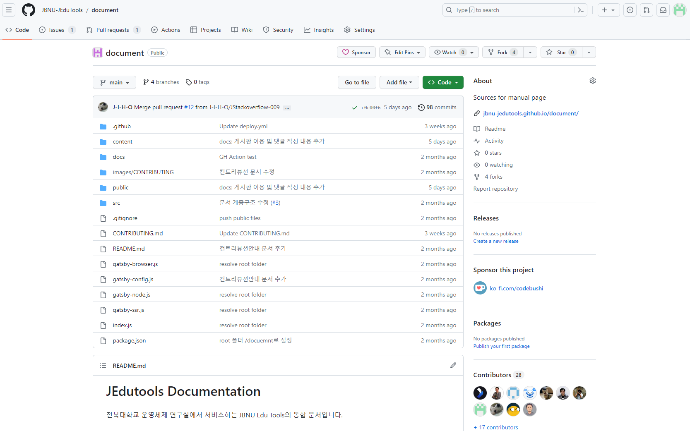
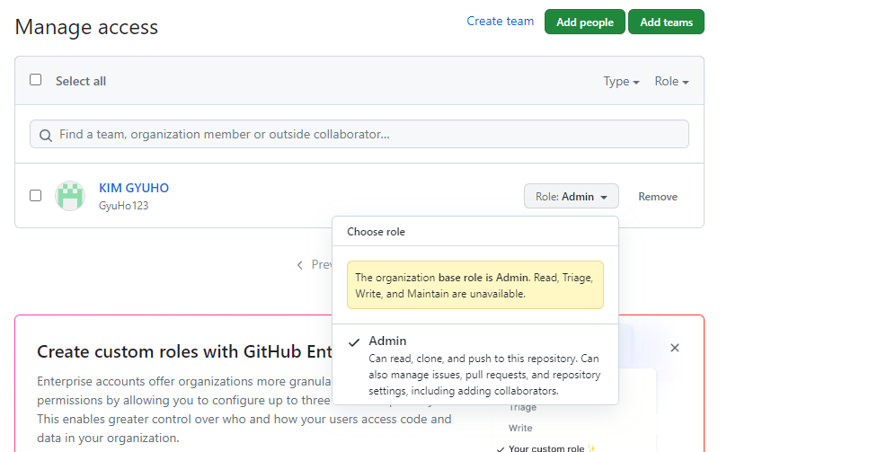

## 관리자 추가

- 관리자의 변경이 필요한 경우(연구실 인원 변동 등)에 관리자의 추가가 필요함

    
  → 상단 메뉴 중 “Settings" 클릭  
    
  → 좌측 메뉴 중 “Collaborators and Teams" 클릭  
    
  → 상단 메뉴 중 “Add People" 클릭하여 Github 닉네임 입력 후 Invite  
    
  → Base Roll이 Admin이기 때문에 인원 추가 시 자동으로 관리자로 지정이 됨
