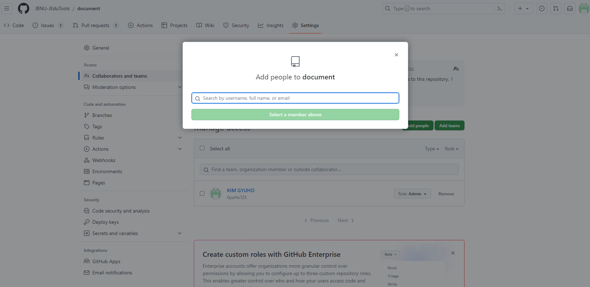
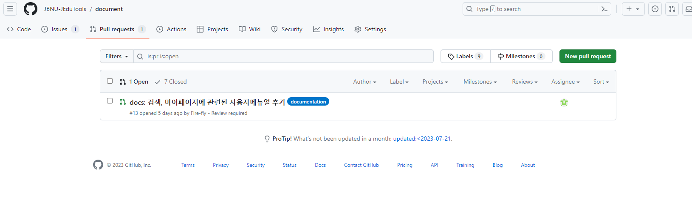
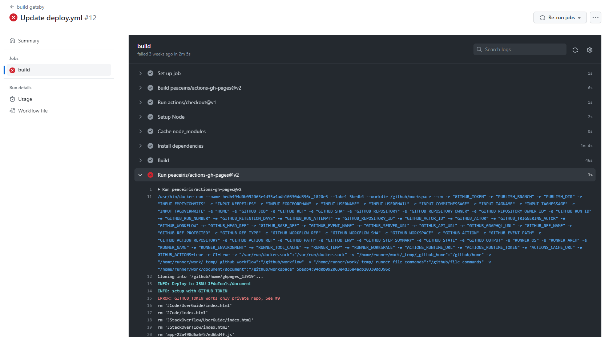

# 관리자 추가

- 관리자의 변경이 필요한 경우(연구실 인원 변동 등)에 관리자의 추가가 필요함

    
  → 상단 메뉴 중 “Settings" 클릭  
    
  → 좌측 메뉴 중 “Collaborators and Teams" 클릭  
    
  → 상단 메뉴 중 “Add People" 클릭하여 Github 닉네임 입력 후 Invite  
    
  → Base Roll이 Admin이기 때문에 인원 추가 시 자동으로 관리자로 지정이 됨

# Pull Request

- Github Repository 내의 PR 요청을 확인하고 그 내용을 Review

    

- 이상이 없을 시 PR 요청을 Merge 하면 PR의 내용을 Action으로 넘겨서 Build & Test 수행
    
 
# Merge 이후 Github Action을 이용한 Build & Test

- Merge 이후에는 Github Action을 통해 자동으로 Build & Test를 진행하도록 설정이 되어 있음

- Github Action을 확인하여 Merge 한 내용이 이상 없이 잘 작동하는지 확인이 필요

- 방법은 아래와 같음

  → 상단 메뉴 중 “Action" 클릭  
    

      - 노란색 점으로 나타나 있는 부분이 현재 Test가 진행 중인 부분 

  → “Build"가 진행 중인 사항 확인  

    

        - 현재 진행 중인 상황 확인 가능 
        - build 클릭 시 상세 진행 사항 확인 가능

  → 진행 중인 상황에서 build 클릭하여 상세 진행 사항 확인 시 아래에 같이 나오게 됨  
      
    
# 오류 발생 시 Trouble Shooting 진행

    

  - 기존에 발생한 오류 해결 방법은 [Trouble Shooting 페이지 - 관리자용](https://jbnu-jedutools.github.io/document/JHelper/AdminManual/Troubleshooting)에 자세히 설명되어 있으니 해당 페이지 참조
