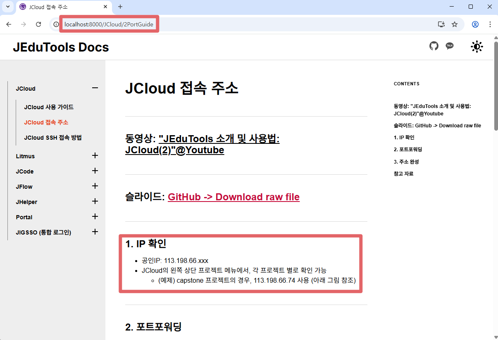
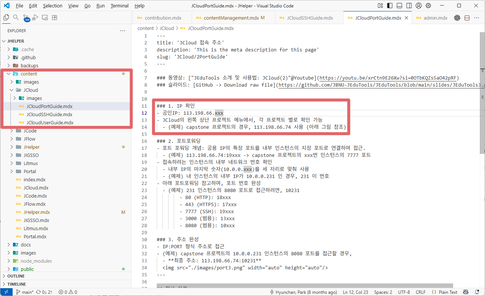
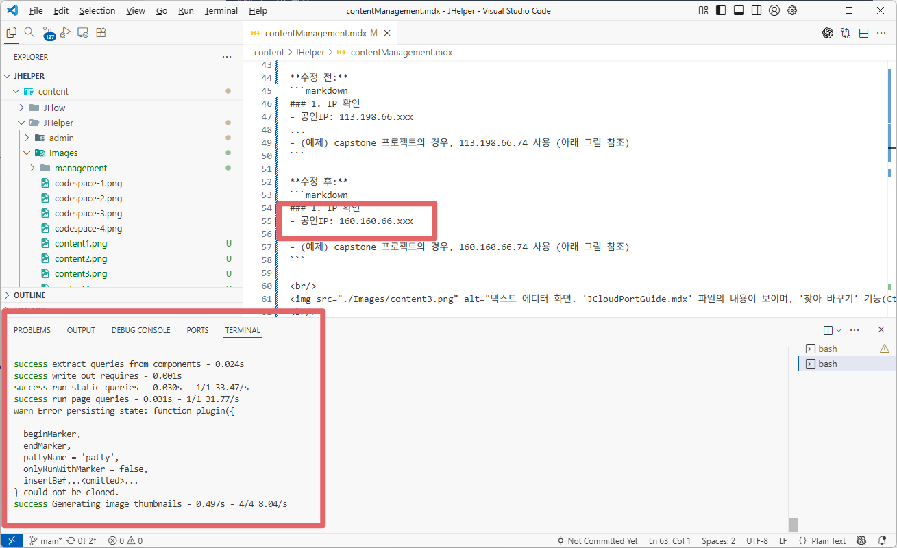
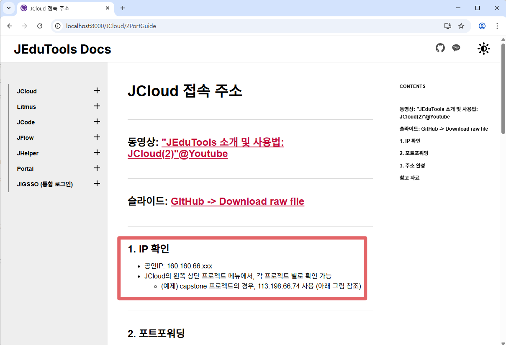

이 가이드는 JEduTools 문서 웹사이트의 콘텐츠를 관리하는 방법을 안내합니다. 문서는 크게 **기존 문서의 내용을 간단히 수정하는 방법**과 **새로운 서비스 문서를 추가하는 방법** 두 가지로 나뉩니다.

## Part 1: 기존 문서 수정하기 (예제)

웹사이트에 이미 존재하는 문서의 내용을 수정하는 방법을 단계별로 알아봅니다. `JCloud 접속 주소` 가이드의 IP 주소를 `113.198.66.xxx`에서 `160.160.66.xxx`로 변경하는 과정을 예시로 사용합니다.

### Step 1: 수정할 페이지와 정보 확인하기

먼저, 로컬 개발 서버(`yarn develop`)를 실행하고 웹 브라우저에서 수정하고 싶은 페이지로 이동합니다.

- **페이지 주소:** `http://localhost:8000/JCloud/2PortGuide`
- **수정할 내용:** 본문에 보이는 `113.198.66.xxx` IP 주소

<br/>

<br/>

### Step 2: 웹 주소(URL)를 이용해 실제 파일 위치 찾기

웹사이트의 URL 경로는 우리 프로젝트 폴더의 `content` 디렉터리 구조와 거의 동일합니다. 이 규칙을 이용해 수정할 파일을 쉽게 찾을 수 있습니다.

- **웹페이지 경로:** `/JCloud/2PortGuide`
- **로컬 파일 경로:** `[프로젝트 폴더]/content/JCloud/JCloudPortGuide.mdx`

파일 탐색기나 VS Code 같은 에디터에서 해당 경로로 이동하여 `.mdx` 파일을 찾습니다.

<br/>

<br/>

### Step 3: 파일 열고 내용 수정하기

찾은 `JCloudPortGuide.mdx` 파일을 에디터로 열고, IP 주소를 수정합니다. 파일 전체에서 변경이 필요할 수 있으므로 '찾아 바꾸기' 기능을 사용하면 편리합니다.

- **찾을 내용:** `113.198.66.xxx`
- **바꿀 내용:** `160.160.66.xxx`

**수정 전:**
```markdown
### 1. IP 확인
- 공인IP: 113.198.66.xxx
...
- (예제) capstone 프로젝트의 경우, 113.198.66.74 사용 (아래 그림 참조)
```

**수정 후:**
```markdown
### 1. IP 확인
- 공인IP: 160.160.66.xxx
...
- (예제) capstone 프로젝트의 경우, 160.160.66.74 사용 (아래 그림 참조)
```

<br/>

<br/>

### Step 4: 로컬 서버에서 변경 결과 확인하기

파일을 저장한 후, 다시 웹 브라우저로 돌아와 `JCloud 접속 주소` 페이지를 새로고침하거나, 개발 서버가 자동으로 업데이트해주기를 기다립니다. IP 주소가 `160.160.66.xxx`로 올바르게 변경되었는지 확인합니다.

<br/>

<br/>

### Step 5: 변경사항 커밋(Commit) 및 푸시(Push)하기

수정한 내용이 만족스러우면, 변경사항을 Git 저장소에 기록(커밋)하고 자신의 원격 저장소에 푸시(Push)합니다.

```bash
# 1. 수정한 파일을 Staging 영역에 추가합니다.
git add content/JCloud/JCloudPortGuide.mdx

# 2. 어떤 내용을 수정했는지 명확한 메시지와 함께 커밋합니다.
git commit -m "docs(JCloud): JCloudPortGuide의 IP 주소 업데이트"

# 3. 자신의 원격 저장소(GitHub)에 변경사항을 푸시합니다.
#    [your-branch-name] 부분에 현재 작업 중인 브랜치 이름을 입력하세요.
git push origin [your-branch-name]
```

이제 자신의 GitHub 저장소에 변경사항이 반영되었으며, 이후 Pull Request를 생성할 수 있습니다.

---

## Part 2: 신규 서비스/문서 추가하기

새로운 서비스(예: J-NewService)를 JEduTools 매뉴얼에 추가하는 전체 과정입니다.

### 1. `content` 디렉터리에 새 폴더 생성

새로운 서비스를 위한 폴더와 그 안에 이미지를 저장할 `images` 폴더를 생성합니다.

```bash
mkdir -p content/J-NewService/images
```

### 2. 메인 문서 파일 생성

서비스의 첫 페이지가 될 메인 문서를 `.mdx` 파일로 생성합니다. 파일 상단에는 `frontmatter`라는 영역에 페이지의 제목, 설명, URL 경로(`slug`)를 정의해야 합니다.

**파일 위치:** `content/J-NewService/Home.mdx`

```yaml
---
title: 'J-NewService 사용 가이드'
description: '새로운 서비스 J-NewService에 대한 간략한 설명'
slug: 'J-NewService/1Home'
---

# J-NewService 사용 가이드

여기에 서비스에 대한 상세한 내용을 작성합니다.
```
> **Tip:** `slug`의 `1Home`처럼 숫자 접두사를 사용하면 사이드바 메뉴의 정렬 순서를 제어할 수 있습니다.

### 3. `gatsby-config.js` 파일 수정 (사이드바 메뉴 추가)

왼쪽 사이드바 메뉴에 새로운 서비스를 추가하기 위해 `gatsby-config.js` 파일의 `forcedNavOrder` 배열을 수정합니다.

```javascript
// gatsby-config.js
sidebarConfig: {
  forcedNavOrder: ['/J-NewService', '/JCloud', '/Litmus', '/JCode', '/JFlow', '/JHelper', '/JIGSSO (통합 로그인)', '/Portal'],
  ignoreIndex: false
}
```

### 4. `index.mdx` 파일 수정 (메인 페이지에 추가)

웹사이트의 메인 페이지(`index.mdx`)에 있는 서비스 목록 표에 새로 추가한 서비스를 한 줄 추가합니다.

```markdown
| 이름      | 소개          | 링크   | 도움말 | GitHub 저장소 |
|-----------|--------------|:------:|:------:|:-------------:|
| J-NewService | 새로운 서비스 설명 | [Click](서비스URL) | [Manual](/J-NewService/1Home) | [repo](repo주소) |
```

### 5. `architecture.md` 파일 업데이트

프로젝트의 전체 구조를 설명하는 `architecture.md` 파일의 디렉터리 구조 부분에도 새 서비스 폴더를 추가하여 문서를 최신 상태로 유지합니다.

```
content/
├── J-NewService/      # 신규 서비스 관련 문서
...
```

### 기존 서비스 제거하기

서비스를 제거할 때는 위 단계의 역순으로 진행합니다:
1. `gatsby-config.js` 파일의 `forcedNavOrder` 배열에서 서비스 제거
2. `index.mdx` 파일에서 해당 서비스 항목 제거
3. `architecture.md` 파일에서 디렉토리 구조 업데이트
4. (선택 사항) `content/서비스명` 디렉토리 삭제

## 주의사항

- 다른 문서로 연결되는 내부 링크는 slug를 사용합니다:
```mdx
[링크텍스트](/서비스명/페이지slug)
```