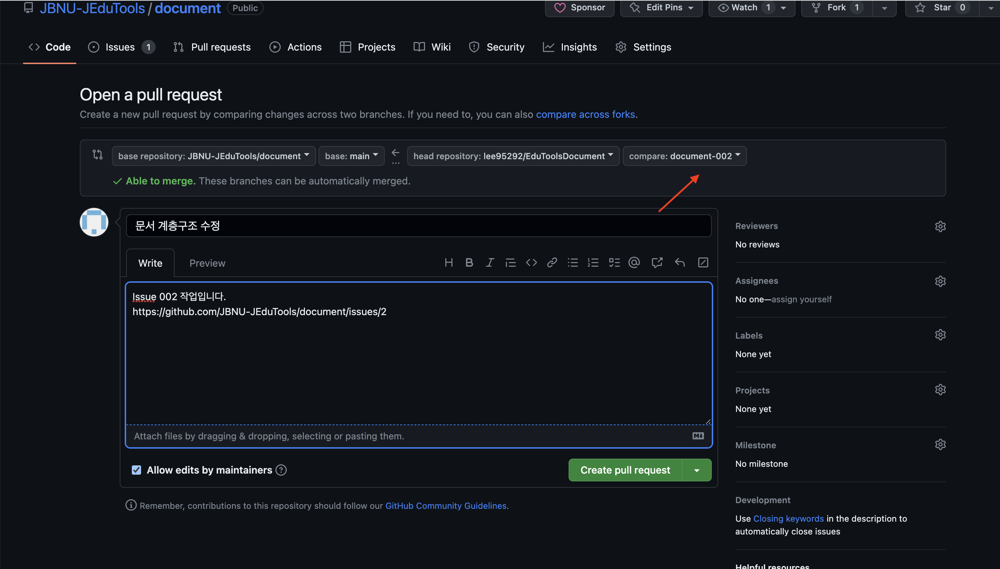
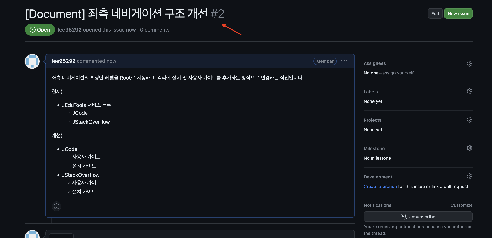

---
title: '기여 요청하기'
description: 'This is the meta description for this page'
slug: 'JHelper/3contribution'
--- 

### 코드 수정 및 로컬 확인
로컬 환경에서 [시작하기](/JHelper/1gettingStarted) 가이드에 따라 프로젝트를 설정하고, 문서 수정 작업을 진행합니다.
수정이 완료되면 로컬 서버를 통해 변경사항이 올바르게 반영되었는지 확인하는 것을 권장합니다.

### 작업 내용 제출 (Commit & Push)
반영내용을 확인 후, commit/push 를 수행합니다. 
```bash
git add .
git commit -m "docs(JHelper): 문서 내용 수정"
git push origin main
```

### Pull Request 생성
이제 자신의 GitHub 저장소에서 원본 저장소로 Pull Request를 생성합니다.


사진처럼 왼쪽에는 내가 커밋을 보낼 저장소(JEdutools) 오른쪽에는 본인이 작업한 저장소를 두고 JEudtools와 자신의 저장소 브랜치 모두 main으로 설정합니다.
(만약 본인이 작업한 브랜치가 document-002라면 document-002브랜치로, 아니라면 main으로 설정합니다.)


## Issue 생성 (선택 사항)

수정을 진행하기전, 승인을 받을 수 있을지 알기 어렵다면, 이슈를 먼저 생성해서 어떤 작업을 할 것인지 기록한 이후에 작업할 수 있습니다.
또한, 직접 작업하기 어려운 내용도 이슈탭에 작성할 수 있습니다.


