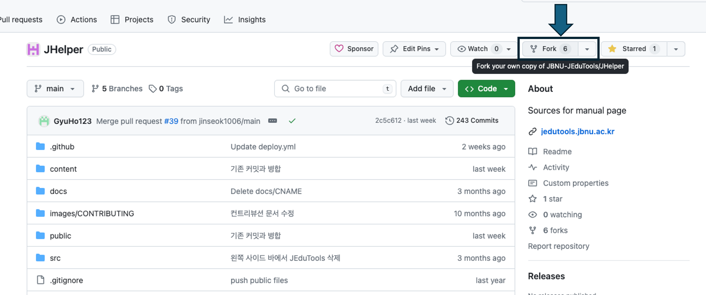
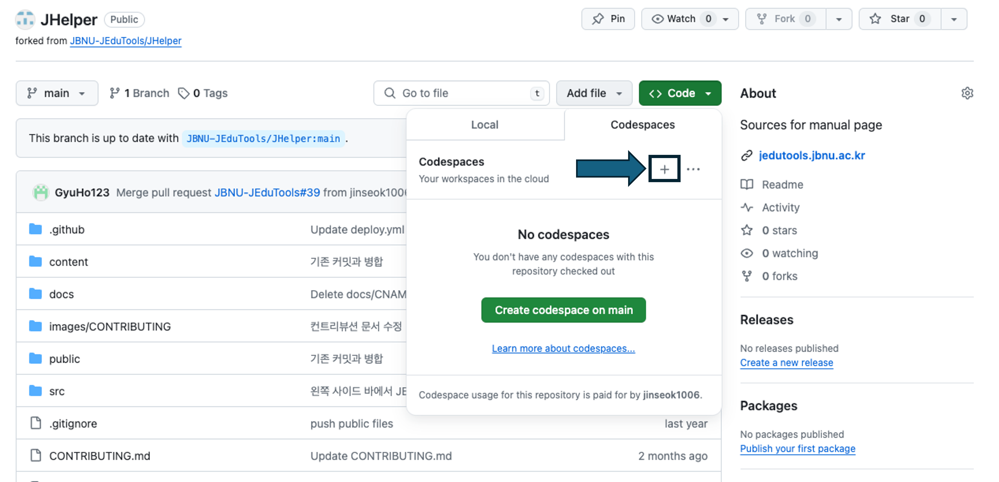
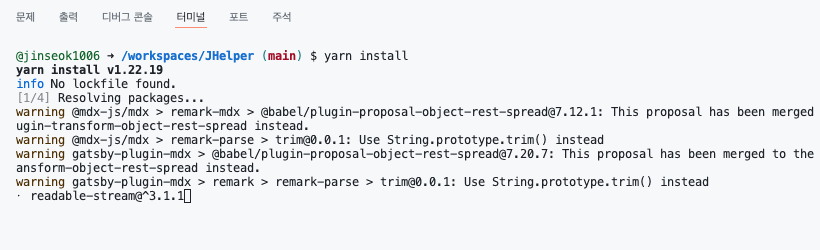

---
title: 'JHelper 개발자 매뉴얼'
description: 'This is the meta description for this page'
slug: 'JHelper/2devManual'
--- 

## 컨트리뷰션 가이드라인

JCode, JStackOverflow 등 JEduTools에 대한 사용법이나 팁, 설치 가이드에 대한 내용을 수정 후 컨트리뷰션 해주세요.

컨트리뷰션이 처음이라면, 아래 가이드라인을 통해 컨트리뷰션하는것을 권장합니다.

### Issue

JEduToos의 문서화 프로젝트 또는 문서 내용에 대한 수정 제안을 Issue 탭에서 작성해주세요

(예시 제목) 문서화 페이지 상단 네비게이션 깃허브링크 수정
```
상단 문서의 깃허브 링크와 트위터 링크를 해당 레포 주소와 운영체제연구실 홈페이지 주소로 수정
```

### 컨트리뷰션 과정 요약

오픈소스 컨트리뷰션이 처음이거나 상세한 컨트리뷰션 가이드가 필요하다면, 아래의 컨트리뷰션 예시를 따라 진행해주세요.

1. 해당 프로젝트를 Fork
2. 브랜치 생성 컨벤션*에 맞춰 브랜치를 생성
3. 문서 내용 또는 문서화프로젝트의 코드를 수정합니다.
4. git에서 commit, push.
5. 내 레포지토리에서 변경된 내용을 원본 레포지토리에 Pull Request.

이후 관리자가 확인 후, 내 코드가 문서화 페이지에 반영됩니다. 

*브랜치 생성 컨벤션이란?
- 브랜치 생성 시, 이름 중복을 방지하기 위해 [서비스명-이슈번호]로 브랜치를 생성합니다.
- 예시) JCode-001


### 컨트리뷰션 예시

**1) 이슈 생성**   
기여하고싶은부분을 찾은 뒤, Issue탭을 통해 해당 부분에 대해 논의를 나눕니다. 기여해야하는 부분으로 확인되면 작업을 시작합니다.   


**2) 작업 시작**  
Fork를 통해, 원본 레포지토리를 내 레포지토리로 복사합니다.  


이후, 로컬에 코드를 불러온 뒤, 문서화 작업을 해줍니다. 내 레포지토리 목록에 있는 문서화 레포지토리임을 주의합시다.
```
git clone https://github.com/lee95292/EduToolsDocument
cd EduToolsDocument
```

저의 경우 좌측 네비게이션에서 서비스 목록을 추가해주는 작업을 완료했습니다. 

단순 오탈자 수정이라면 로컬에서 빌드하지 않고 바로 PR해도 괜찮습니다. (Github Action이 자동빌드/배포를 수행)
이번과 같은 대규모 수정의 경우 정상 반영 여부를 로컬에서 확인하고 PR하는것을 권장합니다.

```
yarn install # 최초 1회, 모듈 설치
yarn run develop # Service Running - localhost:8000
```
**3) 작업 내용 제출**  
반영내용을 확인 후, 브랜치 생성과 commit/push 를 수행합니다. 
```
git checkout -b document-002
git add .
git commit -m "문서 계층구조 수정"
git push origin document-002
```

이제 JEduTools Organization의 문서화 레포지토리에서 Pull Request를 해줍니다. 


이제 모든 작업이 끝났습니다. 프로젝트 관리자는 작업한 PR을 확인 후 프로젝트에 반영할 것입니다.

## 추가정보

### A. 문서 추가시 참고할 내용

1) 계층구조
* 폴더 내에 계층 안에 들어갈 문서 작성
* 폴더명과 같은 이름의 문서.mdx 작성

2) 좌측 네비게이션 정렬 순서
* 기본적으로 slug명, 없다면 파일명으로 정렬된다.
* gatsby-config.js에서 slug와 매칭되는 문자에 대해서 강제로 정렬할 수 있다.
 * 해당 파일의 sidebarConfig.forcedNavOrder 에서 설정하면 된다.

### B. 도메인 수정시 참고할 내용
현재 레포지토리 이름이 /document이므로 github pages에서 /document로 서비스한다.   
그러므로, 빌드 시 설정에 루트 경로를 /document로 설정해놓은 상태이다.  

만약 도메인을 연결해 루트경로에서 서비스할 수 있게된다면 아래 항목을 수정해야 합니다.
* package.json > yarn run build > build:ghpage > PREFIX_PATHS=true gatsby build 항목을 gatsby build 로 변경
* gatsby-config.js > pathPrefix 항목 삭제

### C. Github Codespace 개발환경 구성
일부 로컬 환경에서는 개발환경이 구성되지 않는 경우가 있습니다. 이때 codespace를 활용하여 ubuntu환경을 생성하고 원격으로 작업을 수행할 수 있습니다.

1) JHelper 저장소를 포크하여 개인 저장소로 복제합니다.


2) 아래의 사진과 같이 codespace를 생성하면 웹 기반의 Visual Studio Code 환경에 자동으로 접속됩니다.


3) 모듈 설치 및 기여에 관한 부분은 <a href='#컨트리뷰션-예시'>컨트리뷰션 예시</a>을 참고하여 수행할 수 있습니다. 매뉴얼에 따라 작업을 저장하고 PR을 생성하면 관리자가 반영할 것 입니다.

미리보기 확인시 codespace는 원격 개발환경이므로 localhost로 접속할 수 없음에 유의해야합니다. 아래의 포트 패널에서 8000 포트의 주소를 확인하여 미리보기 페이지로 접속할 수 있습니다.


4) 개인계정에 할당된 codespace는 월별 사용량이 정해져 있으므로 작업을 완료한 이후에는 다음과 같이 codespace를 삭제합니다.


##  Trouble Shooting
* [JHelper 알려진 문제와 해결방법 페이지](/JHelper/2devManual/Troubleshooting)를 참조하여 해결하세요
