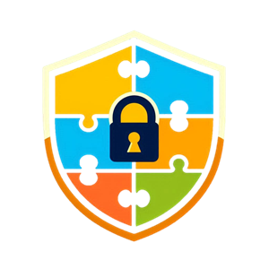

## JIGSSO : JEduTools Integrated Gateway for SSO

JIGSSO는 Keycloak 기반의 Single Sign-On(SSO) 기능을 제공합니다.

이는 JEduTools 학습 플랫폼 통합 인증 시스템으로, 사용자는 단일 계정으로도 로그인 가능합니다.

보안성과 편의성을 고려하여 개발되었으며, OAuth 2.0 및 OpenID Connect(OIDC)를 기반으로 동작합니다.

 

- [JIGSSO 사용자 가이드](https://jhelper.jbnu.ac.kr/JIGSSO/JIGSSOUserManual)