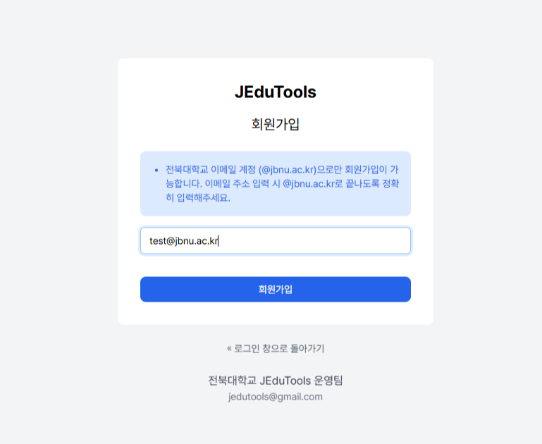

## 회원가입 가이드

JEduTools 학습 플랫폼 사용을 위한 계정을 생성해야 합니다. 아래의 절차를 따라 회원가입을 진행할 수 있습니다.

### 1. 회원가입 페이지 접속

- 서비스의 로그인 페이지에서 '회원가입' 버튼을 통해 접속

### 2. 회원가입 폼 작성

- 전북대 이메일 계정을 통해 회원가입 진행 가능

- 이메일 입력 시 **@jbnu.ac.kr** 로 끝나도록 폼 작성
    - 예시 : test@jbnu.ac.kr

 

### 3. 이메일 인증

- 회원가입을 진행한 이메일 계정에서 회원가입 인증 메일 확인

    - Title : JEduTools - 이메일 인증
    - From : JEduTools SSO

- 전달받은 메일에서 "이메일 주소 인증 링크" 클릭

### 4. 회원가입 완료

- 이메일 인증 후 계정 활성화

- Litmus의 경우 Litmus에서도 별도 회원가입 진행 후 로그인 가능

 

 
 

## 로그인 가이드

회원가입을 통해 생성한 계정을 통해 로그인을 진행할 수 있습니다.

로그인 방법은 2가지로, 아래와 같습니다.

### 1. 구글 로그인

- 로그인 페이지에서 구글 로그인 버튼 클릭 (Sign in with Google)

- 전북대 이메일 계정으로 구글 로그인 진행

### 2. 매직링크

- 로그인 페이지에서 구글 로그인 버튼 아래의 폼 작성 후 '로그인' 버튼 클릭

    - 전북대 이메일 계정 작성 
    - 예시 : test@jbnu.ac.kr

 

- 입력한 이메일 계정에서 로그인 링크가 포함된 메일 확인
    - Title : JEduTools - 로그인 링크 안내
    - From : JEduTools SSO

- 전달받은 메일에서 "본인의 요청이 맞다면 이곳을 클릭하세요" 클릭 시 로그인 성공

 
 

## 로그인 가능 서비스

- JEduToolsPortal
    - 페이지 상단에 위치한 'SIGN IN' 버튼 클릭 시 로그인 페이지로 이동

- JCloud
    - JCloud 접근 시 보이는 드롭다운에서 'JEduTools 통합 로그인 시스템' 선택 (Default)
    - '로그인' 버튼 클릭 시 로그인 페이지로 이동

- Litmus
    - Litmus 에서 별도 회원가입 진행
    - Litmus 로그인 페이지에서 'JEduTools 통합 로그인' 버튼 클릭

- JCode
    - JCode 접근 시 보이는 'JEduTools 통합 로그인' 버튼 클릭

- JFlow
    - 각 서비스의 접속 시, 기본 로그인으로 동작
