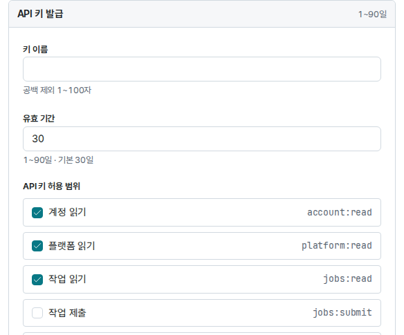

AI 에이전트(Claude Code, Codex 등)에게 JPUShare를 맡기면 작업 제출, 상태 확인, 결과 받기를 대화로 시킬 수 있습니다. 준비는 API 키 발급, 키 넣기, 스킬 설치, 연결 확인 네 단계입니다.

에이전트가 읽는 절차서(스킬)는 JHelper 저장소의 [skills/jpushare](https://github.com/JBNU-JEduTools/JHelper/tree/main/skills/jpushare)에 있습니다. API의 자세한 내용은 [API 사용법](/JPUShare/2Agent/2API)을 참고하세요.

## 1. API 키 발급하기

연구실 참가 승인을 마친 계정에만 **API 키 발급** 판이 보입니다. 아직이라면 먼저 [시작하기](/JPUShare/1Web/1GettingStarted)를 마칩니다.



1. [JPUShare](https://share.jedutools.io)에 로그인합니다.
2. 왼쪽 위의 **내 정보/설정**을 엽니다.
3. **API 키 발급** 판에 키 이름과 유효 기간(1~90일)을 입력합니다.
4. **API 키 허용 범위**에서 에이전트에게 맡길 일에 필요한 범위만 고릅니다. 연결을 확인하고 작업을 내고 결과를 받으려면 `account:read`, `platform:read`, `jobs:read`, `jobs:submit`이 필요합니다. 읽기 범위는 미리 선택되어 있고 `jobs:submit`은 직접 켭니다.
5. **API 키 발급**을 누릅니다. `jobs:submit`처럼 권한이 큰 범위를 골랐다면 **키 허용 범위 확인** 창에서 **확인 후 발급**을 누릅니다.
6. 한 번만 보이는 `jpk_...` 원문을 복사합니다.

에이전트는 키를 스스로 만들 수 없습니다. 키 발급·폐기는 웹에서만 할 수 있습니다. 허용 범위별 경로는 [API 사용법](/JPUShare/2Agent/2API)의 허용 범위 표를 참고하세요.

## 2. 키 넣기

에이전트를 실행할 터미널에서 키를 환경 변수로 넣고, **그 터미널에서 에이전트를 시작**합니다.

```bash
export JPUSHARE_API_KEY='jpk_...'
claude        # Codex라면 codex
```

이미 켜져 있던 에이전트는 나중에 다른 터미널에서 넣은 값을 모릅니다. 키를 넣은 뒤에는 에이전트를 다시 시작합니다.

> 키를 채팅에 붙여 넣어도 에이전트는 쓸 수 있지만, 붙여 넣은 키는 AI 서비스 쪽 대화 기록에 남습니다. 환경 변수로 넘기기를 권장하며, 붙여 넣을지는 사용자가 판단합니다.

## 3. 스킬 설치하기

에이전트에게 아래 프롬프트를 그대로 붙여 넣습니다.

```text
다음 JPUShare 스킬을 설치하고 사용할 수 있게 설정해 줘: https://github.com/JBNU-JEduTools/JHelper/tree/main/skills/jpushare
설치가 끝나면 API 키를 넣는 방법을 알려 주고, 연결을 확인해 줘.
```

직접 설치하려면 에이전트를 쓸 폴더에서 `npx skills add` 명령을 실행합니다. `-a`로 설치할 에이전트를 고릅니다.

```bash
npx skills add JBNU-JEduTools/JHelper --skill jpushare -a claude-code   # Claude Code
npx skills add JBNU-JEduTools/JHelper --skill jpushare -a codex         # Codex
```

모든 프로젝트에서 쓰려면 `-g`를 붙입니다. 설치 도구를 쓸 수 없으면 [SKILL.md](https://github.com/JBNU-JEduTools/JHelper/blob/main/skills/jpushare/SKILL.md)를 에이전트의 스킬 폴더(예: Claude Code는 `.claude/skills/jpushare/`)에 받아 둡니다. 설치한 뒤 에이전트가 스킬을 찾지 못하면 에이전트를 다시 시작합니다.

## 4. 연결 확인하기

에이전트에게 "JPUShare 연결을 확인해 줘"라고 합니다. 에이전트는 `GET /v1/me`를 불러 계정 이름, 소속 연구실, 이 키로 할 수 있는 동작을 알려 줍니다.

| 결과 | 뜻과 할 일 |
| --- | --- |
| 계정과 연구실이 보임 | 연결되었습니다. "jpu-48-edu에서 main.py를 실행해 줘"처럼 일을 맡깁니다. |
| 401 | 키가 만료·폐기되었거나 잘못 복사되었습니다. 키를 다시 발급해 넣고 에이전트를 다시 시작합니다. |
| 403 `API_KEY_SCOPE_REQUIRED` | 키에 필요한 허용 범위가 없습니다. 연결 확인에는 `account:read`가 필요합니다. 필요한 범위를 넣어 새로 발급합니다. |
| 연구실이 비어 있음 | 키를 발급한 뒤 연구실 소속이 바뀌었습니다. 웹에서 참가를 신청하고 책임교수 또는 연구실 관리자의 승인을 받습니다. |

에이전트는 삭제·취소·대기열 순서 변경처럼 되돌리기 어려운 일을 하기 전에 사용자의 확인을 받습니다.

## 5. 에이전트별 참고

### Claude Code

2절처럼 키를 넣은 터미널에서 `claude`를 시작하면 에이전트가 실행하는 명령에 키가 전달됩니다.

### Codex

Codex 문서(2026년 9월 기준)에 따르면 `workspace-write` 샌드박스에서는 바깥 네트워크가 기본으로 막혀 있습니다. 에이전트가 JPUShare에 요청하려면 `~/.codex/config.toml`에서 네트워크를 허용합니다.

```toml
[sandbox_workspace_write]
network_access = true

[shell_environment_policy]
ignore_default_excludes = true   # 이름에 KEY가 든 JPUSHARE_API_KEY도 명령에 넘긴다
```

명령에 넘길 환경 변수는 `shell_environment_policy`가 정합니다. Codex 문서 기준 `ignore_default_excludes`의 기본값은 `true`이고, 이때는 이름에 `KEY`·`SECRET`·`TOKEN`이 든 다른 비밀 값도 함께 넘어갑니다. `false`로 두면 이름에 `KEY`·`SECRET`·`TOKEN`이 들어간 변수가 빠져 `JPUSHARE_API_KEY`도 전달되지 않습니다. 기본값은 Codex 버전에 따라 다를 수 있으니 위처럼 적어 둡니다. `inherit = "core"`나 `"none"`으로 환경을 좁혔다면 `JPUSHARE_API_KEY`가 빠지지 않았는지 확인합니다.

Codex 경로는 검증하지 않았습니다. 설정 이름과 동작은 Codex 버전에 따라 다를 수 있으니 [Codex 설정 문서](https://developers.openai.com/codex/config-advanced)를 함께 확인하세요.

[JPUShare 안내로 돌아가기](/JPUShare)
