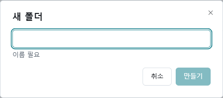
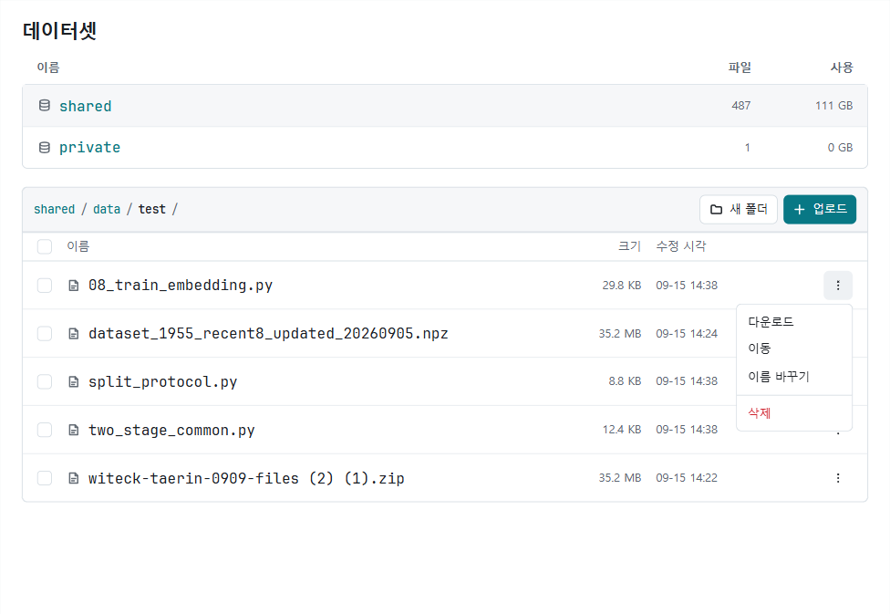

**데이터셋** 화면에서 접근 가능한 저장소의 파일을 관리합니다.
코드는 **새 작업**에서 제출하고, 여러 작업에 사용할 입력 데이터는 이 화면에 먼저 올립니다.

로그인과 연구실 참가 승인을 마친 뒤 **데이터셋** 화면을 엽니다. 처음 이용한다면 [시작하기](/JPUShare/1GettingStarted)를 참고합니다.

## 1. 저장소와 공유 범위 확인하기

목록에는 저장소의 **이름**, **파일**, **사용** 정보가 표시됩니다.
사용할 저장소 이름을 선택하면 해당 위치의 파일 목록이 열립니다.

배포 화면에 따라 `shared`, `private` 같은 버킷 또는 영역 이름이 표시될 수 있습니다.
**표시된 이름만으로 공개 범위나 개인 전용 여부를 단정하지 말고 소속 연구실의 설정을 확인하세요.**
연구실 구성원이 함께 사용하는 저장소도 있으므로 개인 계정으로 업로드했다고 개인 전용 파일이 되는 것은 아닙니다.
데이터셋 화면에는 파일별 공유/비공개 전환 버튼이 없습니다.
개인 전용 보관이 필요한 데이터는 업로드 전에 담당자에게 접근 범위를 확인합니다.

## 2. 파일 업로드하기

1. 업로드할 저장소를 선택합니다.
2. **data/** 폴더를 엽니다. 기존 하위 폴더에 넣으려면 해당 폴더로 이동합니다.
3. 목록 위의 현재 경로를 확인합니다.
4. **업로드**를 선택하고 파일을 고릅니다. 여러 파일을 함께 선택할 수 있습니다.
5. 전송량 표시가 사라지고 일반 파일 목록에 나타나는지 확인합니다.

파일은 현재 보고 있는 경로에 원래 파일명으로 올라갑니다.
실험 버전이 다르면 `sample-v1.csv`, `sample-v2.csv`처럼 이름을 구분해 사용하세요.
저장소 최상위에서는 **업로드**와 **새 폴더**가 비활성화되어 있습니다. **data/** 아래로 이동한 뒤 사용합니다.

### 새 폴더 만들기

- **새 폴더**를 클릭하고 **폴더 이름**을 입력한 뒤 **만들기**를 클릭합니다.
- 생성된 폴더를 열고 파일을 업로드합니다. 폴더를 만든 것만으로 로컬 파일이 올라가지는 않습니다.

전송을 멈추려면 해당 업로드 행의 취소 아이콘을 선택합니다.
이어 올리기는 지원하지 않으므로 실패한 파일은 오류 원인을 확인한 뒤 다시 선택해 업로드합니다.

## 3. 파일 찾기와 다운로드

1. 저장소를 선택하고 필요한 폴더를 엽니다.
2. 상단 경로에서 저장소 이름이나 상위 폴더를 선택하면 위로 이동합니다.
3. 파일이 많으면 **이전**, **다음**으로 목록을 넘깁니다.
4. 파일 오른쪽의 **⋮ 메뉴 → 다운로드**를 클릭합니다.
5. 브라우저 다운로드 목록에서 파일 저장을 확인합니다.

파일 크기와 수정 시각을 확인해 원하는 버전을 받았는지 점검하세요.
목록 조회가 실패했다면 **다시 조회**를 선택합니다.

## 4. 작업 입력으로 연결하기

**새 작업 → 입력 데이터**에는 다음 정보를 입력합니다.

| 항목 | 입력할 내용 |
| --- | --- |
| 이름 | 코드에서 사용할 입력 이름입니다. 예: `train` |
| 위치 | 파일을 올린 영역을 선택합니다. 예: `shared / data` |
| 경로 | 선택한 영역 아래에서 가져올 경로 또는 접두사를 입력합니다. 예: `test/` |
| 크기 (GB) | 가져올 데이터 크기를 정수 GB로 입력합니다. |

경로에는 가져올 데이터가 있는 폴더의 접두사를 입력합니다.
접두사는 일치하는 여러 파일을 포함할 수 있으므로 의도한 데이터 범위인지 확인하세요.
작은 데이터도 필요한 공간을 과소평가하지 않도록 크기를 올림해 입력합니다.

입력 이름은 영문 소문자나 숫자로 시작하고, 이후에는 소문자·숫자·밑줄·하이픈을 사용합니다.
이름이 `train`이면 코드에서 `JOB_CHANNEL_TRAIN` 환경 변수로 입력 디렉터리를 찾습니다.
입력 디렉터리는 읽기 전용이므로 수정한 데이터는 출력 경로에 저장하세요.

데이터 ZIP을 입력으로 올려도 자동으로 압축이 풀리지 않습니다.
압축 해제가 필요하면 코드에서 임시 공간으로 풀고, 펼쳐진 크기까지 고려해 자원을 선택합니다.
전체 제출 과정은 [학습 작업 실행](/JPUShare/3Jobs)을 참고하세요.

## 5. 파일과 폴더 삭제하기

개별 삭제는 파일 또는 폴더 오른쪽의 **⋮ 메뉴 → 삭제**를 클릭합니다.
여러 항목은 체크박스로 고른 뒤 **선택 삭제**를 선택합니다.

**전체 선택**은 현재 페이지의 항목을 선택합니다.
페이지나 경로를 바꾸면 선택이 해제됩니다.
폴더를 삭제하면 현재 화면에 보이지 않는 파일을 포함해 **그 폴더 아래 파일 전체**가 삭제됩니다.

확인창에서 파일 수와 폴더 경로를 다시 읽고 삭제하세요. 삭제는 되돌릴 수 없습니다.
공유 데이터는 다른 구성원의 대기 중인 작업에서도 필요할 수 있으므로 사용 여부를 먼저 확인합니다.
작업 결과에는 별도의 삭제 권한이 적용되어 본인 소유가 아닌 결과의 삭제가 거절될 수 있습니다.

작업에 사용할 저장소와 경로, 크기를 기록해 두면 다음 작업에서도 같은 데이터를 연결할 수 있습니다.

업로드 실패, 저장 공간 부족, 권한 오류는 [문제 해결](/JPUShare/6Troubleshooting)을 확인하세요.
프로그램으로 파일 목록을 조회하려면 [API 사용법](/JPUShare/5API)을 참고합니다.

[JPUShare 안내로 돌아가기](/JPUShare)
