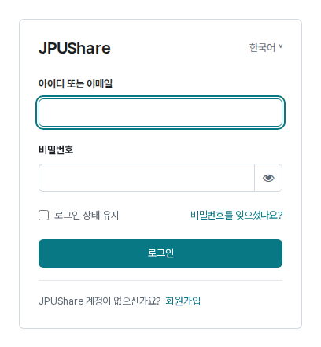
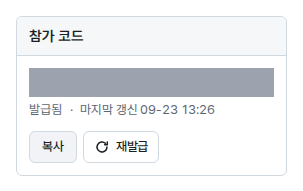
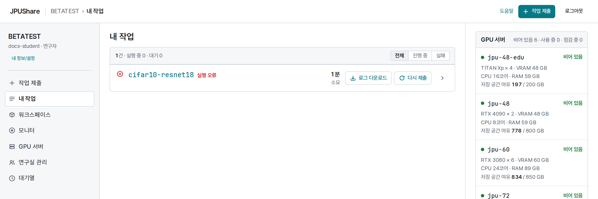
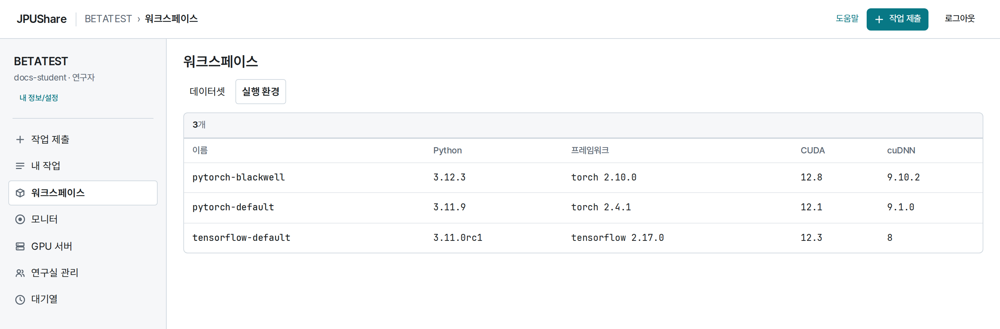

JPUShare를 쓰려면 계정을 만들고 연구실 참가 승인을 받아야 합니다.
참가 코드는 연구실 책임교수에게 받습니다.

## 1. 회원가입과 이메일 인증

1. [JPUShare 열기](https://share.jedutools.io)를 선택하면 로그인 화면이 열립니다.
2. 계정이 없으면 로그인 화면의 **회원가입**을 선택합니다.
3. 아이디, 비밀번호, 비밀번호 확인, 이메일, 이름을 입력합니다. 학번이 있으면 함께 적습니다.
4. 가입하면 입력한 주소로 인증 메일이 옵니다. 메일의 링크를 열어 **이메일 인증**을 마칩니다.
5. 다시 JPUShare에서 아이디와 비밀번호로 로그인합니다.

인증 메일이 보이지 않으면 스팸함을 확인하고, 로그인 화면에서 인증 메일을 다시 보내 달라고 요청합니다.
로그인에 반복해서 실패하면 [문제 해결](/JPUShare/6Troubleshooting)을 참고합니다.

## 2. 참가 코드로 연구실 참가 신청하기

처음 로그인하면 **연구실 참가** 화면이 열립니다. 이미 소속되어 있다면 이 단계는 건너뜁니다.

1. 책임교수에게 받은 **참가 코드** 숫자 5자리를 입력합니다.
2. **신청**을 선택합니다.
3. **승인 대기 중** 표시와 연구실 이름을 확인합니다.
4. 책임교수의 승인을 기다린 뒤 **다시 조회**로 상태를 확인합니다.

승인 전에는 작업 제출과 저장 공간을 이용할 수 없습니다.
잘못된 연구실에 신청했다면 **신청 취소** 후 올바른 코드로 다시 신청하세요.
참가 코드는 공개 문서나 저장소에 올리지 않습니다.

## 3. 책임교수: 참가 코드 보기와 재발급

책임교수와 연구실 관리자는 **연구실 관리** 화면의 **참가 코드** 판에서 코드를 다룹니다.

- **보기**를 누르면 지금 쓰는 참가 코드가 보입니다. **복사**로 구성원에게 전달합니다.
- **재발급**을 누르면 새 코드를 만들기 전에 **기존 코드는 무효가 됩니다**라는 확인 창이 뜹니다. 확정하면 이전 코드로는 더 이상 신청할 수 없습니다.
- 신청이 들어오면 같은 화면의 참가 신청 목록에서 **승인** 또는 **거절**을 선택합니다.

## 4. 사용할 화면 확인하기

| 메뉴 | 할 수 있는 일 |
| --- | --- |
| 작업 제출 | 코드, GPU 서버, 입력 데이터, 실행 환경과 명령을 지정해 작업을 제출합니다. |
| 내 작업 | 제출한 작업의 상태와 상세 정보, 로그, 결과를 확인합니다. |
| `워크스페이스` | 연구실 공유·내 폴더의 파일을 관리하고 실행 환경 목록을 봅니다. |
| 모니터 | 전체 GPU 서버의 실행 중인 작업과 대기 순서를 봅니다. |
| GPU 서버 | GPU 모델·메모리·대기 상태를 확인합니다. |
| 연구실 관리 | 책임교수·연구실 관리자에게 보입니다. 구성원, 참가 코드, 참가 신청을 관리합니다. |
| 대기열 | 내가 낸 작업 중 기다리는 작업의 실행 순서를 확인하고 조정합니다. |

메뉴는 권한에 따라 일부만 보일 수 있습니다.

## 5. 첫 작업 준비하기

1. `워크스페이스`의 실행 환경 탭에서 코드에 필요한 Python과 라이브러리가 들어 있는 환경을 확인합니다.
2. **GPU 서버**에서 GPU 모델과 메모리, 대기 상태를 살펴봅니다.
3. 입력 데이터가 있다면 `워크스페이스`의 파일 탭에 먼저 올립니다. [데이터 관리](/JPUShare/2Datasets)를 참고합니다.
4. 코드를 ZIP으로 준비하거나 공개 Git 저장소 주소와 ref를 확인합니다.
5. [학습 작업 실행](/JPUShare/3Jobs)의 작은 Python 예제로 제출 흐름을 확인합니다.

새 환경이 필요하면 연구실 담당자에게 문의합니다. ZIP에 패키지 목록 파일을 넣는 것만으로 패키지가 설치되지는 않습니다.

## 관련 문서

- 가입·승인이 반영되지 않으면 [문제 해결](/JPUShare/6Troubleshooting)을 확인합니다.
- 파일 준비는 [데이터 관리](/JPUShare/2Datasets), 실행 후 확인은 [결과 확인과 다운로드](/JPUShare/4Results)를 참고합니다.
- 프로그램에서 이용하려면 [API 사용법](/JPUShare/5API)을 참고합니다.

[JPUShare 안내로 돌아가기](/JPUShare)
