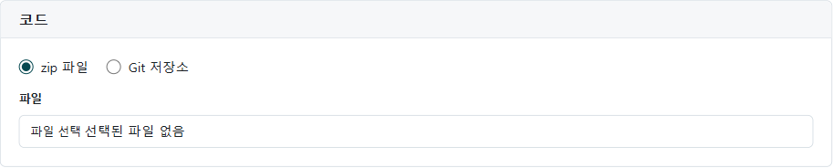
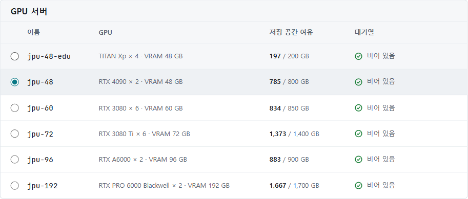

**새 작업**에서 코드와 실행 조건을 지정해 작업을 제출합니다.
학습 외에도 미세조정, 추론, 평가, 데이터 처리 작업을 선택할 수 있습니다.

연구실 참가 승인을 마친 뒤 코드 ZIP 또는 공개 Git 저장소를 준비합니다.
입력 파일은 [데이터셋 관리](/JPUShare/2Datasets)에서 먼저 업로드합니다. 처음에는 작은 작업으로 실행과 결과 저장을 확인합니다.

## 1. 코드와 데이터 경로 준비하기

작업은 코드를 푼 `/workspace`에서 실행합니다.
ZIP 안의 경로와 실행 명령의 파일 경로가 일치해야 합니다.
예를 들어 다음 ZIP은 `python main.py`로 실행합니다.

```text
code.zip
└── main.py
```

ZIP 안에 `project/main.py`가 들어 있다면 실행 명령에도 그 경로를 써야 합니다.
큰 데이터는 코드 ZIP에서 분리해 입력 데이터로 연결합니다.
데이터 압축 파일은 코드 ZIP과 달리 자동으로 풀리지 않습니다.

| 코드에서 쓸 환경 변수 | 용도 |
| --- | --- |
| `JOB_WORKSPACE_DIR` | 코드가 풀리는 작업 디렉터리 |
| `JOB_CHANNEL_TRAIN` | 이름을 `train`으로 지정한 입력 디렉터리 |
| `JOB_SCRATCH_DIR` | 압축 해제 등 임시 계산에 쓸 공간 |
| `JOB_MODEL_DIR` | 보관할 모델 파일을 쓸 `/output/model` |
| `JOB_OUTPUT_DATA_DIR` | 지표나 변환 데이터를 쓸 `/output/data` |
| `JOB_OUTPUT_DIR` | 결과로 회수하는 `/output` 전체 |

입력은 읽기 전용입니다. 작업 공간과 임시 공간은 종료 후 정리되므로 보관할 파일은 `/output` 아래에 씁니다.
데이터셋과 회수된 결과는 오브젝트 저장소에서 관리되며, 실행 중 사용하는 임시 디스크와 구분됩니다.

## 2. 작은 Python 예제 만들기

아래 내용을 `main.py`로 저장하고, 이 파일이 ZIP 최상위에 오도록 압축합니다.
Python 표준 라이브러리만 사용하며 입력 데이터 없이 실행되는 결과 저장 확인용 예제입니다.

```python
import json
import os
from pathlib import Path

values = [1, 2, 3, 4, 5]
summary = {"count": len(values), "mean": sum(values) / len(values)}
output = Path(os.environ["JOB_OUTPUT_DATA_DIR"])
output.mkdir(parents=True, exist_ok=True)
(output / "summary.json").write_text(json.dumps(summary), encoding="utf-8")
print("saved summary.json", flush=True)
```

실제 학습 코드도 같은 방식으로 지표와 모델 저장 위치를 지정합니다.
필요한 패키지는 선택한 실행 환경에 준비되어 있어야 합니다.

## 3. 새 작업 작성하기


1. **새 작업**을 엽니다.
2. **작업 이름**에 구분하기 쉬운 이름을 입력합니다. 예: `first-python-run`
3. **작업 유형**을 선택합니다. 위 예제는 **데이터 처리**, 학습 코드는 **학습**을 선택합니다.
4. 필수 항목인 **작업 설명**에 목적과 데이터 버전을 적습니다.



5. **코드 → zip 파일**을 선택하고 **파일 선택**에서 준비한 ZIP을 지정합니다.

Git을 사용한다면 **Git 저장소**를 선택하고 **저장소 주소**, **ref**를 입력합니다.
화면은 공개 저장소를 대상으로 합니다. 비공개 저장소의 자격증명을 주소에 넣지 말고 코드 ZIP을 사용하세요.

## 4. GPU 서버와 입력 데이터 선택하기



**GPU 서버** 표에서 GPU 모델·개수·VRAM, **저장 공간 여유**, **대기열**을 비교합니다.
모델에 필요한 메모리와 데이터 처리 공간을 기준으로 선택하세요.
여러 GPU의 합계 VRAM이 표시되어도 코드가 자동으로 여러 GPU를 사용하는 것은 아닙니다.
점검 중이거나 선택이 제한된 항목은 사용할 수 없습니다.


입력이 필요한 작업은 **입력 데이터**의 이름, 위치, 경로, 크기를 채웁니다.
여러 입력은 **입력 추가**로 구분하고 각 이름을 코드의 환경 변수와 맞춥니다.
위 예제는 입력 이름을 비워 두면 됩니다. 이름이 없는 입력 행은 제출되지 않습니다.

**결과 위치**에서 산출물을 저장할 영역을 선택합니다. 영역 이름만으로 접근 권한을 판단하지 말고 연구실 설정을 확인합니다.

입력 크기 합계가 선택한 서버의 여유 공간보다 크면 제출할 수 없습니다.
압축을 푼 데이터와 중간 파일도 공간을 쓰므로 실제 필요한 크기를 고려하세요.

## 5. 실행 환경과 명령 지정하기


1. **실행 환경**에서 코드에 필요한 Python·라이브러리를 지원하는 환경을 선택합니다.
2. **시간 제한**에 작업을 허용할 시간을 화면의 범위 안에서 입력합니다.
3. 예제의 **실행 명령**에는 다음을 입력합니다.

```bash
python main.py
```

실행 환경을 고를 수 없으면 **실행 환경** 화면에서 제공 목록을 확인하고 연구실 담당자에게 문의합니다.
학습 스크립트의 인수는 `python train.py --epochs 1`처럼 실제 코드가 받는 형식으로 적습니다.

## 6. 제출과 예상 결과 확인하기


**제출**을 선택하면 작업 목록으로 이동합니다.
작업을 열어 **대기 중 → 배정됨 → 실행 중 → 완료**로 진행하는지 확인합니다.
대기열 상황에 따라 바로 실행되지 않을 수 있습니다.

예제가 완료되면 로그에 `saved summary.json`이 보이고 결과에 `data/summary.json`이 생깁니다.
파일 내용의 `count`는 `5`, `mean`은 `3.0`이어야 합니다.
다운로드 방법은 [결과 확인과 다운로드](/JPUShare/4Results)를 참고하세요.

제출 오류는 해당 입력 칸과 폼 상단의 문구를 확인합니다.
입력 경로 오류, 실행 환경 오류, 메모리 부족은 [문제 해결](/JPUShare/6Troubleshooting)을 참고하세요.
프로그램에서 작업 상태를 조회하려면 [API 사용법](/JPUShare/5API)을 참고합니다.

[JPUShare 안내로 돌아가기](/JPUShare)
