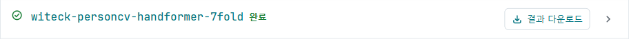
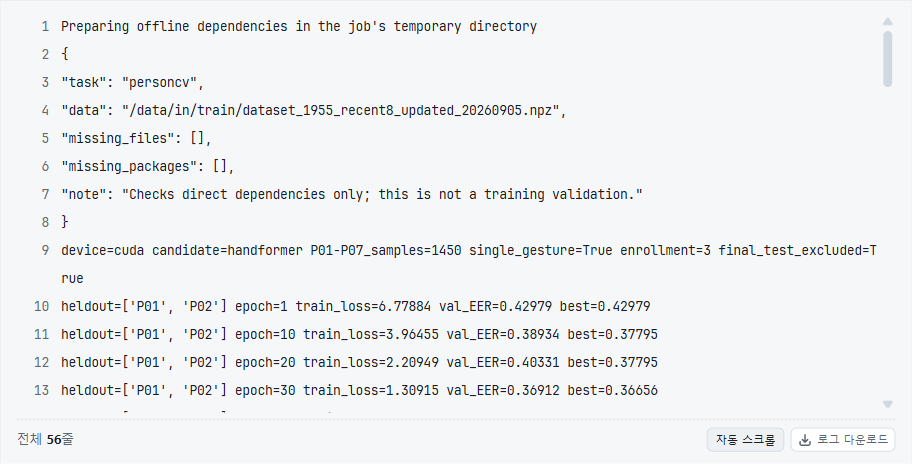
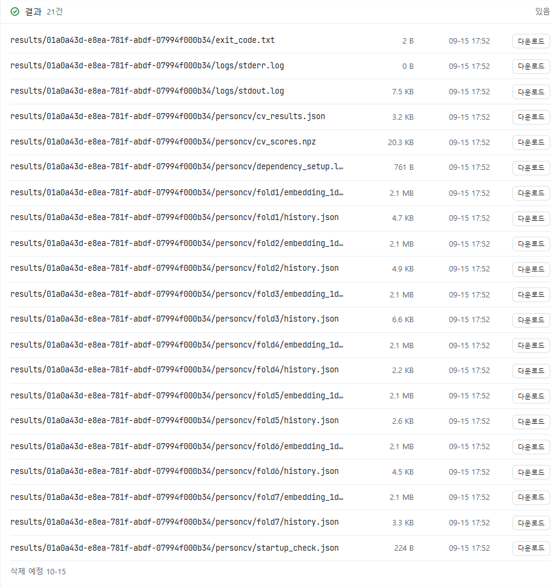

작업을 제출한 뒤에는 상세 화면에서 진행 단계와 로그를 확인합니다.
**완료** 상태가 되면 필요한 결과 파일을 다운로드합니다. 작업 제출 방법은 [학습 작업 실행](/JPUShare/3Jobs)을 참고합니다.

## 1. 작업 상세 화면 열기

1. **내 작업** 목록에서 확인할 작업을 선택합니다.
2. 상단의 작업 이름, ID, 상태를 확인합니다.
3. 진행 단계와 작업 설정에서 실행 명령, 실행 환경, 입력 데이터, 시간 제한을 확인합니다.

문제가 생겼을 때 작업 이름만으로는 다른 실행과 구분하기 어려울 수 있습니다.
문의하거나 실행 기록을 남길 때에는 작업 ID를 함께 기록하세요.

## 2. 상태 읽기

| 상태 | 의미와 확인할 내용 |
| --- | --- |
| 대기 중 | 실행 순서를 기다립니다. |
| 배정됨 | 실행할 자원이 배정된 상태입니다. |
| 실행 중 | 작업이 실행되고 있습니다. 로그를 확인합니다. |
| 완료 | 정상 종료된 작업입니다. 결과 파일을 확인합니다. |
| 실행 오류 | 코드의 오류 메시지와 실행 명령을 확인합니다. |
| 실행 환경 오류 | 선택한 환경과 필요한 패키지를 확인합니다. |
| 제출 실패 | 작업 시작 전에 실패했습니다. 제출 조건을 확인합니다. |
| GPU 메모리 부족 / GPU 메모리 부족(의심) | 로그와 모델·배치 크기를 점검합니다. |
| 시간 초과 | 설정한 시간 제한에 도달했습니다. |
| 취소 중 / 취소됨 | 취소 요청을 처리 중이거나 취소가 완료되었습니다. |
| 관리자 중지 | 관리자가 작업을 중지한 상태입니다. |
| 결과 회수 실패 | 출력 파일을 저장소로 옮기는 과정이 실패했습니다. |

GPU 사용량은 실행 중에 표시될 수 있으며, 완료된 작업에서 실시간 수치가 계속 제공되지는 않습니다.
메모리 부족과 코드 오류의 구체적인 점검 방법은 [문제 해결](/JPUShare/6Troubleshooting)을 참고하세요.

## 3. 로그 확인과 저장

실행이 시작되면 상세 화면의 로그 영역에서 출력 내용을 확인합니다.
**자동 스크롤**을 끄면 이전 줄을 읽고, 켜면 새 로그를 따라갈 수 있습니다.
**로그 다운로드**를 클릭하면 로그를 파일로 저장합니다.

**아직 로그 없음**만 보인다면 실행 상태와 코드의 출력 여부를 함께 확인합니다.
Python 코드에서는 필요한 진행 메시지를 `print(..., flush=True)`로 출력하면 확인하기 쉽습니다.
**로그 연결 한도 도달**이 보이면 같은 작업을 열어 둔 다른 창을 정리한 뒤 다시 확인합니다.

로그에 비밀번호나 접근 토큰을 출력하지 않도록 코드를 작성하세요.
문의할 때도 필요한 오류 부분만 전달하고 비밀 값은 제외합니다.

## 4. 결과 파일 다운로드

상세 화면의 결과 목록과 **결과 다운로드**는 **완료** 상태인 작업에서 제공됩니다.

1. 완료된 작업의 결과 목록을 확인합니다.
2. 파일 경로, 크기, 수정 시각으로 원하는 산출물을 찾습니다.
3. 파일 하나는 해당 행의 **다운로드**를 클릭합니다.
4. 작업 결과를 ZIP으로 받으려면 상단의 **결과 다운로드**를 클릭합니다.
5. 브라우저 다운로드 목록에서 저장 완료를 확인하고 파일을 열어 봅니다.

[학습 작업 실행](/JPUShare/3Jobs)의 예제에서는 `data/summary.json`을 확인합니다.
파일 내용의 `count`가 `5`, `mean`이 `3.0`이면 예제의 계산과 결과 저장이 정상입니다.

### 결과 저장 위치와 보관

코드에서 `/output` 아래에 쓴 파일을 결과로 회수합니다.
모델은 `JOB_MODEL_DIR`, 지표나 변환 데이터는 `JOB_OUTPUT_DATA_DIR`를 이용하면 경로를 구분하기 쉽습니다.
`/output` 바로 아래나 직접 만든 하위 폴더의 파일도 결과에 포함됩니다.

코드 작업 공간과 임시 공간에만 저장한 파일을 영구 보관된 것으로 생각하지 마세요.
결과 저장소로 회수가 끝났는지 확인하고 중요한 산출물은 별도로 내려받아 보관합니다.

결과 목록에 **삭제 예정** 날짜가 표시되면 그 날짜 전에 필요한 파일을 확보하세요.
보존 기간은 서비스 설정과 결과 보존 상태에 따라 달라지므로 고정 기간을 전제로 실험을 계획하지 않습니다.

## 5. 중지하거나 다시 제출하기

대기 중인 작업은 **취소**, 실행 중인 작업은 **중지**를 선택할 수 있습니다.
확인창에서 작업 이름을 확인한 후 해당 동작을 확정하고, 상태가 바뀌는지 확인하세요.

실패하거나 취소된 작업에 **다시 제출**이 표시되면 기존 설정을 새 작업 폼으로 가져올 수 있습니다.
오류 원인을 고친 뒤 코드, 입력 데이터, GPU 서버, 실행 환경을 다시 확인하고 제출합니다.
ZIP으로 제출했던 코드는 새 폼에서 **zip 파일**을 다시 선택해야 합니다.
다시 제출은 새 작업 생성이며, 이전 실행의 메모리 상태에서 자동으로 이어지는 기능은 아닙니다.

## 결과가 보이지 않을 때

- **결과 파일 없음**이면 코드가 `/output` 아래에 파일을 썼는지 로그와 저장 코드를 확인합니다.
- 목록 조회에 실패했다면 **다시 조회**를 선택합니다.
- 실패한 작업은 부분 결과가 남을 수 있지만 상세 화면에 결과 목록이 표시되지는 않습니다. [데이터셋 관리](/JPUShare/2Datasets)의 결과 저장소 또는 [API 사용법](/JPUShare/5API)에서 접근 가능한 파일을 확인합니다.
- **결과 회수 실패**라면 중복 제출보다 먼저 작업 ID와 오류 상태를 담당자에게 전달해 회수 상태를 확인합니다.

추가 점검은 [문제 해결](/JPUShare/6Troubleshooting)을 참고하세요.

[JPUShare 안내로 돌아가기](/JPUShare)
