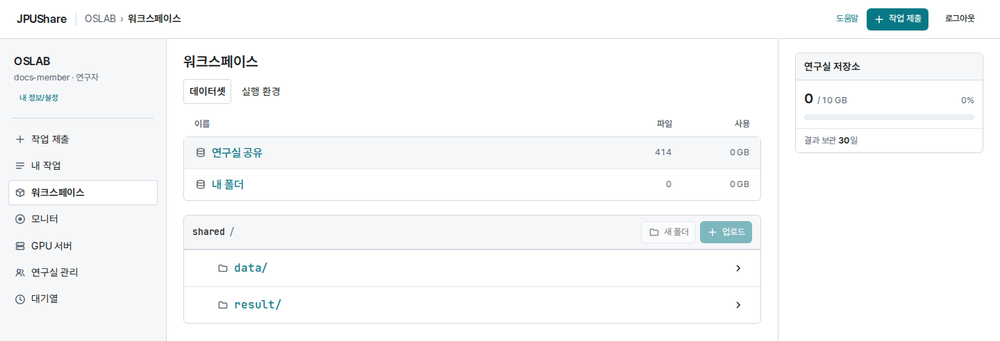
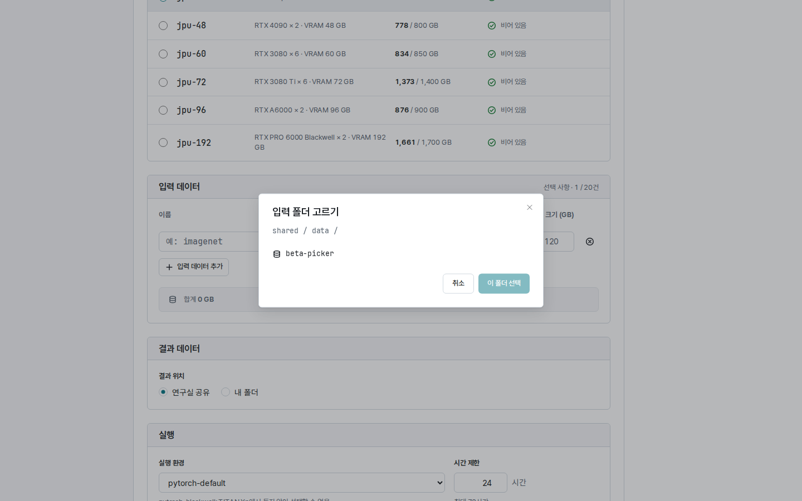

**워크스페이스**의 **데이터셋** 탭에서 작업에 쓸 데이터와 작업 결과를 관리합니다.
코드는 **작업 제출**에서 올리고, 여러 작업에 쓸 입력 데이터는 이 화면에 먼저 올립니다.

연구실 참가 승인을 마친 뒤 이용할 수 있습니다. 처음이라면 [시작하기](/JPUShare/1Web/1GettingStarted)를 참고하세요.

## 1. 연구실 공유와 내 폴더

저장 공간은 네 자리로 나뉩니다.

| 자리 | 누가 보나 | 쓰임 |
| --- | --- | --- |
| 연구실 공유 / data | 연구실 구성원 모두 | 함께 쓰는 입력 데이터 |
| 연구실 공유 / result | 연구실 구성원 모두 | 결과 위치를 **연구실 공유**로 낸 작업의 결과 |
| 내 폴더 / data | 나만 | 개인 입력 데이터 |
| 내 폴더 / result | 나만 | 결과 위치를 **내 폴더**로 낸 작업의 결과(작업 ID 이름의 폴더) |

화면의 경로 표시와 API에서는 연구실 공유를 `shared`, 내 폴더를 `private`로 표기합니다.
**내 폴더**의 파일은 같은 연구실의 다른 구성원에게 보이지 않습니다. 개인 데이터는 내 폴더에 올립니다.
**내 폴더 / result**의 작업 결과는 끝난 뒤 30일이 지나면 정리됩니다. 필요한 결과는 그 전에 내려받습니다.

## 2. 파일 업로드하기

1. 올릴 자리(예: **연구실 공유**의 **data**)를 선택합니다.
2. 기존 하위 폴더에 넣으려면 그 폴더로 이동합니다. 목록 위의 현재 경로를 확인합니다.
3. **업로드**를 선택하고 파일을 고릅니다. 여러 파일을 함께 선택할 수 있습니다.
4. 전송 표시가 사라지고 파일 목록에 나타나는지 확인합니다.

파일은 현재 경로에 원래 이름으로 올라갑니다. 버전이 다르면 `sample-v1.csv`, `sample-v2.csv`처럼 이름을 구분합니다.
**새 폴더**로 폴더를 먼저 만들 수 있습니다. 폴더를 만든 것만으로 파일이 올라가지는 않습니다.
전송을 멈추려면 그 업로드 행의 취소 아이콘을 선택합니다. 실패한 파일은 원인을 확인한 뒤 다시 올립니다.

## 3. 파일 찾기와 다운로드

1. 자리를 선택하고 필요한 폴더를 엽니다.
2. 상단 경로에서 상위 폴더를 선택하면 위로 이동합니다.
3. 파일이 많으면 **이전**, **다음**으로 목록을 넘깁니다.
4. 파일 오른쪽의 **⋮ 메뉴 → 다운로드**를 선택합니다.

파일 크기와 수정 시각으로 원하는 버전인지 확인합니다. 목록 조회가 실패했다면 **다시 조회**를 선택합니다.

## 4. 작업 입력으로 연결하기

**작업 제출 → 입력 데이터**에서 **입력 데이터 추가**를 누르고 행마다 다음을 채웁니다.

| 항목 | 입력할 내용 |
| --- | --- |
| 이름 | 코드에서 쓸 입력 이름입니다. 예: `train` |
| 위치 | 파일을 올린 자리입니다. 예: `shared / data` |
| 하위 경로 | 그 자리 아래에서 가져올 폴더입니다. 예: `imagenet/train/` |
| 크기 (GB) | 가져올 데이터 크기(정수 GB)입니다. |

행의 **폴더**를 누르면 저장된 폴더를 내려가며 고를 수 있습니다. 폴더를 고르면 하위 경로가 채워지고, 크기는 그 폴더 전체 크기를 GB로 올림한 값(최소 1)으로, 이름이 비어 있으면 폴더 이름에서 만든 이름으로 채워집니다. 직접 입력해도 됩니다.

입력 이름은 영문 소문자나 숫자로 시작하고 소문자·숫자·밑줄·하이픈을 씁니다.
이름이 `train`이면 코드는 `JOB_CHANNEL_TRAIN` 환경 변수로 입력 디렉터리를 찾습니다.
입력 디렉터리는 읽기 전용이므로 바꾼 데이터는 `/output` 아래에 저장합니다.
데이터 ZIP을 올려도 자동으로 풀리지 않습니다. 필요하면 코드에서 풉니다.

## 5. 파일과 폴더 삭제하기

하나씩 지우려면 **⋮ 메뉴 → 삭제**를, 여러 항목은 체크박스로 고른 뒤 **선택 삭제**를 선택합니다.

> 폴더를 삭제하면 화면에 보이지 않는 파일까지 **그 폴더 아래 파일 전체**가 삭제됩니다. 삭제는 되돌릴 수 없습니다.

연구실 공유 데이터는 다른 구성원의 작업에서도 쓸 수 있으니 먼저 확인합니다.
다른 사람이 낸 작업의 결과는 지울 수 없습니다.

업로드 실패, 저장 공간 부족, 권한 오류는 [문제 해결](/JPUShare/1Web/5Troubleshooting)을 참고하세요.
프로그램으로 파일을 다루려면 [API 사용법](/JPUShare/2Agent/2API)을 참고하세요.

[JPUShare 안내로 돌아가기](/JPUShare)
