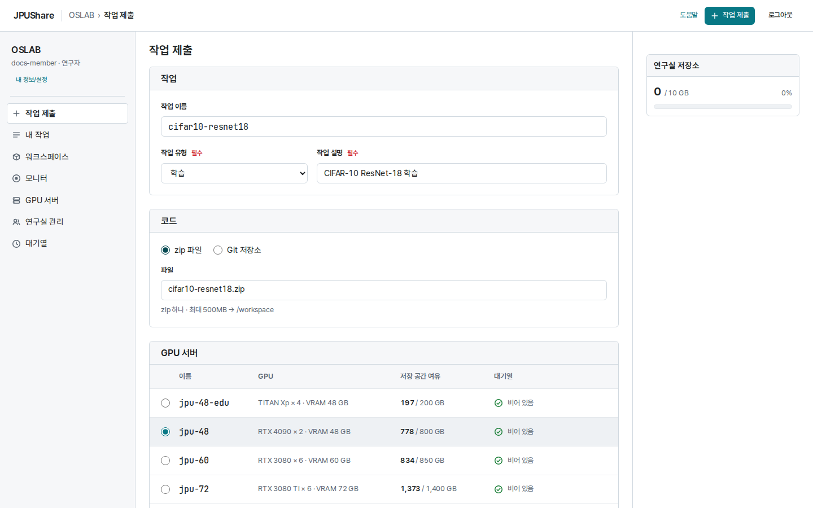
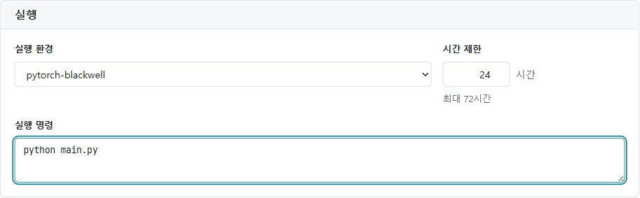

**작업 제출**에서 코드와 실행 조건을 지정합니다.
학습 외에도 미세조정, 추론, 평가, 데이터 처리 작업을 낼 수 있습니다.

연구실 참가 승인을 마친 뒤 코드 ZIP 또는 공개 Git 저장소를 준비합니다.
입력 파일은 [데이터 관리](/JPUShare/1Web/2Datasets)에서 먼저 올립니다. 처음에는 작은 작업으로 실행과 결과 저장을 확인합니다.

## 1. 코드와 데이터 경로 준비하기

작업은 코드를 푼 `/workspace`에서 실행합니다. ZIP 안의 경로와 실행 명령의 파일 경로가 맞아야 합니다.

```text
code.zip
└── main.py        # python main.py 로 실행
```

코드 ZIP은 500 MiB까지 올릴 수 있습니다. 큰 데이터는 ZIP에서 빼고 입력 데이터로 연결합니다.

| 코드에서 쓸 환경 변수 | 용도 |
| --- | --- |
| `JOB_WORKSPACE_DIR` | 코드가 풀리는 작업 디렉터리 |
| `JOB_CHANNEL_TRAIN` | 이름을 `train`으로 지정한 입력 디렉터리 |
| `JOB_SCRATCH_DIR` | 압축 해제 등 임시 계산에 쓸 공간 |
| `JOB_MODEL_DIR` | 보관할 모델 파일을 쓸 `/output/model` |
| `JOB_OUTPUT_DATA_DIR` | 지표나 변환 데이터를 쓸 `/output/data` |
| `JOB_OUTPUT_DIR` | 결과로 회수하는 `/output` 전체 |

입력은 읽기 전용입니다. 작업 공간과 임시 공간은 작업이 끝나면 정리되므로 보관할 파일은 `/output` 아래에 씁니다.

## 2. 작은 Python 예제

아래 내용을 `main.py`로 저장하고 ZIP 최상위에 오도록 압축합니다.

```python
import json
import os
from pathlib import Path

values = [1, 2, 3, 4, 5]
summary = {"count": len(values), "mean": sum(values) / len(values)}
output = Path(os.environ["JOB_OUTPUT_DATA_DIR"])
output.mkdir(parents=True, exist_ok=True)
(output / "summary.json").write_text(json.dumps(summary), encoding="utf-8")
print("saved summary.json", flush=True)
```

## 3. 작업 제출 화면 작성하기



1. **작업 제출**을 엽니다.
2. **작업 이름**, **작업 유형**, **작업 설명**(필수, 500자 이내)을 적습니다.
3. **코드**에서 **zip 파일**을 고르고 준비한 ZIP을 지정합니다.
   Git을 쓰면 **Git 저장소**를 고르고 **저장소 주소**와 **브랜치 또는 태그**를 입력합니다. 주소는 HTTPS여야 하고 허용된 호스트(예: `github.com`)여야 합니다. 주소에 계정이나 토큰을 넣지 마세요.
4. **GPU 서버** 표에서 GPU 모델·개수·VRAM, 저장 공간 여유, 대기 수를 비교해 하나를 고릅니다.

## 4. 입력 데이터와 결과 위치

**입력 데이터**는 선택입니다. 필요하면 **입력 데이터 추가**를 누르고 이름·위치·하위 경로·크기를 채웁니다.
행의 **폴더**로 저장된 폴더를 고르면 하위 경로·크기·이름이 채워집니다. 자세한 내용은 [데이터 관리](/JPUShare/1Web/2Datasets)의 입력 연결 절을 참고하세요.
입력 크기 합계가 고른 GPU 서버의 여유 공간보다 크면 제출할 수 없습니다.

**결과 데이터**에서 결과를 둘 자리를 고릅니다.

| 결과 위치 | 누가 보나 | 저장 위치와 보관 |
| --- | --- | --- |
| **연구실 공유** | 연구실 구성원 모두 | 연구실 공유 / result |
| **내 폴더** | 나만 | **내 폴더 / result** 아래 작업 ID 폴더. 작업이 끝나고 30일이 지나면 정리됩니다. |

고르지 않으면 입력 데이터의 자리를 따라갑니다(내 폴더 입력이 있으면 내 폴더).

## 5. 실행 환경과 GPU 호환, 명령, 시간 제한



1. **실행 환경**에서 코드에 필요한 Python·라이브러리가 든 환경을 고릅니다.
2. 실행 환경마다 지원하는 GPU 세대가 다릅니다. 고른 GPU 서버와 호환되지 않는 환경은 목록에 "(이 GPU 미지원)"으로 표시되고 선택할 수 없습니다. GPU 서버를 바꾸면 선택할 수 있는 첫 환경으로 자동으로 바뀝니다.
3. **시간 제한**에 1~72시간 사이의 정수를 적습니다. 범위를 벗어나면 입력 칸 아래에 오류가 뜨고 **제출** 버튼이 비활성화됩니다.
4. 예제라면 **실행 명령**에 다음을 입력합니다.

```bash
python main.py
```

인수는 `python train.py --epochs 1`처럼 코드가 받는 형식으로 적습니다.

## 6. 제출과 확인

**제출**을 누르면 작업 목록으로 이동합니다. 작업을 열어 **대기 중 → 배정됨 → 실행 중 → 완료**로 진행하는지 확인합니다.
예제가 완료되면 로그에 `saved summary.json`이 보이고 결과에 `data/summary.json`이 생깁니다.
결과 확인은 [결과 확인과 다운로드](/JPUShare/1Web/4Results)를 참고하세요.

제출 오류가 나면 해당 입력 칸과 화면 위쪽의 문구를 확인합니다. 오류별 확인 사항은 [문제 해결](/JPUShare/1Web/5Troubleshooting)을 참고하세요.

[JPUShare 안내로 돌아가기](/JPUShare)
