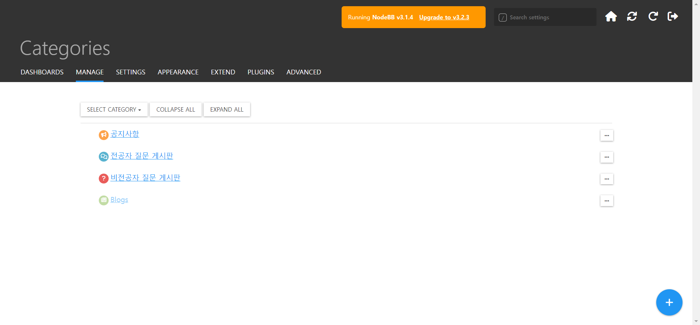
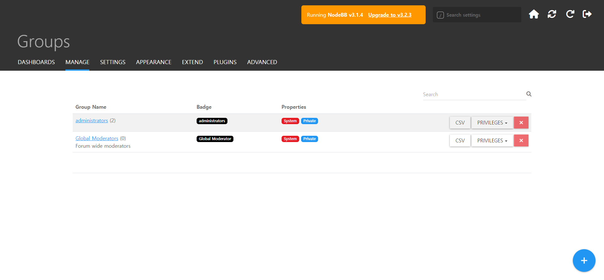
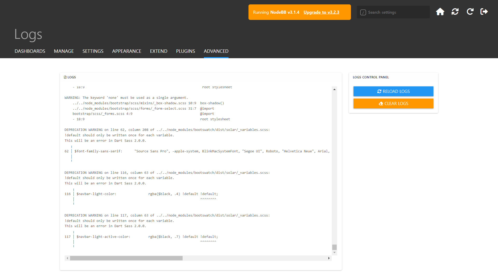
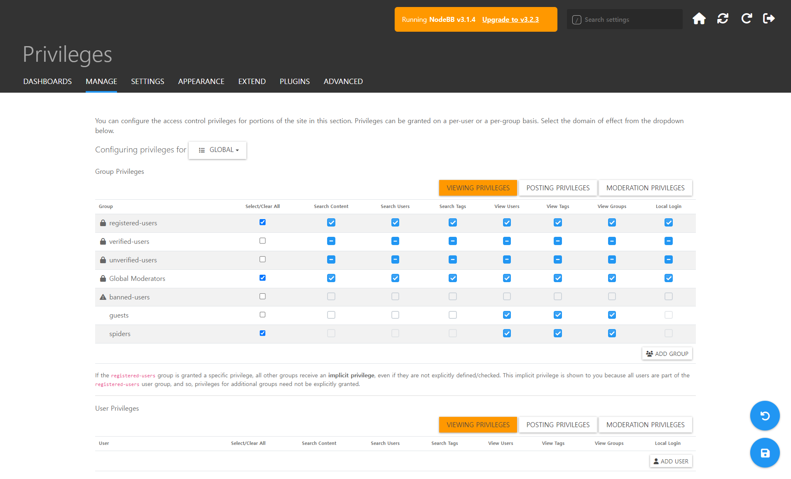
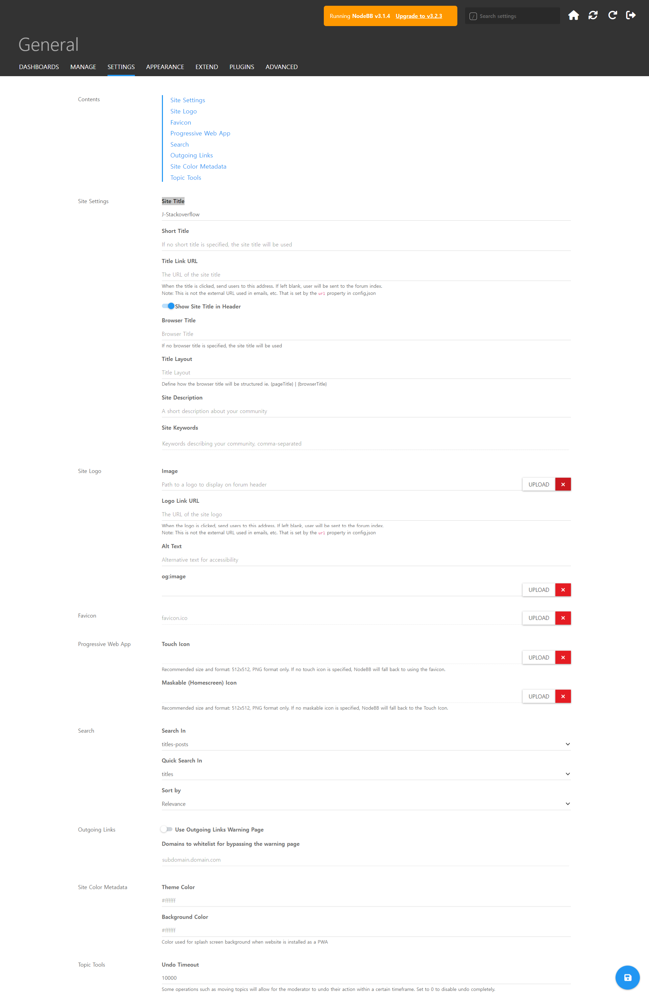
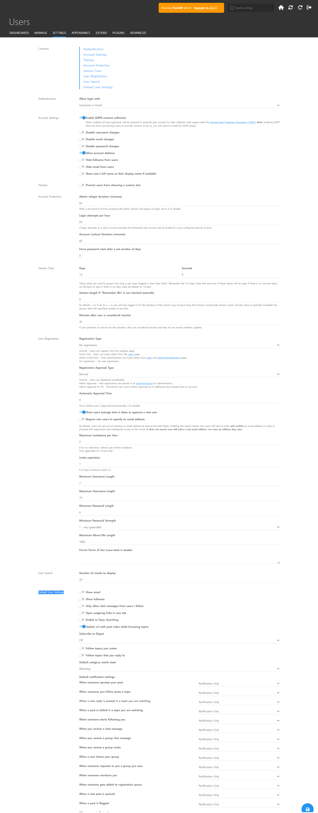

## 게시판 설정 변경하기

  

- 메인페이지의 왼쪽 메뉴목록 중 “관리자” → 상단 메뉴 중 “Manage” → Categories
- 게시판 이름, 설명, 이미 변경 가능 - 상위 게시판 선택 가능, 권한 수정 가능

## admin 계정 추가하기

  

- 메인페이지의 왼쪽 메뉴목록 중 “관리자”  
  → 상단 메뉴 중 “Manage”  
  → Groups  
  → groupName이 administrators인 항목 클릭  
  → 하단 MEMBER LIST에서 멤버 추가 아이콘을 클릭 후 admin으로 등록할 사용자 추가하기  

## 로그 확인

  

- 메인페이지의 왼쪽 메뉴목록 중 “관리자”
   
  → ADVANCED
   
  → Logs
   

## 행위에 따른 권한 제어

  

- 사이트의 일부에 대해 엑세스 제어 권한을 구성할 수 있습니다 
- 메인페이지의 왼쪽 메뉴목록 중 “관리자” 
  → Manage 
  → Privileges 
- 콘텐츠 검색, 사용자 검색, 검색 태그, 태그보기, 그룹보기 등에 대해서 여러 사용자들 별로 권한 제어를 할 수 있습니다 

## 사이트 이름 변경하기

  

- 메인페이지의 왼쪽 메뉴목록 중 “관리자”
   
  → SETTINGS
   
  → Site Title
   

## 재시작하기

  

- 메인페이지의 왼쪽 메뉴목록 중 “관리자”
   
  → 상단 메뉴 중 “DashBoards”
   
  → 오른쪽 상단의 주황색 박스 “Restart”
   

## 기본 사용자 설정

  

- 메인페이지의 왼쪽 메뉴목록 중 “관리자” 
  → 상단 메뉴 중 “Settings” 
  → 하단의 “Default User Settings” 
- 이벤트 발생시 알림 설정 가능 
- 이메일 보기, 전체 이름 표시 기능 
