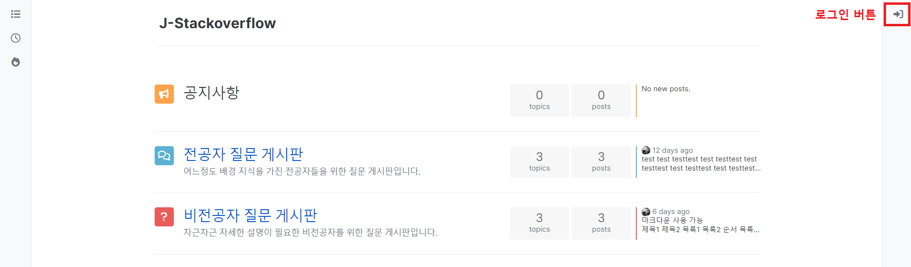
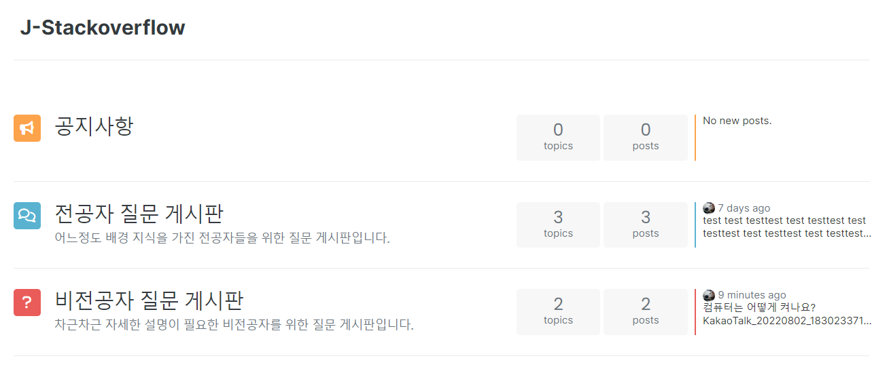
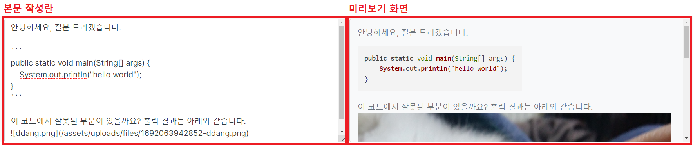
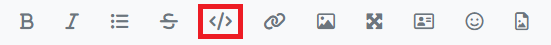
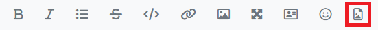
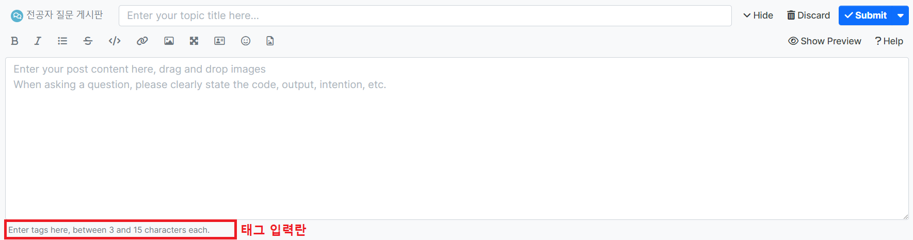
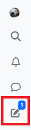
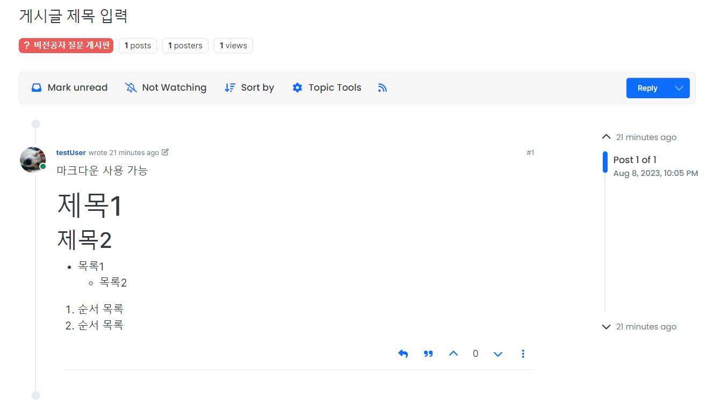

# 1. 메인화면

**로그인하지 않은 경우**

  

**로그인한 경우**

  

# 2. 로그인 및 회원가입

  

- 우측 메뉴바의 로그인 버튼을 클릭하여 로그인 화면으로 이동할 수 있습니다.

  

- 오아시스 아이디(학번)와 비밀번호를 이용하여 로그인할 수 있으며, 별도의 회원가입 기능은 제공하지 않습니다.

# 3. 게시판 이용

## 3.1. 게시판 목록
  

- 메인 화면에서 게시판 이름을 클릭하면 해당 게시판의 게시판 화면으로 이동합니다.

## 3.2. 게시판 화면
  

- 우측 상단의 `New Topic` 버튼을 클릭하여 게시글을 작성 가능합니다. 게시글은 로그인 후에만 작성 가능합니다.
- 화면 중앙에서 게시글 목록을 확인할 수 있고, 게시글 제목 클릭 시 게시글 상세 화면으로 이동합니다.

## 3.3. 게시글 작성
- 3.2.의 게시판 화면에서 `New Topic` 버튼 클릭 시 하단에 게시글 작성란이 표시됩니다.

**게시판 선택 및 제목 작성**
  

- 질문을 작성할 게시판을 선택하고, 제목을 작성합니다.

 

**본문 작성하기**
  

- 질문 내용을 자유롭게 작성할 수 있는 입력란입니다.
- **질문 작성시에는 코드, 결과물, 작성 의도 등을 명확히 알려주세요.**
- 마크다운 문법을 지원하며, 자세한 문법은 [링크](https://gist.github.com/ihoneymon/652be052a0727ad59601)를 참고해주세요

 

**작성 결과 미리보기**
- `Show Preview` 버튼을 클릭하여 미리보기 화면을 열 수 있습니다.
- 본문 작성란 우측에 미리보기 화면이 생성됩니다.

  
  

 

**게시글 꾸미기**
  

- 위 버튼을 이용하여 게시글을 꾸밀 수 있습니다.
- 순서대로 두껍게, 기울이기, 목록 생성, 취소선, 코드블럭, 하이퍼링크, 이미지 링크, 전체화면으로 보기, 썸네일 추가, 이모지 추가, 이미지 파일 업로드 버튼입니다.

 

**코드블럭 삽입**
  

- `code` 버튼을 클릭하여 코드 블럭을 삽입할 수 있습니다.

  

- `code` 버튼 클릭 시 3개의 백틱(`)이 두 줄에 걸쳐 삽입됩니다.
- 질문에 필요한 코드를 두줄의 백틱 사이에 삽입합니다.

 

**이미지 업로드**

*1. 이미지 업로드 버튼 사용하기*

  

- `Upload image` 버튼을 클릭하여 이미지 파일을 업로드할 수 있습니다.
- 파일을 선택하면 커서 위치에 이미지를 삽입합니다.

*2. 드래그 & 드랍으로 이미지 업로드하기*
- 본문 작성란에 이미지 파일을 드래그 & 드랍하여 이미지 파일을 업로드할 수 있습니다.

 

**태그 작성**

  

- 태그 입력란을 이용해 게시글에 태그를 달 수 있습니다.

  

- 태그명을 입력한 후 엔터 또는 쉼표를 입력하여 태그를 추가할 수 있습니다.

 

**게시글 작성 중단 및 임시 저장**

  

- `Hide` 버튼을 클릭하면 게시글 작성을 중단 및 임시 저장할 수 있습니다. 

  

- 임시저장된 게시글은 우측 메뉴바의 draft 버튼을 클릭하여 계속 작성할 수 있습니다.

 

**게시글 작성 중단/취소/완료**

- `Submit` 버튼 클릭 시 작성한 게시글이 등록됩니다.
- `Discard` 버튼 클릭 시 게시글 작성을 취소합니다.

## 3.4. 게시글 상세 화면
  

- 우측 Reply 버튼 클릭 시 댓글 작성이 가능합니다. 작성 요령은 게시글 작성 요령과 같습니다.
- 게시글 본문에 마우스를 올렸을 때 등장하는 위, 아래 화살표를 클릭하여 게시글을 추천 및 비추천할 수 있습니다.