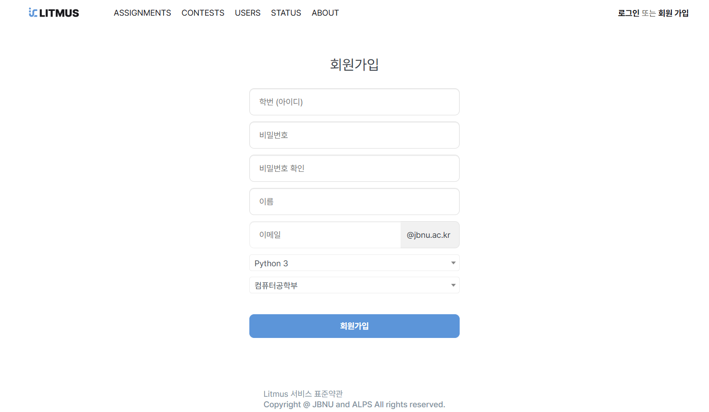
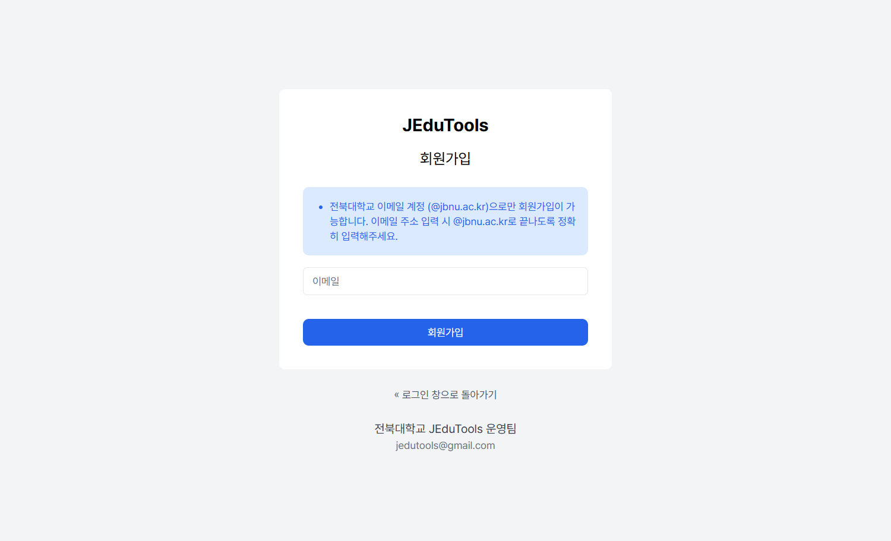
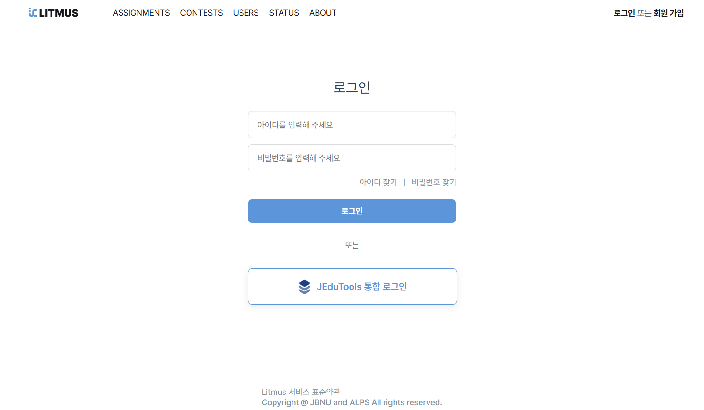
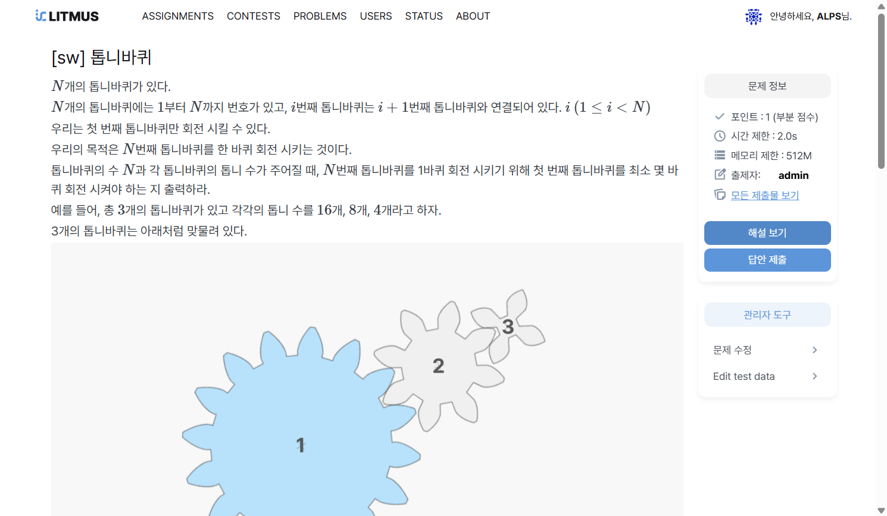
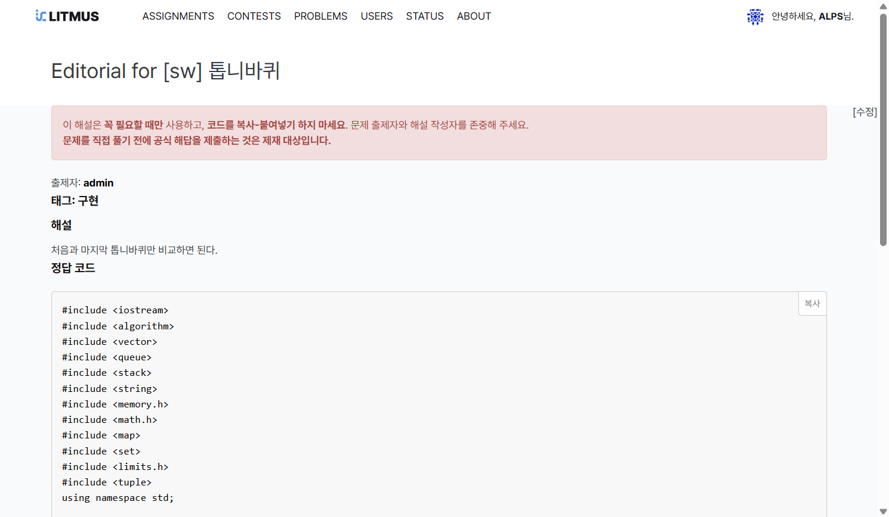
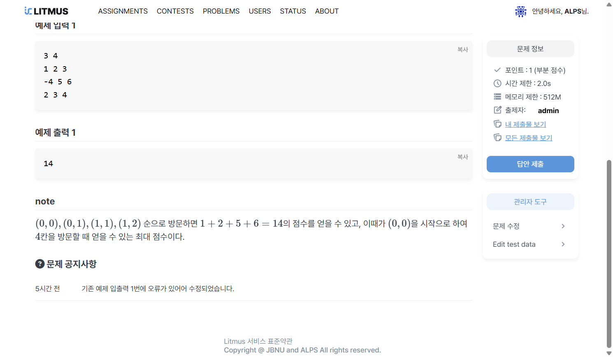
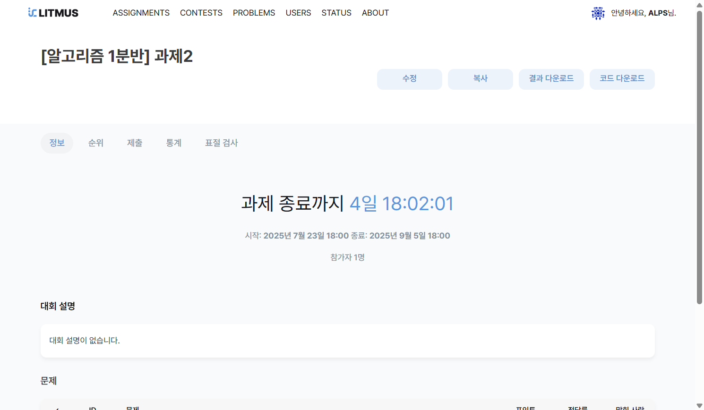
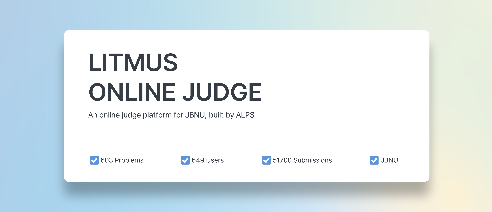

# Litmus 사용자 설명서 (교수자용)

## 목차
1. 회원가입/로그인
2. 문제 관리
3. 과제/대회 관리
4. 서비스 정보

---

## 1. 회원가입/로그인

### (1) 회원가입

Litmus 서비스는 JEduTools와 연동되어 있습니다. 두 단계의 회원가입을 거쳐야 원활하게 이용할 수 있습니다.

1. **Litmus 서비스 회원가입**: Litmus 웹사이트에서 회원가입을 진행해주세요. 학교 메일(@jbnu.ac.kr)만 사용 가능합니다.

<div style={{ textAlign: 'center', width: '100%' }}>
  
</div>
<br />

2. **JEduTools 서비스 회원가입**: JEduTools 서비스에서 회원가입을 진행해주세요. 학교 메일(@jbnu.ac.kr)만 사용 가능하며, 메일 인증을 완료해야 합니다.

<div style={{ textAlign: 'center', width: '100%' }}>
  
</div>
<br />

3. 교수자 권한 설정

회원가입 이후 litmus@jbnu.ac.kr로 연락주시면 교수자 권한 설정을 도와드리겠습니다.

### (2) 로그인

두 가지 방법으로 로그인할 수 있습니다.

1. **기본 로그인**: Litmus 가입 시 설정했던 ID와 PW를 입력하여 로그인합니다.

2. **JEduTools 통합 로그인**: JEduTools 계정을 통해 통합 로그인합니다.

<div style={{ textAlign: 'center', width: '100%' }}>
  
</div>
<br />

---

## 2. 문제 관리

<div style={{ textAlign: 'center', width: '100%' }}>
  
</div>

본인이 **생성한 문제**에 대해 수정 및 삭제 등 모든 관리 권한을 가집니다. 

본인이 **생성하지 않은 문제**는 지문 및 테스트케이스를 확인 할 수 있습니다.

### (1) 주요 문제 정보 

문제의 주요 설정 항목입니다.

- **문제 이름**: 문제의 제목을 입력합니다.

- **문제 공개**: 문제의 공개 여부를 설정합니다.
  - 공개: 학생들이 PROBLEM 탭에서 언제든지 문제를 확인하고 풀 수 있습니다. 
  - 비공개: 문제가 과제/대회에 포함된 경우 참가자들이 문제를 확인할 수 있습니다.

- **문제 암호화**: 문제의 보안을 위해 암호화 기능을 사용할 수 있습니다. 주로 과제나 대회가 시작되기 전까지 문제를 비공개로 유지하기 위해 사용됩니다.
  - 암호화 방법: '암호화'를 체크한 후, 암호를 입력하고 저장합니다.
  - 복호화 방법: '암호화'를 체크 해제한 후, 동일한 암호를 입력하고 저장합니다.
  - 암호화 키를 분실하면 복구가 불가능하니, 암호 관리에 유의하시기 바랍니다.

- **제한**: 문제에 대한 시간 제한, 메모리 제한, 허용된 언어를 설정할 수 있습니다. 기본 설정값은 시간 2초, 메모리 512MB, 모든 언어 허용이지만, 문제 특성에 따라 변경할 수 있습니다.

### (2) 기타 문제 정보

- **문제 코드**: 문제에 할당된 고유 식별 코드입니다.

- **게시 날짜**: 문제가 생성된 날짜가 자동으로 설정됩니다. 필요에 따라 수동으로 수정할 수 있습니다.

- **제작자**: 문제를 편집하고 작성자로 표시되는 사용자입니다. 기본적으로 문제를 생성한 사용자가 등록되며, 여러 명을 추가할 수 있습니다.

- **테스터**: 문제의 테스트를 진행할 수 있는 사용자 목록입니다. 기본적으로 비어있으며, 필요시 사용자를 추가할 수 있습니다.

- **분류**: 문제의 그룹을 선택하여 분류할 수 있습니다.

- **포인트**: 현재는 사용되지 않는 기능으로, 기본값 그대로 두시면 됩니다.

- **특정 언어 리소스 제한**: 특정 프로그래밍 언어에 대해 별도의 시간 및 메모리 제한을 설정할 수 있습니다.

### (3) 문제 지문

문제 지문은 일반적으로 **본문**, **입력 설명**, **출력 설명**, **예제 입력**, **예제 출력**으로 구성됩니다. 필요에 따라 **Note**나 **힌트**와 같은 추가 섹션을 포함할 수 있습니다.

문제 지문은 DMOJ의 **Markdown** 기반 포맷을 사용하며, 일반적으로 세션 제목은 ```##```, 수식은 ```~...~```, 예제는 코드 블록````(```)```` 형식으로 작성합니다.

#### 지문 예시 ([문제: 최대 점수를 얻어보자](https://litmus.jbnu.ac.kr/problem/11743))
````
~N~ x ~N~ 크기의 보드판이 있으며, 보드판에서 각 칸에는 점수가 존재한다.
~(0, 0)~에서 시작하여 정확히 K개의 칸을 방문할 때 얻을 수 있는 최대 점수를 구해보자.
점수는 방문한 칸의 점수를 모두 합한 값이 된다. ~(0, 0)~은 맨 왼쪽 상단을 의미한다.
이동할 때에는 상,하,좌,우로 이동할 수 있으며, 이미 지난 칸은 다시 갈 수 없다.
                                    
## 입력 설명
입력은 첫 번째 줄에 ~N~과 ~K~가 순서대로 주어지며, 이후에 보드판의 점수가 ~N~ x ~N~ 형태로 주어진다.

## 출력 설명
~(0, 0)~부터 시작하여 정확히 ~K~개의 칸을 방문할 때 얻을 수 있는 최대 점수를 출력한다.
~(0, 0)~도 1개의 칸을 방문한 것으로 처리한다.

## 제약 조건
~3 ≤ N ≤ 7~

~1 ≤ K ≤ 8~

~-100,000 ≤~ 원소의 값 ~≤ 100,000~

## 예제 입력 1
```
3 4
1 2 3
-4 5 6
2 3 4
```

## 예제 출력 1
```
14
```

## note
~(0, 0), (0, 1), (1, 1), (1, 2)~ 순으로 방문하면 ~1 + 2 + 5 + 6 = 14~의 점수를 얻을 수 있고, 이때가 ~(0, 0)~을 시작으로 하여 ~4~칸을 방문할 때 얻을 수 있는 최대 점수이다.
````

### (4) 문제 테스트케이스 

문제 테스트케이스는 `ZIP 파일 방식`과 `generator 방식`을 지원합니다.

- `ZIP 파일 방식`: **input 파일**과 **output 파일**을 하나의 ZIP 파일로 묶어 업로드하는 방식입니다. 파일 이름은 1.in/1.out, 2.in/2.out 혹은 test_1.in/test_1.out 등 숫자로 매칭해주세요.

- `generator 방식`: 테스트케이스를 자동으로 생성하는 코드를 제출하여 사용하는 방식입니다.

자세한 내용과 예시 파일은 **[DMOJ DOCS](https://docs.dmoj.ca/#/problem_format/problem_examples)**에서 확인할 수 있습니다.


### (5) 문제 해설 및 공지사항

**문제 해설 및 공지사항**은 문제 지문과 동일한 문법을 지원합니다.

- **문제 해설**: 문제 풀이에 대한 **힌트, 태그, 정답 코드** 등을 작성할 수 있습니다. 공개된 해설은 학생들이 확인할 수 있습니다.

<div style={{ textAlign: 'center', width: '100%' }}>
  
  
</div>
<br />

- **문제 공지사항**: 문제에 오류가 있거나 중요한 변경사항이 발생한 경우, 학생들에게 알리기 위해 사용됩니다.

<div style={{ textAlign: 'center', width: '100%' }}>
  
</div>
<br />

---

## 3. 과제/대회 관리

<div style={{ textAlign: 'center', width: '100%' }}>
  
</div>

**과제(Assignment)**와 **대회(Contest)**는 기능적으로 동일하나, 용도에 따라 분류됩니다. 일반적으로 과제는 수업용으로, 대회는 시험이나 공식 행사용으로 사용됩니다.

### (1) 과제/대회 정보

- **대회 이름**: 과제/대회의 제목을 입력합니다.

- **Subject**: 과제의 경우, 해당 과목을 선택합니다. 대회의 경우에는 빈칸으로 남겨둡니다.

- **공개**: 과제/대회의 공개 여부를 설정합니다. 일반적으로 공개로 설정하지만, 특정 상황에 따라 비공개로 설정할 수 있습니다.

- **실습 여부**: 이 항목에 체크하면 과제로, 체크 해제하면 대회로 분류됩니다.

- **스케줄링**: 과제/대회 진행에 필요한 시작 시각과 종료 시각을 설정합니다.

- **설명**: 과제/대회에 대한 상세 설명을 작성하는 부분입니다. 목적, 규칙, 유의사항 등을 기재할 수 있습니다.

- **접근 코드**: 학생들이 과제/대회에 참여할 때 필요한 코드입니다. 일반적으로 자동으로 생성되며, 필요에 따라 수정할 수 있습니다.

- **대회 제출물을 볼 수 있음**: 해당 과제/대회의 제출물을 확인할 수 있는 사용자를 설정합니다.

- **문제**: 과제/대회에 포함될 문제들을 선택하고, 각 문제의 배점을 설정할 수 있습니다.
  - **점수 설정**: 각 문제의 점수를 설정하여, 이들의 합이 총 점수가 됩니다.
  - **부분 점수 허용**: 부분 점수를 허용할지 여부를 설정할 수 있습니다.
    - 허용: 통과한 테스트케이스 수에 비례하여 점수를 부여합니다. 예를 들어, 100개의 테스트케이스 중 80개를 맞히면 총점의 80%에 해당하는 점수를 받게 됩니다.
    - 허용 안 함: 제출된 답안이 모든 테스트케이스를 통과해야만 만점을 받습니다. 하나라도 틀릴 경우 0점 처리됩니다.

### (2) 결과 확인

<div style={{ textAlign: 'center', width: '100%' }}>
  
</div>

과제/대회의 순위와 제출 목록을 확인할 수 있으며, 결과를 다운로드 할 수 있습니다.

- **결과 다운로드**: 순위를 엑셀(Excel) 파일로 다운로드 할 수 있습니다.

- **코드 다운로드**: 참가자들이 최종적으로 제출한 코드를 다운로드 할 수 있습니다.

---

## 4. 서비스 정보

<div style={{ textAlign: 'center', width: '100%' }}>
  
</div>
<br />

Litmus는 DMOJ 오픈소스를 기반으로 개발되었으며, **[ALPS](https://sites.google.com/view/jbnu-alps)**의 **[LITMUS](https://github.com/alps-jbnu)** 팀에서 관리합니다.

해당 프로젝트는 **AGPL-3.0 License** 하에 배포됩니다. **GitHub** 주소는 **[여기](https://github.com/dameun2224/Litmus)**를 클릭해주세요.

더 자세한 내용은 **[ABOUT 탭](https://litmus.jbnu.ac.kr/about/)**을 참고해주세요.


---

<br/>

문의사항은 아래 연락처로 문의해 주세요.

**ALPS** | Email: litmus@jbnu.ac.kr
