# Litmus 사용자 설명서 (학생용)

## 목차
1. 회원가입/로그인
2. 과제/대회 확인 및 참가
3. 문제 확인 및 풀이
4. 제출 및 결과 확인
5. 서비스 정보

---

## 1. 회원가입/로그인

### (1) 회원가입

Litmus 서비스는 JEduTools와 연동되어 있습니다. 두 단계의 회원가입을 거쳐야 원활하게 이용할 수 있습니다.

1. **Litmus 서비스 회원가입**: Litmus 웹사이트에서 회원가입을 진행해주세요. 학교 메일(@jbnu.ac.kr)만 사용 가능합니다.

  

 

2. **JEduTools 서비스 회원가입**: JEduTools 서비스에서 회원가입을 진행해주세요. 학교 메일(@jbnu.ac.kr)만 사용 가능하며, 메일 인증을 완료해야 합니다.

  

 

### (2) 로그인

두 가지 방법으로 로그인할 수 있습니다.

1. **기본 로그인**: Litmus 가입 시 설정했던 ID와 PW를 입력하여 로그인합니다.

2. **JEduTools 통합 로그인**: JEduTools 계정을 통해 통합 로그인합니다.

  

 

---

## 2. 과제/대회 확인 및 참가

과제와 대회는 기능적으로 동일하지만, 용도에 따라 구분됩니다. 

과제는 **[ASSIGNMENTS 탭](https://litmus.jbnu.ac.kr/contests/1/)**에서, 대회는 **[CONTESTS 탭](https://litmus.jbnu.ac.kr/contests/0/)**에서 확인할 수 있습니다.

### (1) 참가

교수님 또는 학과에서 받은 과제/대회 참여 코드를 통해 과제나 대회에 참가할 수 있습니다.

  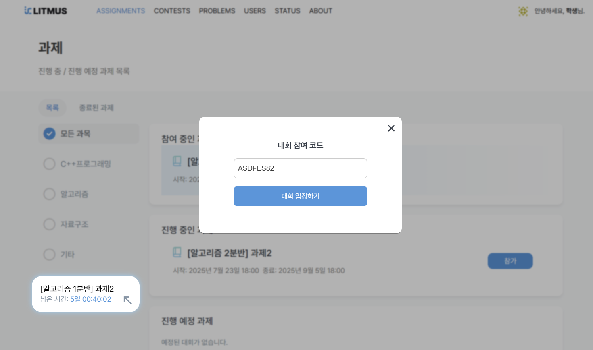

 

### (2) 결과 확인

- **정보**: 대회의 정보와 문제 목록을 확인할 수 있습니다.

- **순위**: 실시간 순위를 확인할 수 있습니다.

- **제출**: 내가 제출한 코드들의 채점 결과를 확인할 수 있습니다.

  
  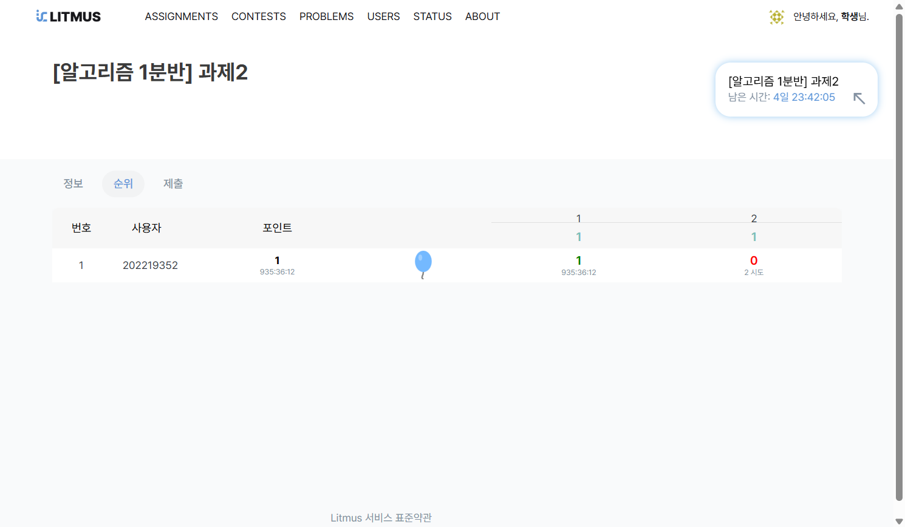
  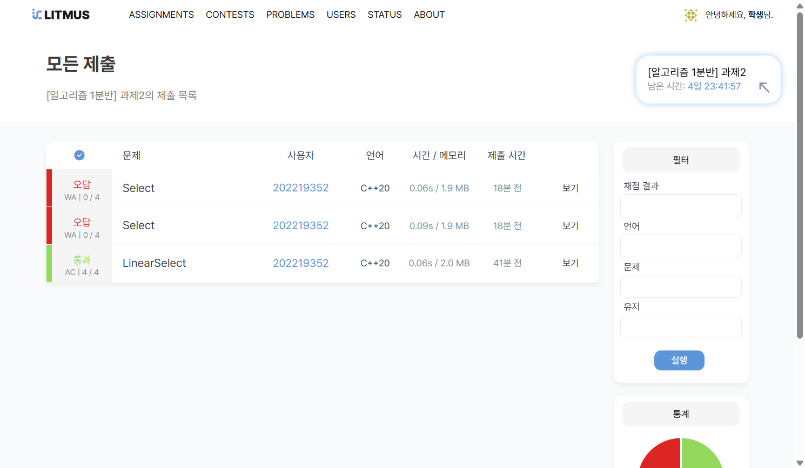

 

---

## 3. 문제 확인 및 풀이

- **문제 목록**: **참가 중인 과제/대회의 문제**나 **공개된 문제**를 확인할 수 있습니다. 공개된 문제는 **[PROBLEM 탭](https://litmus.jbnu.ac.kr/problems/)**에서 확인할 수 있습니다.

  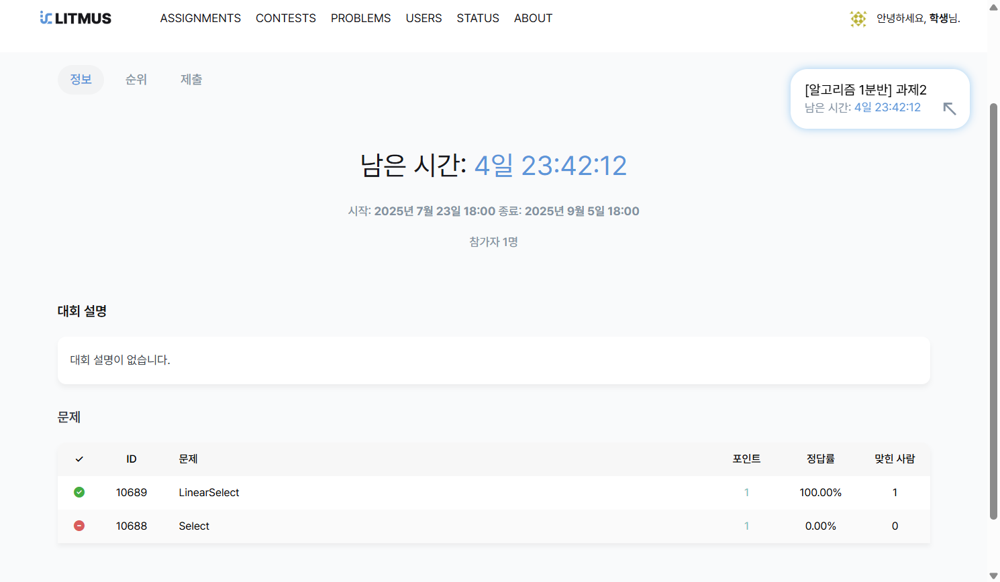
  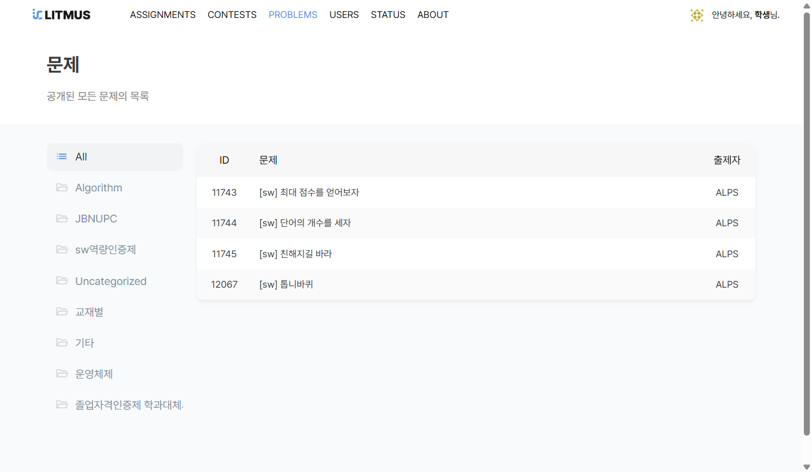

 

- **문제 구성**: 문제 페이지에는 **지문**, **예제 입출력** 등 문제를 푸는 데 필요한 정보가 포함되어 있습니다.

  

 

- **해설 확인**: 해설이 제공되는 문제의 경우, **해설 보기**를 통해 해설을 확인할 수 있습니다.

  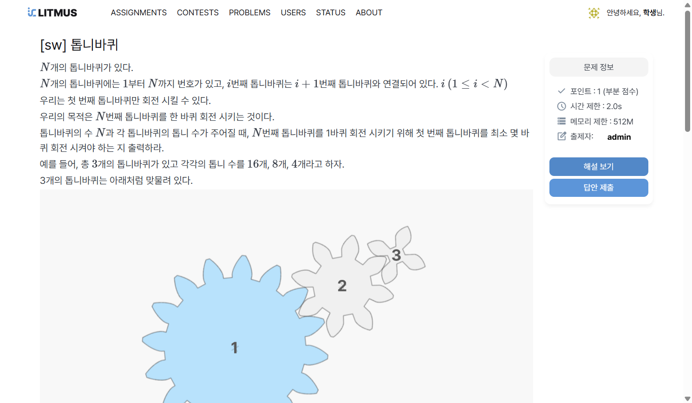
  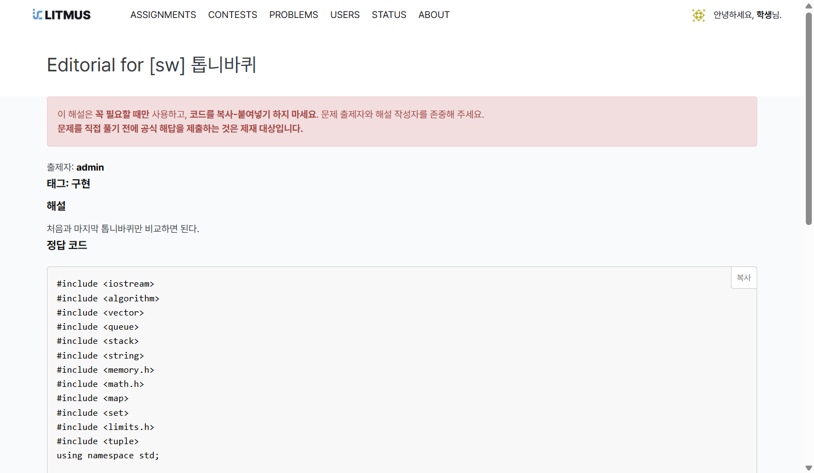

 

- **문제 공지사항**: 문제와 관련된 중요한 공지사항이 있다면, 문제 페이지의 **문제 공지사항**에서 확인할 수 있습니다

  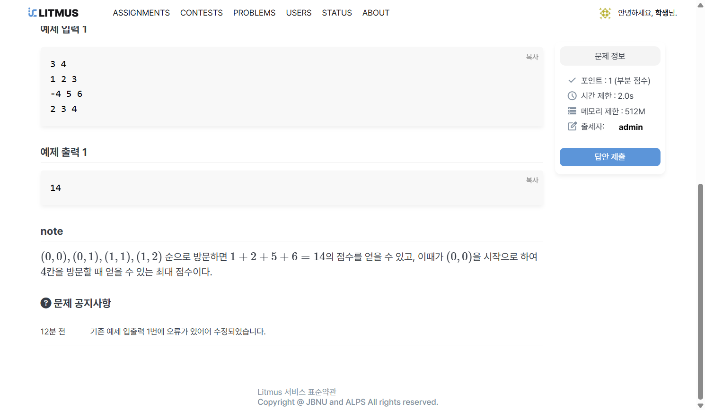

 

---

## 4. 제출 및 결과 확인

### (1) 답안 제출 및 확인

- 문제 페이지의 '답안 제출' 버튼을 통해 코드를 제출할 수 있습니다.

  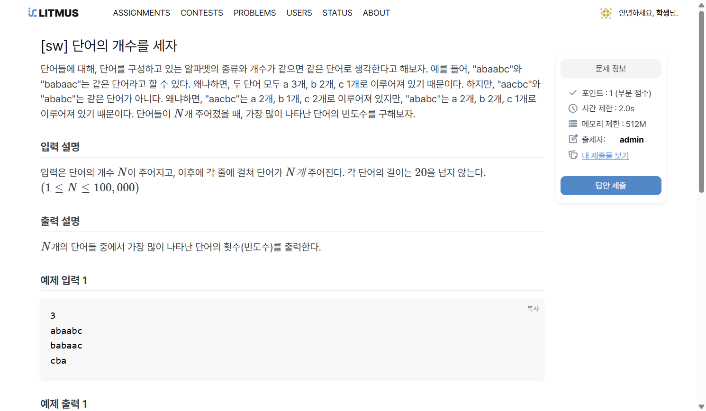

 

- 제출 시 언어를 선택하고 코드를 작성할 수 있습니다. 

  

 

- 제출 목록에서 각 제출의 '보기' 버튼을 누르면 채점 상세 정보를 확인할 수 있습니다.

  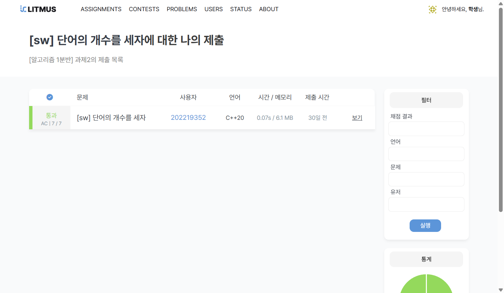
  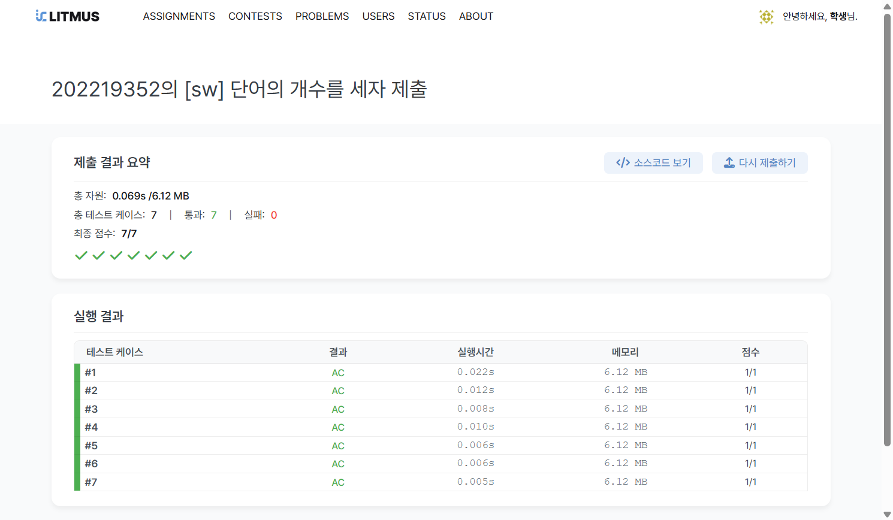
  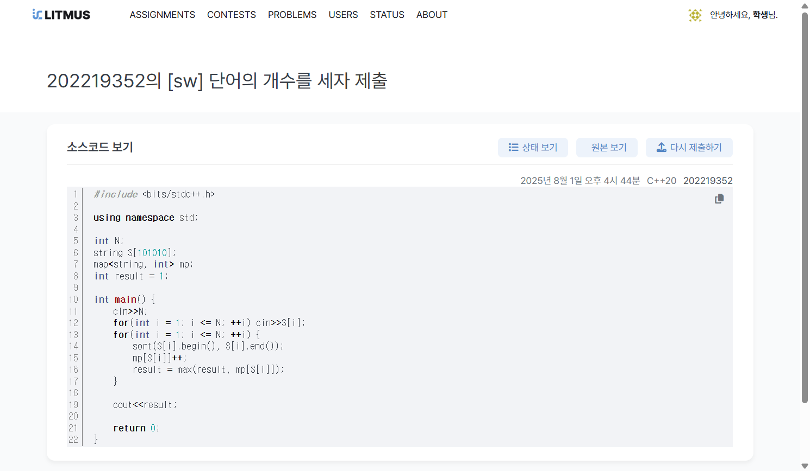

 

### (2) 채점 결과 용어

채점 결과에 따라 아래와 같은 용어들을 확인할 수 있습니다.

#### 정답
- **AC (Accepted, 정답)**: 모든 테스트 케이스를 통과한 결과입니다.

#### 오답 및 오류
- **WA (Wrong Answer, 오답)**: 출력 결과가 정답과 일치하지 않는 경우입니다.
- **TLE (Time Limit Exceeded, 시간 초과)**: 실행 시간이 정해진 제한을 초과한 경우입니다.
- **MLE (Memory Limit Exceeded, 메모리 초과)**: 메모리 사용량이 정해진 제한을 초과한 경우입니다.
- **OLE (Output Limit Exceeded, 출력 초과)**: 출력 크기가 제한을 초과한 경우입니다.
- **SC (Short Circuited, 단락)**: 일부 테스트 케이스에서 실패하여 나머지 테스트를 건너뛴 경우입니다.

#### 프로그램 오류
- **IR (Invalid Return, 잘못된 반환)**: 프로그램이 예상되지 않은 방식으로 종료된 경우입니다.
- **RTE (Runtime Error, 런타임 에러)**: 프로그램 실행 중 오류가 발생한 경우입니다.
- **CE (Compile Error, 컴파일 에러)**: 코드 컴파일 중 문법적인 오류가 발생한 경우입니다.

#### 시스템 오류
- **IE (Internal Error, 내부 오류)**: 채점 시스템 내부에서 오류가 발생한 경우입니다.
- **AB (Aborted, 중단)**: 채점 과정이 중단된 경우로, 주로 사용자가 채점 중 중단한 경우입니다.

---

## 5. 서비스 정보

  

 

Litmus는 DMOJ 오픈소스를 기반으로 개발되었으며, **[ALPS](https://sites.google.com/view/jbnu-alps)**의 **[LITMUS](https://github.com/alps-jbnu)** 팀에서 관리합니다.

해당 프로젝트는 **AGPL-3.0 License** 하에 배포됩니다. **GitHub** 주소는 **[여기](https://github.com/dameun2224/Litmus)**를 클릭해주세요.

더 자세한 내용은 **[ABOUT 탭](https://litmus.jbnu.ac.kr/about/)**을 참고해주세요.

---

 

문의사항은 아래 연락처로 문의해 주세요.

**ALPS** | Email: litmus@jbnu.ac.kr

