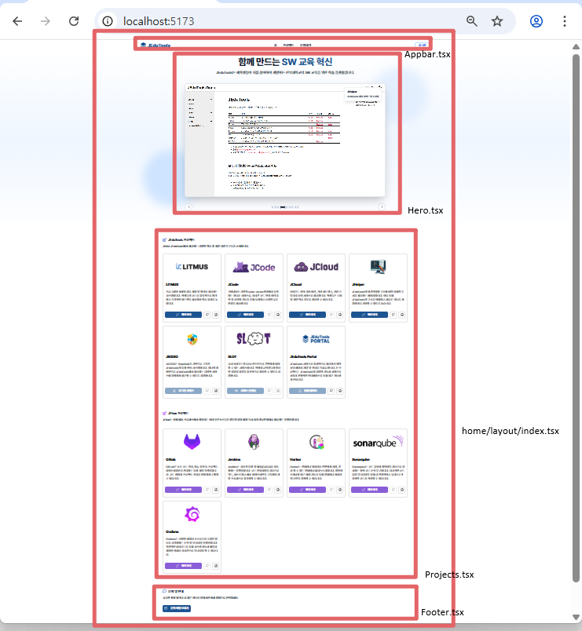

### **1. Keycloak 인증 흐름**

`src/hooks/useKeycloak.ts` 파일은 Keycloak(JIG SSO) 인증을 처리하는 핵심적인 역할을 담당합니다. 이 로직의 동작 방식을 이해하는 것은 매우 중요합니다.
`useKeycloak` 훅은 `react-oidc-context` 라이브러리를 기반으로 하여, 애플리케이션 전체의 인증 상태를 관리합니다.


인증 과정은 다음 단계로 이루어집니다.

1.  **인증 상태 확인:** `useAuth()` 훅을 호출하여 `auth` 객체에서 `isAuthenticated`, `isLoading` 같은 현재 인증 상태를 가져옵니다.
2.  **로그인 시작:** `handleLogin` 함수 내에서 `auth.signinRedirect()`를 호출하여 사용자를 Keycloak 로그인 페이지로 보냅니다.
3.  **로그인 완료:** 사용자가 Keycloak에서 성공적으로 로그인하고 돌아오면, URL에 포함된 `code`, `state` 같은 파라미터를 `hasAuthParams()` 함수로 감지하여 로그인 절차를 마무리합니다.
4.  **사용자 정보 제공:** 인증이 완료되면, 훅은 앱의 다른 컴포넌트에서 사용할 수 있도록 `user` 객체, `isAuthenticated` 상태 등을 반환합니다.
    ```typescript
    return {
      isAuthenticated: auth.isAuthenticated,
      isLoading: auth.isLoading,
      user: auth.user,
      // ... and other helpers
    };
    ```


`useEffect` 훅을 사용하여 `auth.error`를 감시합니다. 예를 들어, `No matching state found in storage` 에러가 발생하면, 로그인 요청을 보낸 브라우저와 다른 브라우저에서 접속했음을 알리는 경고창을 띄웁니다.

### **2. 중첩 라우팅과 Outlet**

이 프로젝트는 `react-router-dom`을 사용하여 페이지 간의 이동을 관리합니다. 전체 페이지의 공통적인 레이아웃(상단 메뉴, 푸터 등)은 `src/components/layout/index.tsx` 파일에 정의되어 있습니다.

```tsx
// src/components/layout/index.tsx
export default function Layout() {
  return (
    <>
      <AppBar />
      <NoticeBanner />
      <Outlet />
      <Footer />
    </>
  );
}
```

여기서 `<AppBar />`, `<NoticeBanner />`, `<Footer />`는 각각 상단 메뉴, 공지 배너, 하단 푸터를 나타냅니다. 이 컴포넌트들은 모든 페이지에 공통으로 표시됩니다.

**`<Outlet />`의 역할**

`Layout` 컴포넌트의 핵심은 바로 `<Outlet />` 입니다. 이것은 `react-router-dom`이 제공하는 특별한 컴포넌트로, **"자식 경로(child route)의 컴포넌트가 렌더링될 위치"**를 지정하는 역할을 합니다.

라우팅 설정은 `src/App.tsx`에 정의되어 있습니다.

```tsx
// src/App.tsx
const routes = createRoutesFromElements(
  <Route path="/" element={<Layout />}>
    <Route index element={<HomePage />} />
    {/* 다른 페이지 경로를 여기에 추가할 수 있습니다. */}
  </Route>
);
```

위 설정은 "사용자가 `/` 경로에 접속하면, 먼저 `<Layout />` 컴포넌트를 렌더링하고, 그 안의 `<Outlet />` 위치에 `<HomePage />` 컴포넌트를 렌더링하라"는 의미입니다.

이러한 중첩 라우팅 구조 덕분에, 여러 페이지가 `AppBar`나 `Footer` 같은 공통 UI를 코드 중복 없이 공유할 수 있습니다.

**예시: 새로운 페이지 추가하기**

이 구조의 장점을 활용하여 `/about` 경로에 새로운 페이지를 추가하는 과정은 매우 간단합니다.

**1. 페이지 컴포넌트 생성**

먼저 `src/components/about/AboutPage.tsx` 와 같은 파일을 생성하여 페이지 내용을 작성합니다.

```tsx
// src/components/about/AboutPage.tsx
export default function AboutPage() {
  return (
    <div className="container p-8 mx-auto">
      <h1 className="text-3xl font-bold">JEduTools 소개</h1>
      <p className="mt-4 text-gray-700">
        JEduTools는 전북대학교 학생들을 위한 SW 교육 플랫폼입니다.
      </p>
    </div>
  );
}
```
이 컴포넌트는 페이지의 고유한 내용만 담고 있으며, 상단 메뉴나 푸터 코드는 포함하지 않습니다.

**2. 라우팅 설정에 경로 추가**

다음으로 `src/App.tsx` 파일에 방금 만든 컴포넌트를 보여줄 경로를 추가합니다.

```tsx
// src/App.tsx
import {
  Route,
  createBrowserRouter,
  createRoutesFromElements,
  RouterProvider,
} from "react-router-dom";
import Layout from "@/components/layout";
import HomePage from "@/components/home";
import AboutPage from "@/components/about/AboutPage"; // 1. 새 컴포넌트 가져오기

const routes = createRoutesFromElements(
  <Route path="/" element={<Layout />}>
    <Route index element={<HomePage />} />
    <Route path="about" element={<AboutPage />} /> {/* 2. <Layout>의 자식으로 새 경로 추가 */}
  </Route>
);

// ...
```

**결과**

이 두 단계만으로, 사용자가 `/about` 주소로 접속하면 `Layout` 컴포넌트(상단 메뉴, 푸터) 안에 `AboutPage`의 내용이 자동으로 나타납니다. 새로운 페이지를 만들 때마다 공통 레이아웃을 반복해서 코딩할 필요가 없어 매우 효율적입니다.

더 자세한 내용은 [React Router 공식 문서](https://reactrouter.com/)를 참고하세요.


### 컴포넌트 구조

 
