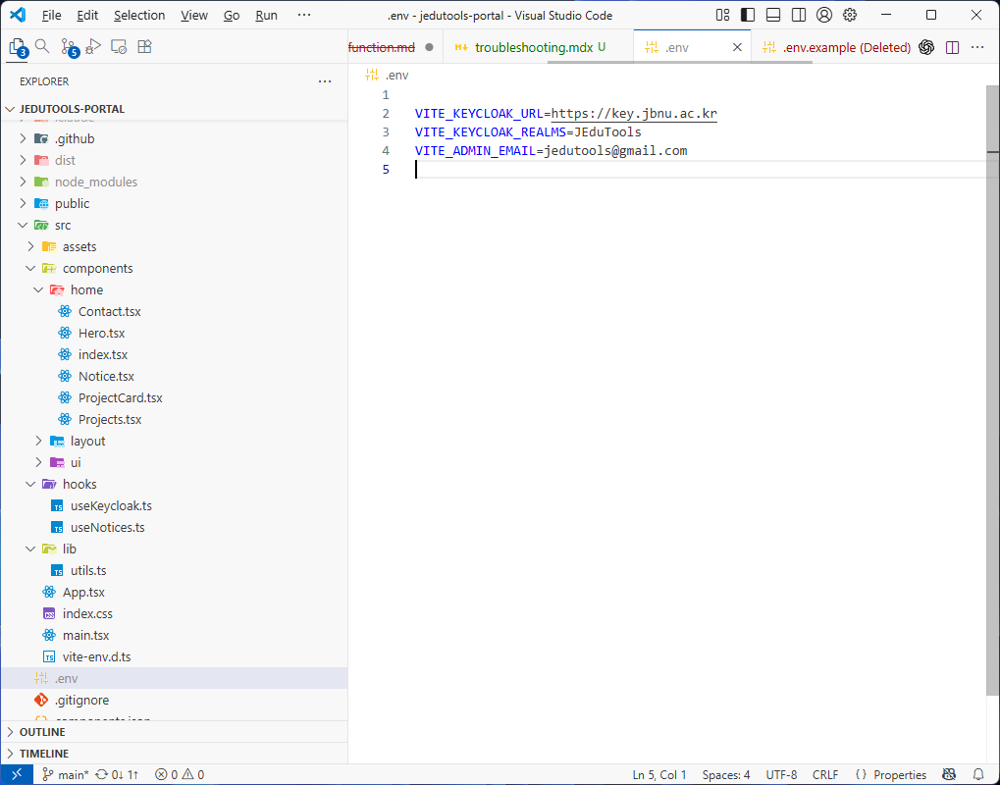
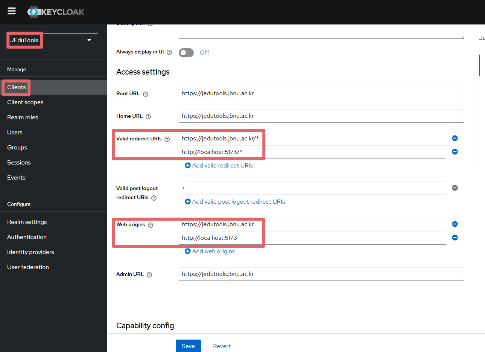
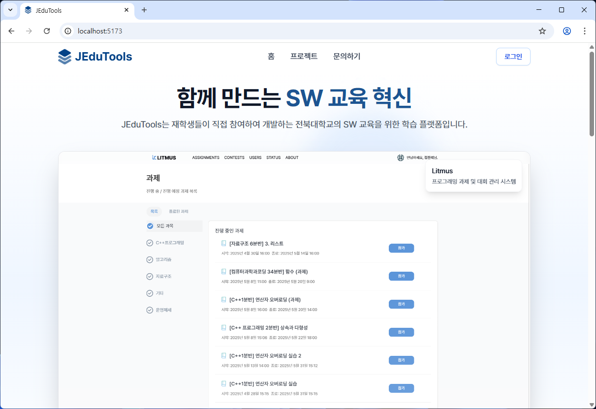

### **1. 코드 내려받기**

가장 먼저, Git을 사용하여 프로젝트 코드를 컴퓨터로 복제합니다.

```bash
git clone https://github.com/JBNU-JEduTools/portal.git
```

### **2. 패키지 설치**

프로젝트 폴더로 이동하여 필요한 라이브러리들을 설치합니다.
node.js가 필수적으로 사전설치 되어있어야합니다.

```bash
cd portal
npm install
```

### **3. 환경 변수 설정**

로그인 등 주요 기능을 사용하려면 Keycloak 서버 정보를 설정해야 합니다.

1.  `.env.example` 파일을 복사하여 `.env` 파일을 생성합니다.
2.  생성된 `.env` 파일에 아래 정보를 참고하여 값을 입력합니다.

    *   `VITE_KEYCLOAK_URL`: `https://key.jbnu.ac.kr`
    *   `VITE_KEYCLOAK_REALMS`: `JEduTools` (대소문자 유의)
    *   `VITE_ADMIN_EMAIL`: `jedutools@gmail.com`

> **중요:** `.env` 파일에 정확한 값이 없으면 로그인 기능이 동작하지 않습니다.




### **4. Keycloak 리디렉션 설정 (로컬 로그인 시 필수)**

로컬 환경에서 로그인을 테스트하려면 Keycloak에 로컬 개발 서버의 주소를 등록해야 합니다. 아래 절차를 따라 설정을 완료하세요.

1.  **Keycloak 클라이언트 설정 접속**
    - Keycloak 관리자 페이지에 로그인한 후, `JEduTools` 렐름(Realm)의 **Clients** 메뉴로 이동합니다.
    - 클라이언트 목록에서 `jedutools-portal`을 찾아 클릭합니다.

2.  **리디렉션 URI 추가**
    - `jedutools-portal` 클라이언트 설정 화면에서 **Valid Redirect URIs** 항목을 찾습니다.
    - 필드에 `http://localhost:5173/*` 값을 추가하고 페이지 하단에서 **Save** 버튼을 눌러 저장합니다.



> **주의:** 개발이 끝난 후에는 보안을 위해 추가했던 `http://localhost:5173/*` 설정을 반드시 삭제해야 합니다.

### **5. 개발 서버 실행**

모든 설정이 완료되면, 개발 서버를 실행하여 결과를 확인합니다.

```bash
npm run dev
```

서버가 성공적으로 실행되면 터미널에 표시된 주소(보통 `http://localhost:5173`)로 접속하여 아래와 같이 포털 화면이 뜨는지 확인합니다.

